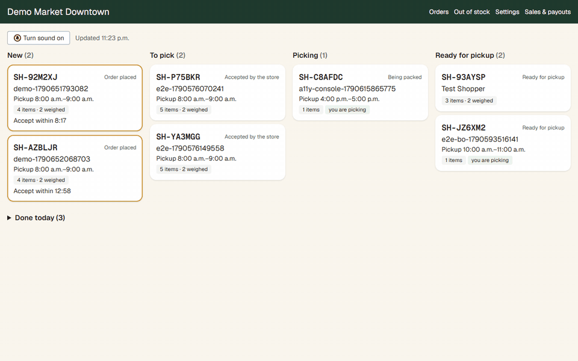
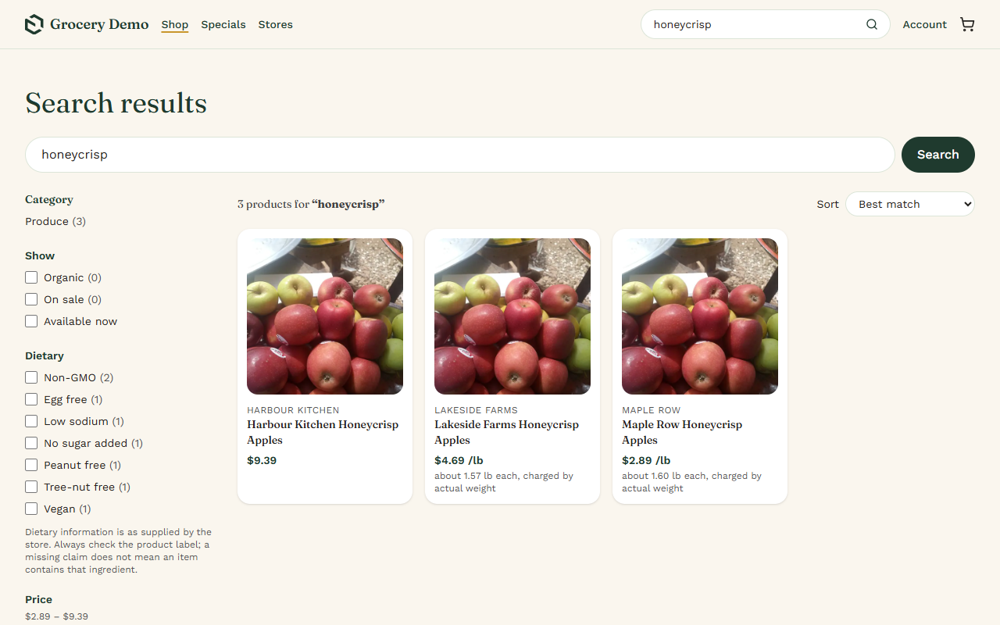
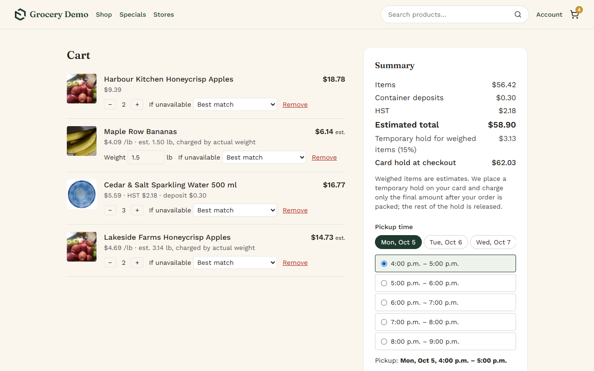
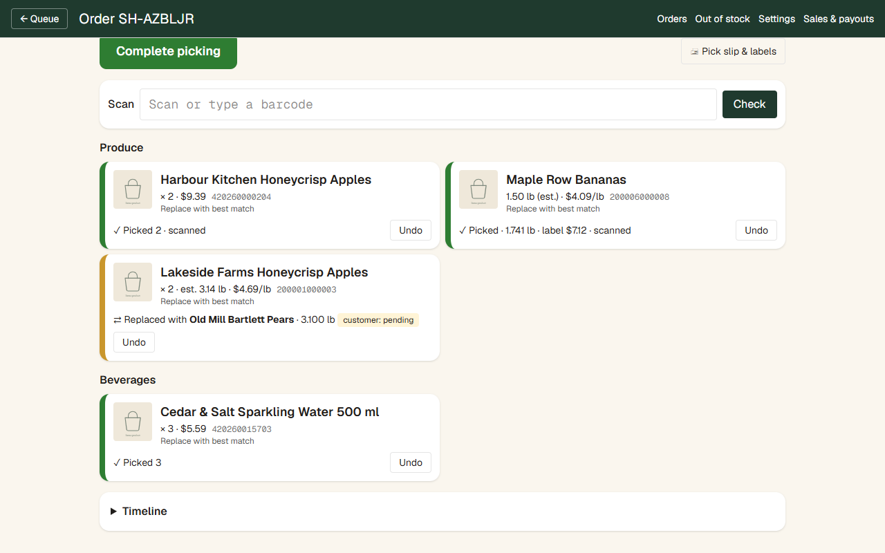
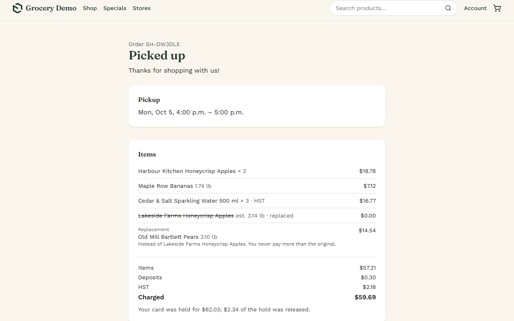
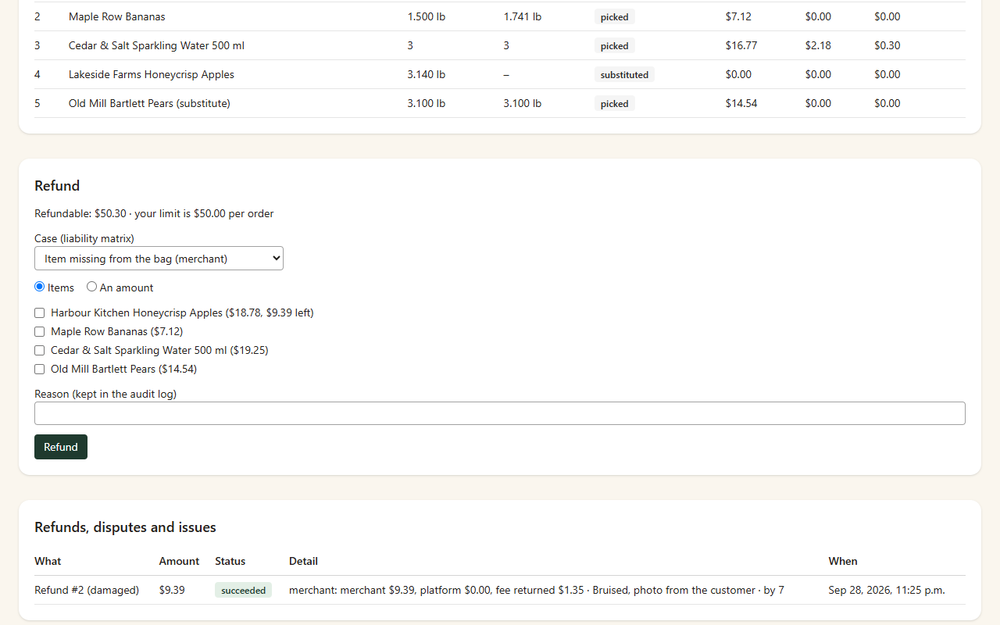
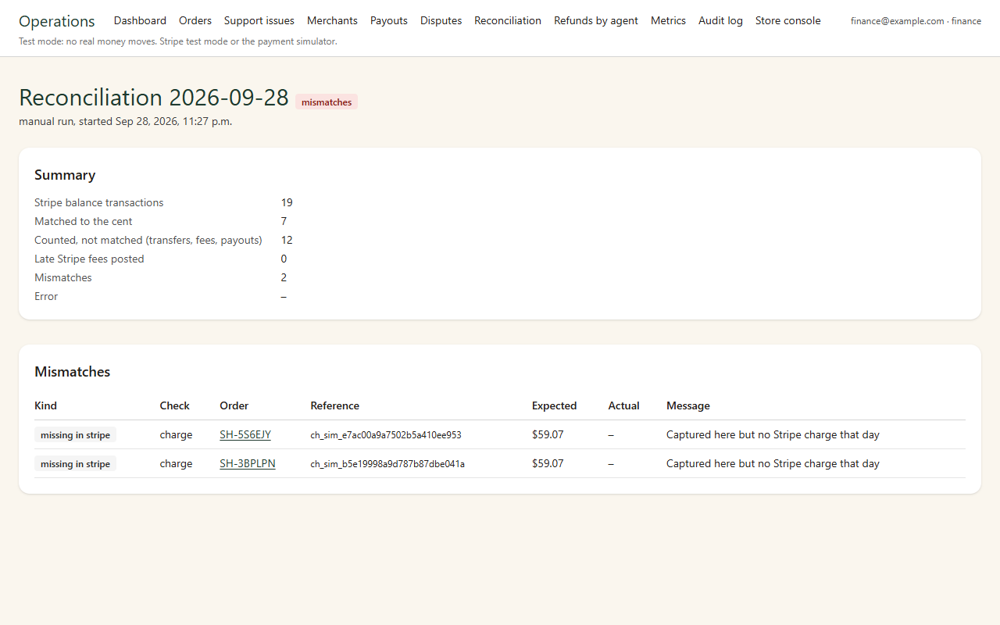
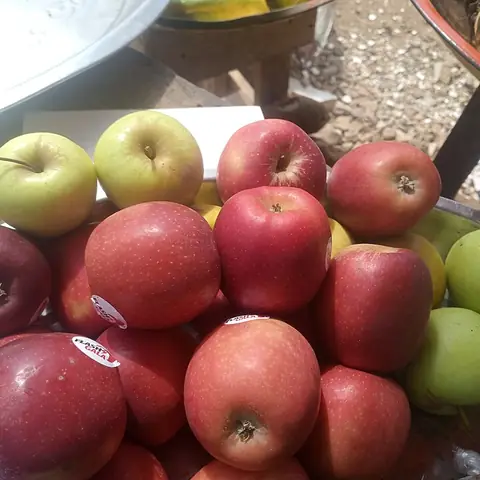
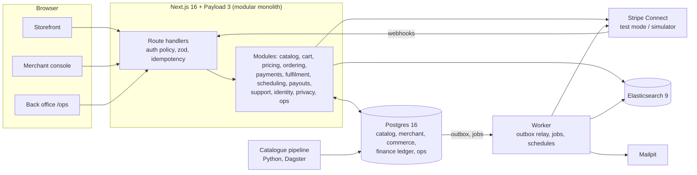

# Grocery Marketplace: reference implementation

<!-- CI badges are added at publication (pre-publish checklist, step 8), once GitHub Actions has run. -->

> **Disclaimer:** this is an independent demonstration project. It is **not affiliated with, endorsed by or operated on behalf of Summerhill Market** or any other retailer named in it. Payments run in **Stripe test mode** only (or in the built-in payment simulator); no real orders are placed and no real money moves. All catalogue data is **synthetic**. © 2026 Pranita Panchal, all rights reserved (see [LICENSE](LICENSE)).

A grocery marketplace where a local store sells through the platform, built as a professional reference implementation. The hard part of online grocery is money: **the customer pays for what was actually packed**, not what was ordered. Bananas weigh more or less than estimated, an item is out of stock, a replacement costs more. This project places a **card hold at checkout, lets the store pick, weigh and replace, then captures exactly the final amount**, splits it between the merchant and the platform, and **reconciles every cent** against Stripe.



## What it does

| Area | Highlights |
|---|---|
| **Storefront** | Search with synonyms and typo tolerance (Elasticsearch, Postgres fallback), categories, unit prices, weighed items, HST and bottle deposits, pickup slots, guest checkout, order tracking, replacement approval, "report a problem" |
| **Payments** | Stripe Connect destination charges; **hold at checkout, capture after picking** (idempotent, retried safely); tiered platform fee; refunds by a liability matrix; disputes with an evidence pack; payouts with four-eyes approval; a double-entry ledger |
| **Merchant console** | Tablet-first: accept (auto-reject after 15 min), pick with barcode scanning and deli-scale labels, weigh, mark unavailable, replace, complete, hand over with a pickup code; hours, capacity, closures |
| **Back office** (`/ops`) | Orders, refunds, disputes, payouts, **daily reconciliation**, statements, merchant onboarding and lifecycle, catalogue review, users and roles, feature flags, privacy requests, audit log, metrics; staff sign in with MFA |
| **Catalogue pipeline** | Python/Dagster ingestion with connectors, data-quality rules and an **anomaly guard** that holds suspicious runs for review |
| **Operations** | Transactional outbox and a Postgres job queue; alerts as code, each with a [runbook](docs/runbooks/); OpenTelemetry traces across request → webhook → job; circuit breakers and timeouts on every outbound call |
| **Quality** | Unit, authorisation-matrix, integration (real Postgres) and Playwright tests; money and state machine at 100% branch coverage; CSP A+, OWASP ZAP baseline, axe accessibility checks |

| | |
|---|---|
|  |  |
| Search: synthetic catalogue, unit prices | Cart: pickup time, the card hold explained |
|  |  |
| Console: scanned, weighed, replaced | Customer: charged the final amount, the rest of the hold released |
|  |  |
| Back office: a refund split by the liability matrix | Finance: reconciliation catching two charges Stripe (here, the simulator) has no record of |

## Demo catalogue

The seed data is a synthetic grocery catalogue of 70+ products across produce, dairy, bakery, meat, seafood, pantry, frozen and beverages. Each has a photo from Wikimedia Commons (public domain or CC0, see [CREDITS](web/summerhill-commerce/public/product-images/CREDITS.md)).

| | | | |
|:---:|:---:|:---:|:---:|
| <br>Honeycrisp Apples | <br>Bananas | <br>Mangoes | <br>Broccoli Crowns |
| <br>Sourdough Loaf | <br>Butter Croissants | <br>Aged Cheddar | <br>Free-run Eggs |
| <br>Atlantic Salmon Fillet | <br>Rib Steak | <br>Pure Maple Syrup | <br>Orange Juice |

## Architecture



One codebase, two processes (app and worker), Postgres as the system of record. Every state change that must trigger work writes an outbox event in the same transaction; the worker turns events into jobs (capture, email, search updates) with retries and dead letters. The reasoning is in the [ADRs](docs/adr/) and [SYSTEM_DESIGN](docs/architecture/SYSTEM_DESIGN.md).

## Quick start

### Everything in Docker

Needs only **Docker** (4 GB or more of memory for Docker; the first build takes several minutes). Postgres, Elasticsearch, the catalogue pipeline (Dagster), the app (storefront and API) and the worker all run in containers, with the payment simulator instead of Stripe.

```bash
npm run stack:full        # builds the images, migrates, seeds, builds the search index, starts everything
npm run stack:down        # stop (`npm run stack:reset` also deletes the data)
```

| URL | What |
|---|---|
| http://localhost:3000 | Storefront and API (Next.js and Payload; admin at `/admin`) |
| http://localhost:3070 | Dagster: ingest jobs, schedules, run history |
| http://localhost:8025 | Mailpit: order emails |
| http://localhost:9200 | Elasticsearch ([sample queries](docs/SEARCH_QUERIES.md)) |
| localhost:5433 | Postgres |

Demo accounts are in [Demo accounts](#demo-accounts); the walkthrough is [docs/DEMO.md](docs/DEMO.md). The containers and a local `npm run dev:sim` share the same databases but use different `PAYLOAD_SECRET` values, which seal the staff two-step codes: when you switch from one to the other, run `npm run seed:users --prefix web/summerhill-commerce` once (or set the same `PAYLOAD_SECRET` for both). The setup is in [infra/docker-compose.yml](infra/docker-compose.yml) (profile `full`) and [infra/docker/](infra/docker/).

### Without Docker for the app (development)

Docker runs only Postgres, Elasticsearch and Mailpit here; the app runs on your machine. Needs **Docker**, **Node 20** (`.nvmrc`) and **Python 3.12+** (`.python-version`). No Stripe account needed: the payment simulator implements Stripe's test cards, including 3-D Secure.

```bash
git config core.hooksPath tools/git-hooks                 # secret/data scanner before commits
npm install && npm install --prefix web/summerhill-commerce
npm run pipeline:install                                  # .venv with the catalogue pipeline
npm run stack:up                                          # Postgres :5433, Elasticsearch :9200, Mailpit :8025
npm run db:setup                                          # migrations + synthetic catalogue (via the pipeline)
cp web/summerhill-commerce/.env.example web/summerhill-commerce/.env   # then set PAYLOAD_SECRET (see the file)
npm run seed:users --prefix web/summerhill-commerce       # demo accounts (below)
npm run catalog:sync-payload --prefix web/summerhill-commerce # mirror products into the Payload admin (rename / out of stock)
npm run search:rebuild --prefix web/summerhill-commerce   # build the search index
npm run dev:sim --prefix web/summerhill-commerce          # http://localhost:3000 with the payment simulator
npm run worker:sim --prefix web/summerhill-commerce       # second terminal: webhooks, captures, emails, schedules
```

Then follow the **[5-minute demo script](docs/DEMO.md)**. Emails appear in Mailpit at http://localhost:8025.

On a slow machine, a production build is faster to click through than the dev server: `npm run build:sim && npm run start:sim` (in `web/summerhill-commerce`).

Upgrading a local database from before G2: run `npm run db:migrate` and `npm run payload:cleanup` once (it removes the old Payload ecommerce tables, which otherwise make Payload's schema sync stop at an interactive prompt). Starting over: `npm run stack:reset`.

### With Stripe test mode

Put an `sk_test_…` key in `.env` (live keys are refused at startup), run `dev:stack` and `worker` instead of the `:sim` variants, and forward webhooks with `npm run stack:up:stripe`; put the printed `whsec_…` secret into `.env` as `STRIPE_WEBHOOKS_SIGNING_SECRET`.

### Test cards

| Card | Result |
|---|---|
| `4242 4242 4242 4242` | Succeeds |
| `4000 0000 0000 0002` | Declined |
| `4000 0027 6000 3184` | Asks for 3-D Secure |
| `4000 0000 0000 0259` | Succeeds, then disputed once captured |

Any future expiry date and any CVC.

### Demo accounts

Created by `npm run seed:users`; addresses and the shared password are in [`web/summerhill-commerce/stack.env`](web/summerhill-commerce/stack.env) (local demo values only).

| Account | Can | Where |
|---|---|---|
| `customer@example.com` | Shop, see orders | Storefront |
| `picker@example.com` | Accept, pick, hand over | `/console` |
| `owner@example.com` | Picker's work plus store settings | `/console` → Settings |
| `support@example.com` | Orders, refunds up to $50, support issues | `/ops` |
| `finance@example.com` | Payouts, reconciliation, disputes, statements | `/ops` |
| `admin@example.com` | Everything, incl. merchants, catalogue, users, flags, privacy | `/ops`, Payload at `/admin` |

**Staff sign in with a second factor.** After the password, enter the 6-digit code from `npm run demo:totp --prefix web/summerhill-commerce` (or add `DEMO_TOTP_SECRET` from stack.env to an authenticator app).

### More to try

- **Catalogue pipeline:** `npm run pipeline:ingest` runs one ingest; `CATALOG_FIXTURE_FRACTION=0.5 npm run pipeline:ingest` makes the anomaly guard hold the run for review in `/ops/catalog` ([pipeline/README.md](pipeline/README.md)). `npm run pipeline:dagster` opens the Dagster UI with the schedules on http://localhost:3070.
- **Traces:** `npm run stack:observability` starts Jaeger (http://localhost:16686); run the app with `OTEL_EXPORTER_OTLP_ENDPOINT=http://localhost:4318` and follow one checkout from request to webhook to capture.
- **Operator commands:** `npm run ops --prefix web/summerhill-commerce -- alerts` (and `jobs:dead`, `webhook:replay`, `capture:retry`, `mfa:reencrypt`), used by the [runbooks](docs/runbooks/).

## Checks

```bash
npm run ci:local     # everything CI runs: scans, docs, format, lint, typecheck, unit, authz, integration, coverage, audit (needs the stack)
npm run ci:fast      # without integration tests and the audit (no Docker)
npm run test:e2e --prefix web/summerhill-commerce   # browser journeys (payment simulator); PW_CHANNEL=chrome to use an installed Chrome
npm run scan:security                               # security headers + OWASP ZAP baseline against the running app
```

Results of the quality, security and performance checks are in [TESTING §2.1](docs/TESTING.md#21-quality-security-and-performance-results-g6-2026-09-28). See [CONTRIBUTING.md](CONTRIBUTING.md) for conventions and the Definition of Done.

## Scraper and catalogue data

[`scripts/scraper.js`](scripts/scraper.js) fetches a storefront's product list and writes it grouped by category and subcategory, with retries and backoff. Setup, output format, re-run instructions and assumptions are in [docs/SCRAPER.md](docs/SCRAPER.md); a synthetic sample of the output is [docs/samples/scraped.sample.json](docs/samples/scraped.sample.json). Scraped data is never committed. The demo runs on a **synthetic** catalogue loaded through the same pipeline. The pipeline's `scraped_json` connector reads the scraper's output (`CATALOG_CONNECTOR=scraped_json`), and each Dagster run loads Postgres and then syncs Elasticsearch.

## How money moves (Stripe)

1. **Checkout:** the cart becomes a hosted Stripe Checkout session (or the simulator's equivalent) with `capture_method = manual`: the card is **authorised, not charged**, for the estimate plus a buffer for weighed items.
2. **Picking:** the store picks, weighs and substitutes, so the final amount is known.
3. **Capture:** the platform captures exactly the final total. This is a **destination charge**: `transfer_data.destination` is the merchant's connected account, `on_behalf_of` makes the merchant the seller of record, and `application_fee_amount` is the platform's commission.
4. **Commission** on the final item subtotal after promotions: **20%** under $50, **15%** from $50 to $100 inclusive, **10%** over $100. The merchant receives the captured total minus the fee, so the parts always add up to the whole.
5. **Payouts:** each merchant's payout schedule is set through the Stripe API. Refunds, disputes and every cent are recorded in a double-entry ledger and reconciled against Stripe.

A second flow, **separate charge and transfer** (the platform charges the customer, then transfers the merchant's share), is kept as a demo route for baskets that span merchants; the trade-offs are in [ADR-0005](docs/adr/0005-charge-model.md). Connected accounts are **Custom** by default, as the brief asks, and Express (Stripe-hosted onboarding) is one setting away (`CONNECT_ACCOUNT_TYPE`; [ADR-0012](docs/adr/0012-custom-accounts-by-default.md), [ADR-0011](docs/adr/0011-connect-account-type.md)). Details: [PAYMENTS_AND_MONEY](docs/domains/PAYMENTS_AND_MONEY.md).

## Search design

Elasticsearch handles text search and Postgres handles browsing and is the fallback, behind one `SearchService` ([ADR-0007](docs/adr/0007-search-engine.md)). Relevance weights name over brand over category, with typo tolerance, prefix matching for search-as-you-type, synonyms (pop/soda) and boosts for on-sale, in-stock and popular items. Products are always read from Postgres, so prices and stock are never stale. The index is updated within seconds of a product change (outbox event, then worker) and rebuilt nightly into a new index behind an alias swap. Design and [sample queries](docs/SEARCH_QUERIES.md); full detail in [CATALOG_AND_SEARCH](docs/domains/CATALOG_AND_SEARCH.md#8-search).

## Hosting

There is no hosted demo, on purpose: the project runs entirely from this repo with `npm run stack:full`, on test data and the payment simulator, so nothing real is exposed. The walkthrough video covers the running system.

## Documentation

Start with the **[documentation index](docs/README.md)**. The most useful entry points:

| Doc | What it covers |
|---|---|
| [docs/DEMO.md](docs/DEMO.md) | The 5-minute walkthrough |
| [docs/architecture/SYSTEM_DESIGN.md](docs/architecture/SYSTEM_DESIGN.md) | Architecture, modules, data, jobs, integrations |
| [docs/domains/PAYMENTS_AND_MONEY.md](docs/domains/PAYMENTS_AND_MONEY.md) | Holds, capture, fees, refunds, disputes, ledger, reconciliation |
| [docs/adr/](docs/adr/) | Architecture decision records |
| [docs/runbooks/](docs/runbooks/) | What to do when an alert fires |
| [docs/IMPLEMENTATION_PLAN.md](docs/IMPLEMENTATION_PLAN.md) | Every work item with acceptance criteria, and what was built |
| [CHANGELOG.md](CHANGELOG.md) | Releases |

## Repository layout

```
db/                   forward-only migrations (checksums, advisory lock), synthetic seed, Payload cleanup
docs/                 design, ADRs, runbooks, plan, traceability, openapi.yaml (generated), media
infra/                docker compose stack (Postgres, Elasticsearch, Mailpit, Stripe CLI, ZAP, k6, Jaeger)
pipeline/             catalogue ingestion (Python, Dagster): connectors, quality rules, anomaly guard
tools/                ci-local runner, secret/data scanner, git hooks, security scans
web/summerhill-commerce/   Next.js 16 + Payload 3 app
  src/modules/        one folder per module; its public API is its index.ts (boundaries enforced by lint)
  src/worker/         worker process: outbox relay, job queue, schedules
  src/server/         config, db, route wrapper (auth policy, validation, errors), logging, tracing, security headers
  src/app/            storefront, (console) merchant console, (ops) back office, api
  src/scripts/        seed users, search rebuild, ops commands
  tests/              unit, authz matrix, integration (real Postgres), e2e (Playwright)
scripts/               legacy prototype scripts (stages 1–2), superseded by pipeline/
```

## Security

See [SECURITY.md](SECURITY.md). Third-party licences: [THIRD_PARTY_NOTICES.md](THIRD_PARTY_NOTICES.md).
