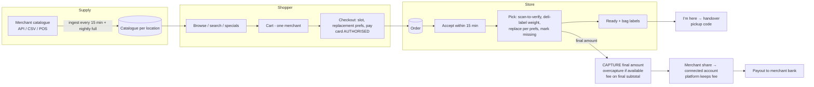

# Summerhill Marketplace — Blueprint (master document)

| | |
|---|---|
| **Status** | Draft v0.3, for review. Adds market/competitor/regulatory research, strategy, and department operating model. Supersedes v0.2 |
| **Owner** | Pranita Panchal |
| **Last updated** | 2026-09-27 |
| **Code reviewed** | branch `stripe-connect-marketplace` @ `e74124d` + uncommitted Stage 4 work |
| **Data reviewed** | `sample.json` (3,150 upstream products), `scraped.json` (3,100 loaded) |
| **Research** | Web research on 2026-09-27: Stripe docs and pricing, competitors, Canadian regulation. Sources in [§14](#14-sources) |

> **Scope (decided 2026-09-27):** this project is published **on GitHub only** as a reference implementation. It isn't operated as a business, runs in Stripe **test mode** with **synthetic data**, and is **not affiliated with Summerhill Market**. The market, business, legal and launch sections below are **design exploration**: they explain the design choices but aren't operational commitments. The build plan is [IMPLEMENTATION_PLAN.md](IMPLEMENTATION_PLAN.md) (phases G0–G8); business decisions B1–B16 apply only if the project ever becomes a real product.

This is the entry point. It gives the whole picture and links to the detailed documents. **Where they disagree, the detailed document wins, and the fix goes in the same PR.** Facts marked *(verified)* were checked against a primary or reputable source on the date above. Anything about law or tax is an engineering reading of public guidance and **must be confirmed by counsel or an accountant**.

## Document map

| Doc | What it answers | Read it if you are… |
|---|---|---|
| **BLUEPRINT.md** (this) | What we're building, the market, strategy, how the company runs, what's decided | Everyone |
| [product/PRD.md](product/PRD.md) | Users, journeys, use cases, scope, business model, unit economics, success metrics | Product, founders |
| [product/FEATURE_ROADMAP.md](product/FEATURE_ROADMAP.md) | Features beyond the pilot core: Now/Next/Later/Won't, effort, metric, design notes | Product, founders, engineers |
| [architecture/CURRENT_STATE.md](architecture/CURRENT_STATE.md) | What exists today, what's broken, what we keep/delete | Engineers joining now |
| [architecture/SYSTEM_DESIGN.md](architecture/SYSTEM_DESIGN.md) | Target architecture, modules, data model, API, async processing, integrations | Engineers |
| [domains/CATALOG_AND_SEARCH.md](domains/CATALOG_AND_SEARCH.md) | Catalogue ingest, product model, pricing/promos, stock, search | Engineers, merchant ops |
| [domains/ORDERS_AND_FULFILMENT.md](domains/ORDERS_AND_FULFILMENT.md) | Cart → order → accept → pick/weigh/substitute → pickup; cancellations, issues | Engineers, store ops, support |
| [domains/PAYMENTS_AND_MONEY.md](domains/PAYMENTS_AND_MONEY.md) | Stripe Connect, auth-and-capture, fees, HST, refunds, disputes, payouts, ledger | Engineers, finance |
| [SECURITY_AND_COMPLIANCE.md](SECURITY_AND_COMPLIANCE.md) | Threat model, auth, data protection, PCI, Canadian legal obligations | Engineers, legal, founders |
| [OPERATIONS.md](OPERATIONS.md) | SLOs, monitoring, on-call, incidents, support, DR, running costs | Engineers, ops |
| [TESTING.md](TESTING.md) | Test strategy, mandatory test cases, UAT, launch testing | Engineers, QA |
| [DELIVERY_PLAN.md](DELIVERY_PLAN.md) | Team, milestones, estimates, risks, ways of working | Everyone |
| [IMPLEMENTATION_PLAN.md](IMPLEMENTATION_PLAN.md) | **Every remaining phase, one by one**: numbered work items, files, acceptance criteria, estimates, dependencies, phase gates | Engineers, founder |
| [TRACEABILITY.md](TRACEABILITY.md) | Proof of completeness: all 314 requirements from every document mapped to a work item or an explicit decision; verified by `node docs/tools/check-docs.mjs` | Engineers, reviewers |
| [adr/](adr/) | Individual architecture decisions with rationale | Engineers |

---

## 1. Executive summary

**What:** Summerhill Marketplace is an online specialty-grocery marketplace for Toronto. Shoppers order from independent grocers; the platform takes payment, routes the order to the merchant, and pays the merchant out minus a tiered commission. **Summerhill Market** (six Toronto stores) is launch merchant #1.

**Where we are:** a working *demo*: scraped catalogue, Postgres + Elasticsearch, a storefront with cart, Stripe Checkout with a destination charge and platform fee, and Connect onboarding scripts. No paid order is recorded or fulfilled, prices come from the browser, admin endpoints are open, there's no tax, weighed items are priced wrong, and our code has no tests ([CURRENT_STATE](architecture/CURRENT_STATE.md)).

**What the research changed (§3–4):**
1. **There's a real gap today.** The merchant's own online shop offers shopping lists but says pickup and delivery are "coming soon". Its delivery partner Inabuggy **stopped grocery orders on 15 Aug 2026**. Holiday pre-orders are taken through **Microsoft Forms**.
2. **Our commission is high for pickup.** Delivery apps charge restaurants roughly 6–10% on *pickup* orders; the merchant's current vendor (Homesome) charges a flat monthly fee with no revenue share. Our 10–20% tiers need a value story beyond "an online shop": new customers, operations tooling, and pre-orders.
3. **Online grocery in Canada is small.** Around 5.7% of all Canadian retail is online, and food e-commerce is lower. We win on **specialty and prepared foods, pre-orders and convenience pickup**, not the weekly shop.
4. **Stripe can do more than we assumed.** Overcapture (+15% on Visa, and Amex at grocery), incremental authorisation and 30-day extended holds all exist for online cards, **but only on IC+ pricing or by request**. The design uses them where available and falls back otherwise.
5. **New compliance obligations:**
   - CRA **Part XX platform reporting** applies to sale of goods, so we must collect merchant tax details and file annually.
   - The **Competition Act drip-pricing** rules require every mandatory fee in the advertised price.
   - The **GST/HST platform rules** make us collect HST for any *non-registered* merchant.

**Plan:**
- *(Startup scenario only.)* A pickup-first pilot at one Summerhill location, ≈ 204 engineer-days with 2 engineers, public pilot ≈ 29 March 2027 ([DELIVERY_PLAN](DELIVERY_PLAN.md)). **For the GitHub release, the plan is [IMPLEMENTATION_PLAN](IMPLEMENTATION_PLAN.md): ≈ 99 days core / ≈ 133 days full, one developer, test mode.**
- A proposed **holiday pre-order "wedge"** to earn merchant trust and real revenue early (decision B11).
- In parallel, **signed interest from 3–5 more merchants** before the public pilot. A marketplace with one merchant is just an online store with a commission.

---

## 2. What the data told us

From profiling the 3,150 products the upstream API returns:

| Fact | Number | Design consequence |
|---|---|---|
| Taxable products (13% HST) | **950 (30%)**; 2,200 zero-rated | Tax per line; today's checkout under-charges tax on 30% of the catalogue |
| Priced per pound | **263** (bananas $1.49/lb, rib steak $35.99/lb) | Final price known only after weighing → **authorise, then capture** |
| Average weight supplied | 199 of 263 per-lb items | Estimates come from data |
| Reported "in stock" | **3,149 / 3,150** | Not real inventory → out-of-stock found **at picking** → substitutions are core |
| On promotion | 235 (`specials`) | Ingest promotions; we currently charge the regular price |
| Dietary/allergen claims | 283 products, 21 claim types | Filters with a safety disclaimer |
| Bottle deposits / day-restricted / min-qty | 4 / 6 / 1 | Separate non-commissionable lines; slot rules; cart rules |
| Duplicate UPC / display name | 1 / 5 | Use upstream `name` (0 duplicates) as `external_id` |
| Catalogue requested per `LOCATION_ID` | all | **merchant → locations** from day one (merchant has 6 stores) |
| Prepared meals / deli / bakery | ~730 products | Order-ahead, pre-orders, catering |
| Price distribution | min $0.99 · median $8.99 · p90 $18.99 · max $129.99 | Typical basket ≈ $40–70 → mostly the **20% and 15%** tiers |
| Descriptions / images | empty / hotlinked from the vendor's bucket | SEO weakness; mirror images; confirm rights |
| Rows loaded vs. fetched | 3,100 vs. 3,150 | The loader loses products; fixed in the ingest rewrite |

---

## 3. Market and competitive research

### 3.1 Market
- Online is **~5.7% of Canadian retail trade** (Statistics Canada, Nov 2025 release, as reported), and food e-commerce's share is lower. Canadian shoppers lean strongly to in-store grocery buying *(verified)*.
- **Implication:** position online as a *complement to the store*: order-ahead prepared foods, holiday pre-orders, and quick pickup of specialty items. Don't aim to replace the weekly shop. Size the pilot's volume targets accordingly (PRD §8: 50 orders/week by week 6 is deliberately modest).

### 3.2 The launch merchant today *(verified 2026-09-27)*

| Channel | What it offers | Implication for us |
|---|---|---|
| **shop.summerhillmarket.com** (built on **Homesome**) | Shopping lists, loyalty points, native app; **"Delivery and pickup … not yet available … coming soon"** | Gap today, but a **channel-conflict risk**: their vendor may switch pickup on. Our offer must complement it, not duplicate it |
| **Uber Eats** (Annex location) | On-demand delivery of prepared items | Covers hot/instant delivery; we don't compete on 30-minute delivery |
| **Inabuggy** | **Stopped accepting grocery delivery orders on 15 Aug 2026** | Displaced customers want scheduled grocery delivery: supports delivery in v1.1 |
| **Holiday pre-orders** | Thanksgiving turkey/beef/ham pre-orders through **Microsoft Forms** | Clear operational pain → pre-orders are our strongest early wedge (§4.3) |
| Stores | **Six Toronto locations**; "serving Toronto since 1954"; large prepared-foods range | Multi-location model; prepared foods are the hero category |

### 3.3 Platform landscape

| Player | Model | Notable capabilities | What we learn |
|---|---|---|---|
| **Instacart** (marketplace) | Commission/fees; shopper-picked | Replacement choice per item (**best match / specific item / refund**, up to **3** specific options), customer approves or rejects replacements, price range guidance, chat when needed | Adopt the replacement UX; it addresses the #1 complaint category |
| **Instacart Storefront Pro + FoodStorm** (enterprise SaaS) | White-label e-commerce for grocers | Integrated **order management for prepared foods and order-ahead**; connects to in-store tech (Caper carts, Carrot Tags) and retail media (Carrot Ads) | Prepared-food order-ahead is a recognised product category. Retail media comes later |
| **Homesome** (merchant's current vendor) | **Flat monthly fee per store, no revenue share**; white-label | Branded store + app, POS integration, loyalty, inventory, **mobile picking app**, delivery automation, AI recipe-to-cart; live in 2–3 weeks | This is the price anchor our commission is compared against |
| **Local Express** (Canadian presence) | Custom quote SaaS | POS sync with real-time inventory, pick-and-pack, curbside, prepared-food management, AI SEO/marketing, retail media | Table-stakes list for a grocer's own channel |
| **Mercatus / Rosie / Freshop** | Grocery SaaS | Weighted items, substitutions, promotions, digital weekly ads, fulfilment tools | Weighted items + subs + promos are table stakes, not differentiators |
| **PC Express (Loblaw)** | Chain-owned | Slot-dependent pickup fees, **priority slots** for members, **PC Express Pass** subscription ($0 fees on orders ≥ $30) | Slot pricing and passes are later monetisation levers |
| **Voilà (Sobeys)** | Chain-owned, centralised fulfilment | Slot-based fees **$0–$9.99** by time/day; **delivery pass $9.99/month**; curbside pickup | Dynamic slot pricing smooths demand. Later, and drip-pricing compliant |
| **Uber Eats / DoorDash** (Canada) | Commission | Restaurants: ~15/25/30% delivery tiers; **pickup ~6–10%** (restaurant figures; grocery terms not published) | Our commission is compared against these |

### 3.4 What a merchant pays elsewhere (for our pitch)

| Channel | Merchant cost | Who owns the customer |
|---|---|---|
| Homesome (own channel) | Flat monthly fee per store | Merchant |
| Uber Eats / DoorDash | ~15–30% delivery, ~6–10% pickup (restaurant data, Canada 2026) | Platform |
| **Us (brief)** | **20% (<$50) / 15% ($50–$100) / 10% (>$100)**, on pickup and delivery alike | Shared (we must define it: see B13) |

**Reading:** on pickup, our commission is 2–3× what delivery apps charge restaurants, and the merchant's own vendor charges no revenue share at all. A rational merchant pays that only for **incremental customers** (marketplace demand), **operations the vendor doesn't provide** (pre-orders, catering, multi-merchant discovery), or **higher basket values**. See decision **B10**.

### 3.5 Operational benchmarks *(industry sources, US-heavy)*

| Metric | Benchmark | Our pilot target |
|---|---|---|
| Curbside wait after arrival | Avg ≈ 5 min 21 s; most retailers < 8 min | **Median ≤ 5 min**, p90 ≤ 10 min |
| Pick accuracy | ≥ 98% best-in-class; < 95% is a red flag; leaders ≈ 99.8% with barcode scanning | **≥ 98%** with scan-to-verify |
| Pick rate | Ambient ~180–200 picks/h, frozen ~120–150 (warehouse-style) | Measure; a 20-line order picked in < 10 min |
| Top customer complaints | Incomplete/incorrect orders, poor freshness, bad substitutions, silence about changes | Scan-to-verify, substitution preferences, proactive notifications, freshness policy |

### 3.6 Regulatory findings *(verify with counsel/accountant)*

| Area | Finding | Consequence |
|---|---|---|
| **Competition Act drip pricing** (Bill C-59, June 2024) | Advertised prices must include all **mandatory fees** except government-imposed taxes | No surprise service/bag/"platform" fees at checkout. Any mandatory fee appears in displayed prices. Prefer a **minimum order** to a small-basket fee (B6) |
| **CRA Part XX platform reporting** (in force since 2024) | Sale of goods is a reportable activity. Operators must do due diligence (name, address, TIN/BN, jurisdiction) and file an XML return **by 31 January** for the previous year. Sellers are excluded only if they have **< 30 sales *and* ≤ $2,800** | We're a reporting platform operator from our first merchant. Onboarding collects the data; an annual report job; the first return is due **31 Jan 2028** for calendar 2027 (earlier if we transact in 2026) |
| **GST/HST distribution-platform rules** | Registered vendors charge their own GST/HST through the platform. The platform collects and remits for **non-registered** vendors on qualifying goods | v1: onboard **only HST-registered merchants** and validate their number. Small artisan merchants (under the $30k small-supplier threshold) would make **us** the collector, so plan for it before merchant #2 |
| **Privacy** | **PIPEDA remains in force.** Bill C-27 died in Jan 2025; **Bill C-36** was tabled 15 Jun 2026 (second reading) | Build to PIPEDA now; watch C-36 (likely stronger consent, transparency and penalties). Appoint a named privacy officer |
| **Ontario Consumer Protection Act, 2023** | Royal Assent Dec 2023, **not yet in force**; plain-language agreements, unified disclosure rules | Comply with the current CPA internet-agreement rules. Write terms in plain language now, so the switch-over costs little |
| **Unit pricing** | Mandatory only in Quebec; the Competition Bureau urges all provinces to adopt it and opened a grocery-pricing call for information (25 Sep 2026) | Show unit prices anyway, as a trust differentiator |

### 3.7 Stripe facts that shape the design *(verified in Stripe docs/pricing)*

| Fact | Detail | Design use |
|---|---|---|
| Authorisation validity | Online card authorisations are valid **7 days** by default; the `capture_before` field on the charge is authoritative | Slots ≤ 5 days out; always read `capture_before`, never assume |
| **Extended authorisation** | Up to **30 days** (Visa effectively 29 d 18 h; Mastercard all categories; Visa "other" categories add **+0.08%**); Amex/Discover not for grocery; **IC+ pricing or on request** | Holiday pre-orders without a deposit when available |
| **Overcapture** | Visa "all other merchant categories" **+15%**; Amex grocery **+15%**; Mastercard only US restaurants; **IC+ or on request** | Safety net when weighed items exceed the hold; lets us shrink the buffer later |
| **Incremental authorisation** | Visa, Mastercard, Amex in all categories; ≤ 10 increments; works with Checkout + manual capture; **IC+ or on request** | "Add items to my order" without a second payment |
| Capture parameters | `amount_to_capture` ≤ authorised; `application_fee_amount` can be **set at capture** (capped at the captured amount) | Fee recomputed on the final amount (ADR-0005 confirmed) |
| Pricing (Canada) | Cards **2.9% + CA$0.30**; disputes **CA$15**; Connect with platform-handled pricing: **CA$2 per monthly active account** and **0.25% + CA$0.25 per payout** | Unit economics updated ([PAYMENTS §4](domains/PAYMENTS_AND_MONEY.md#4-platform-fee)) |

---

## 4. Strategy: what the research means

### 4.1 Positioning
> **"Order ahead from Toronto's best independent food shops: prepared meals, holiday feasts and specialty groceries, ready when you arrive."**

- Lead with **prepared foods, order-ahead and pre-orders** (strong fit with the catalogue: ~730 prepared/deli/bakery items), then specialty grocery.
- **Complement the merchant's own channel.** We bring customers and tools the merchant doesn't have, rather than cloning their shop. The strongest version is multi-merchant discovery ("build a dinner from three shops"), which needs merchants #2–#5.

### 4.2 Adopt / adapt / avoid from the market

| Adopt now (table stakes) | Adapt (our version, later) | Avoid (for now) |
|---|---|---|
| Per-item replacement preferences incl. up to 3 specific choices + refund option (Instacart) | Slot-based pricing and passes (PC Express, Voilà), designed within drip-pricing rules | In-store hardware: smart carts, pick-to-light (Caper, Carrot Tags) |
| Weighted items, promotions, substitutions (Mercatus class) | Geofenced arrival → start with an **"I'm here"** button | Our own delivery fleet |
| Picking app with **barcode scan-to-verify** and **price-embedded deli-label scanning** (GS1 variable-measure, prefix 2/02) | AI recipe-to-cart (Homesome), once search data shows demand | Native apps before repeat rate is proven |
| Order-ahead for prepared foods with lead times (FoodStorm class) | Retail media / sponsored products (Carrot Ads, Local Express), once traffic justifies it | Our own loyalty programme; **integrate** with the merchant's instead (B12) |
| Weekly specials (Freshop digital ads) | POS/inventory sync (Homesome, Local Express), per merchant demand | 24/7 live chat |

### 4.3 Go-to-market wedge: holiday pre-orders (decision B11)
- The merchant runs pre-orders on Microsoft Forms today. That's our clearest, most painful problem to solve.
- **Christmas 2026 option:** a narrow pre-order flow of ~20–40 holiday items:
  - fixed pickup days (e.g. 22–24 Dec) at one store
  - **deposit online, balance paid in store**, which avoids weighed-item capture for turkeys
  - a production report per item/day, and email confirmations
  - built from the M1 payments core plus a small admin view
  - ≈ 3–4 ew, live by **~30 Nov 2026**
- **Pros:** real revenue and real payments in production early; merchant trust; a customer list to launch the pilot to.
- **Cons:** needs Stripe live activation, the Part XX/tax set-up and legal terms 6 weeks earlier; pushes the main pilot back ~2–3 weeks.
- **Recommendation:** do it **if** the merchant agrees by 10 Oct 2026 and Stripe live review is fast. Otherwise, run Easter 2027 (28 Mar) pre-orders inside the closed pilot.
- **Note:** transacting in 2026 makes us a Part XX reporting platform for 2026, with the first return due **31 Jan 2027**.

### 4.4 Merchant value proposition (what we must prove)
1. **Incremental customers**, measured: new-to-merchant customers per month.
2. **Less work:** pre-orders and order-ahead replace forms, phone calls and spreadsheets.
3. **Operational quality:** ≥ 98% pick accuracy, ≤ 5 min pickup wait, issues handled by our support.
4. **Transparent money:** a daily statement, payouts on schedule, clear commission maths.

If a merchant would pay less for the same result through their own vendor or the delivery apps, **the commission model is wrong for them**. B10 exists to confront that early.

---

## 5. The product in one picture

---

## 6. Scope

**Pilot (v1.0), one merchant, one location first:**
- Pickup with time slots and capacity
- Catalogue with prices, promotions, tax, units, deposits, dietary claims
- Search, browse, specials, unit prices, SEO basics
- Guest and account checkout; authorise at order, capture after picking
- Per-item replacement preferences (best match / up to 3 specific items / refund)
- Merchant console (tablet):
  - queue, accept/reject, and pick list with **barcode scan-to-verify and deli-label weight capture**
  - substitutions, bag labels, ready status
  - **"I'm here"** alerts and handover
- Notifications: email, plus SMS for ready and substitutions
- Admin console: merchants, orders, refunds, catalogue overrides, ingest runs, audit log
- HST-correct receipts; Part XX seller data captured at onboarding
- Analytics with consent, reconciliation, monitoring, alerting, backups

**Optional wedge (B11):** holiday pre-orders MVP for Christmas 2026.

**v1.1–v1.3:** delivery through a courier API, more merchants, Express onboarding, saved cards, lists, back-in-stock, add-to-order (incremental authorisation where available), full pre-orders, merchant analytics, promo codes, store credit, recall tool ([FEATURE_ROADMAP](product/FEATURE_ROADMAP.md)).

---

## 7. How the company runs: department operating model

A two-engineer startup doesn't have departments. It has **hats**. Each function below has an owner (who wears the hat now), a clear mandate, pilot deliverables and KPIs. That way nothing a larger company would cover is silently dropped, and hiring later means handing over a hat, not inventing a function.

| # | Function | Mandate | Pilot deliverables | KPIs | Hat now → first hire |
|---|---|---|---|---|---|
| 1 | **Product Management** | Decide what to build and why; own the roadmap and pricing proposals | PRD, roadmap, B-decisions closed, pilot review | Completed orders/week, conversion, repeat rate | Founder → PM at merchant #5 |
| 2 | **Engineering** | Build and run the platform safely | M0–M5; SLOs; on-call | DORA: deploy frequency, lead time, change-failure rate, MTTR; SLO attainment | Eng A + Eng B |
| 3 | **Design & UX research** | Make checkout holds and the picking console obvious | Checkout + console designs; 2 usability rounds with pickers; 5 shopper interviews | Task success; console SUS ≥ 75; checkout drop-off | Contract designer 25% |
| 4 | **Data & Analytics** | One source of truth for metrics | Event taxonomy, consented analytics, WBR dashboard, pilot readout | Metric definitions signed off; dashboard freshness < 1 h | Eng B → analyst post-pilot |
| 5 | **Security & Privacy** | Protect money, accounts and personal data | Threat model, pen test, PIPEDA programme, **named privacy officer**, breach playbook | 0 open high/critical findings; patch SLA (critical ≤ 72 h) | Eng A (security), founder (privacy officer) |
| 6 | **Finance** | Money is right to the cent and the model works | Unit economics, daily reconciliation, monthly close, merchant statements, cash forecast | Contribution/order; 0 unexplained recon differences; close ≤ 5 business days | Founder + bookkeeper |
| 7 | **Tax** | Correct HST and platform reporting | HST model sign-off (ADR-0009), merchant HST validation, **Part XX** data + filing process | Filings on time; 0 tax errors on receipts | External accountant |
| 8 | **Legal & Compliance** | Contracts and regulatory compliance | Shopper Terms, Privacy Policy, merchant agreement, catalogue/image licence, CASL consent, drip-pricing review, CPA internet-agreement disclosures | 0 compliance incidents; all launch documents signed off | External counsel |
| 9 | **Merchant Partnerships** (sales + merchant success) | Win and keep merchants | Pilot success plan with Summerhill; **LOIs from 3–5 merchants**; onboarding playbook; monthly merchant review | Merchants live; time to go-live; merchant NPS; incremental customers delivered | Founder → partnerships lead at pilot start |
| 10 | **Store Operations** (fulfilment excellence) | Orders picked right and handed over fast | Picking/bagging/cold-chain/handover SOPs; staff training; capacity planning with slots | Pick accuracy ≥ 98%; median wait ≤ 5 min; fill rate ≥ 95%; auto-reject ≤ 2% | Founder + merchant store manager |
| 11 | **Customer Experience** | Solve problems fast and learn from them | Help centre, macros, refund policy engine, tag taxonomy, weekly insights to the merchant | First response ≤ 1 h (store hours); CSAT ≥ 90%; contacts per order ≤ 8% | Founder → CX agent at ~150 orders/week |
| 12 | **Marketing & Growth** | Acquire and retain shoppers efficiently | Brand, launch plan, SEO, consented email list, weekly specials, pre-order campaign | CAC; organic sessions; list growth; activation; 30-day repeat | Founder + freelancer |
| 13 | **Trust & Safety / Risk** | Keep fraud, abuse and merchant risk low | Radar rules, velocity limits, refund-abuse scoring, dispute playbook, merchant reserves policy | Dispute rate < 0.5%; fraud loss < 10 bps of GMV | Eng A + founder |
| 14 | **Quality Assurance** | Nothing ships that breaks money or trust | Test strategy, UAT scripts, release sign-off checklist | Escaped defects/release; 0 SEV1 from releases | Shared by engineers |
| 15 | **People & Culture** | Hire well when needed | Hiring plan, role scorecards, onboarding docs (these docs) | Time to hire; new-hire ramp time | Founder |

### 7.1 Operating cadence

| Ritual | Frequency | Who | Output |
|---|---|---|---|
| Stand-up | Daily, 15 min | Engineering (+ founder) | Blockers cleared |
| **Weekly Business Review (WBR)** | Weekly, 45 min | All hats | Metrics pack: funnel, ops, money, support, incidents; actions with owners |
| Sprint review + demo | Every 2 weeks | Team + merchant (from M3) | Accepted increments |
| Merchant business review | Monthly | Partnerships + merchant | Performance vs. value proposition (§4.4); requests |
| Risk & compliance review | Monthly | Founder, Eng A, counsel/accountant as needed | Risk register, regulatory watch (C-36, CPA 2023), audit-log review |
| Quarterly planning (OKRs) | Quarterly | All | 3 objectives, measurable key results |
| **Launch readiness review (go/no-go)** | Before each launch | Every function signs its row | Signed checklist ([PRD §9](product/PRD.md#9-release-criteria-pilot-go-live-checklist)) |
| Post-incident review | Within 5 business days of SEV1/2 | Incident lead + involved | Blameless write-up, actions |

---

## 8. Research-driven changes to the design

| Change | Why (research) | Updated in |
|---|---|---|
| Request **overcapture / incremental / extended authorisation** `if_available`; read `capture_before`; ask Stripe for IC+ or feature access; keep the weight buffer as the fallback | §3.7 | [PAYMENTS §3](domains/PAYMENTS_AND_MONEY.md#3-authorise-then-capture) |
| Connect fees + CA$15 dispute fee in unit economics | §3.7 | [PAYMENTS §4](domains/PAYMENTS_AND_MONEY.md#4-platform-fee), [PRD §6](product/PRD.md#6-business-model) |
| Onboard only **HST-registered** merchants in v1; validate the HST number; design platform collection for non-registered merchants before merchant #2 | §3.6 GST/HST platform rules | [ADR-0009](adr/0009-sales-tax.md), [PAYMENTS §5](domains/PAYMENTS_AND_MONEY.md#5-sales-tax-hst) |
| **Part XX** seller due diligence at onboarding + annual XML return | §3.6 | [SECURITY §7.2](SECURITY_AND_COMPLIANCE.md#72-obligations-canadaontario-to-be-confirmed-by-counsel) |
| No drip fees; minimum order preferred over a small-basket fee; any future slot fee shown before slot choice and inside advertised totals | §3.6 Competition Act | [SECURITY §7.2](SECURITY_AND_COMPLIANCE.md#72-obligations-canadaontario-to-be-confirmed-by-counsel), [FEATURE_ROADMAP](product/FEATURE_ROADMAP.md) |
| Replacement preferences: best match / **up to 3 specific items** / refund, with approval on the order page | §3.3 Instacart; §3.5 complaints | [ORDERS §6](domains/ORDERS_AND_FULFILMENT.md#6-picking-weighing-and-substitutions) |
| **Scan-to-verify** (UPC) and **deli-label scanning** (GS1 variable-measure, prefix 2/02) in the picking console | §3.5 accuracy benchmarks | [ORDERS §6](domains/ORDERS_AND_FULFILMENT.md#6-picking-weighing-and-substitutions) |
| Pickup wait and pick-accuracy KPIs | §3.5 | [PRD §8](product/PRD.md#8-success-metrics) |
| Holiday pre-orders moved up; Christmas 2026 wedge option | §3.2 Microsoft Forms | [FEATURE_ROADMAP](product/FEATURE_ROADMAP.md), B11 |
| Loyalty: integrate with the merchant's programme rather than building our own | §3.2 merchant already has points | B12 |
| Channel-conflict, merchant-concentration and market-size risks | §3.2–3.4 | [DELIVERY_PLAN §4](DELIVERY_PLAN.md#4-risk-register) |

---

## 9. Architecture at a glance

- A **modular monolith**: one Next.js + Payload deployable with strict modules, plus a worker process ([ADR-0002](adr/0002-modular-monolith.md)).
- **Postgres** is the system of record; search is a rebuildable projection ([ADR-0007](adr/0007-search-engine.md)).
- **pg-boss jobs + transactional outbox** ([ADR-0008](adr/0008-background-jobs-and-outbox.md)).
- **Stripe:**
  - Checkout with **manual capture**
  - **destination charges + `on_behalf_of`**
  - fee set at capture
  - card-network extensions requested when available
  - single merchant per cart
  - see [ADR-0005](adr/0005-charge-model.md)
- **One commerce path**; the Payload ecommerce plugin's commerce features are removed ([ADR-0003](adr/0003-single-commerce-path.md)).
- **merchant → locations** model from day one.

Details: [SYSTEM_DESIGN.md](architecture/SYSTEM_DESIGN.md).

---

## 10. Decision log

| ADR | Decision | Status |
|---|---|---|
| [0001](adr/0001-record-architecture-decisions.md) | Use ADRs | Accepted |
| [0002](adr/0002-modular-monolith.md) | Modular monolith on Next.js + Payload | Proposed |
| [0003](adr/0003-single-commerce-path.md) | One commerce path (custom); remove Payload ecommerce plugin commerce | Proposed |
| [0004](adr/0004-postgres-system-of-record.md) | Postgres system of record; ingest-owned catalogue + override layer | Proposed |
| [0005](adr/0005-charge-model.md) | Destination charges, `on_behalf_of`, manual capture, single-merchant cart | Proposed |
| [0006](adr/0006-money-representation.md) | Integer cents, snapshotted fee and tax | Proposed |
| [0007](adr/0007-search-engine.md) | Search engine choice (ES vs. Postgres FTS) | **Needs decision** |
| [0008](adr/0008-background-jobs-and-outbox.md) | pg-boss jobs + transactional outbox | Proposed |
| [0009](adr/0009-sales-tax.md) | HST computed by us per line and sent to Checkout as an HST line; merchant is seller of record; registered merchants only in v1 | **Needs accountant** |
| [0010](adr/0010-fulfilment-v1-pickup.md) | Pilot = pickup; delivery via courier API in v1.1 | Proposed |
| [0011](adr/0011-connect-account-type.md) | Custom (brief) vs. Express connected accounts | **Needs decision** |

## 11. Decisions only the business can make

| # | Question | Blocks | Our recommendation |
|---|---|---|---|
| B1 | Written permission (or an official feed) to use the merchant's catalogue and images? | Launch | Required. Today's scraper spoofs browser headers |
| B2 | Fee tiers have a **cliff** ($100.00 → $15.00 fee; $100.01 → $10.00). Flat or marginal tiers? | Pricing | Marginal, if the brief allows ([PAYMENTS §4](domains/PAYMENTS_AND_MONEY.md#4-platform-fee)) |
| B3 | Commission charged **plus HST**? Who invoices? | Finance, tax | Accountant opinion; model both |
| B4 | Liability for missing items, wrong substitutions, disputes | Merchant agreement | Merchant pays for fulfilment errors, platform for platform errors ([ORDERS §9](domains/ORDERS_AND_FULFILMENT.md#9-liability-matrix)) |
| B5 | Custom vs. Express connected accounts | Onboarding build | Express for real merchants |
| B6 | Minimum order vs. small-basket fee | Unit economics, drip-pricing rules | **CA$20 minimum order**; no small-basket fee at pilot |
| B7 | Merchant agreement: SLA, commission, payout timing, reserves, data ownership | Launch | Draft with counsel in M1 |
| B8 | Hosting / budget ceiling | Infra | ≈ CA$200–600/month at pilot ([OPERATIONS §8](OPERATIONS.md#8-running-costs)) |
| B9 | Accept ≈ 7.75 ew net of pilot additions incl. scanning or defer SEO + "buy again"? (Dates are now governed by B16.) | Pilot date | Accept |
| **B10** | Is a 10–20% commission competitive for **pickup**, given ~6–10% pickup commissions at delivery apps and a flat fee at the merchant's current vendor? | Merchant adoption | If the brief fixes the tiers: keep them, and win on incremental customers and pre-order tooling. If not: test a lower pickup rate or a SaaS + low-commission hybrid with merchant #1 |
| **B11** | Ship a **Christmas 2026 holiday pre-order wedge** (deposit online, balance in store), delaying the main pilot ~2–3 weeks? | Roadmap | Yes, if the merchant agrees by 10 Oct 2026 and Stripe live activation is on track |
| **B12** | Integrate with the merchant's existing loyalty programme (through their vendor) or skip loyalty in the pilot? | Shopper value | Ask the merchant; do not build our own points |
| **B13** | Customer data ownership between platform and merchant (marketing rights, exports) | Merchant agreement, privacy | Shared: the merchant gets its customers' order data for service; marketing only with the customer's consent to each party |
| **B14** | Apply to Stripe for **IC+ pricing** / overcapture, incremental and extended authorisation access? | Payments UX | Yes; apply in M0. The design works without them |
| **B15** | **Platform brand name.** "Summerhill" is the launch merchant's own brand; a multi-merchant marketplace named after one merchant confuses shoppers and other merchants, and may need the merchant's trademark consent | Domain, emails, Stripe statement descriptor, legal documents | Choose a neutral name before P2 ends; run a trademark search (C-02) |
| **B16** | Schedule option after the completeness audit: A (public pilot ≈ 29 Mar 2027), B cut list (≈ 22 Mar), or C contract engineer (≈ 15 Mar) | Pilot date, budget | A, with B's cuts pre-agreed as the fallback ([IMPLEMENTATION_PLAN](IMPLEMENTATION_PLAN.md#phase-overview)) |

## 12. Roadmap summary

| Milestone | Weeks | Outcome |
|---|---|---|
| M0 Foundations | 1–2 | Repo hygiene, env/secrets, migrations, docker-compose, CI, auth guards, server-side pricing; Stripe IC+/live applications |
| M1 Orders & payments core | 3–5 | Orders, webhooks, jobs/outbox, auth-and-capture, tax, ledger, Part XX data model |
| *(optional)* Holiday pre-order wedge | 5–7 | Christmas 2026 pre-orders at one store (B11) |
| M2 Catalogue v2 & search | 4–6 (parallel) | Connectors, full product model, promotions, dietary claims, 15-min sync, search v2 |
| M3 Fulfilment | 6–9 | Slots, merchant console with scanning, replacements, capture, "I'm here", bag labels, notifications |
| M4 Admin, support, finance | 9–11 | Refunds, disputes, payouts, reconciliation, audit, overrides, statements |
| M5 Hardening & pilot | 12–14 | Security review, load/DR tests, merchant UAT, closed → public pilot |

- **Without the wedge:** public pilot ≈ 29 Mar 2027 (≈ 22 Mar with the cut list; ≈ 15 Mar with a contract engineer: B16).
- **With the wedge:** add ≈ 2 weeks. Easter (28 Mar 2027) pre-orders run inside the closed pilot.
- **After the pilot:** v1.1 (delivery, saved cards, lists), v1.2 (merchant #2, analytics, add-to-order, full pre-orders), v1.3 (promos, store credit, recall tool).

Details: [DELIVERY_PLAN](DELIVERY_PLAN.md), [FEATURE_ROADMAP](product/FEATURE_ROADMAP.md).

---

## 13. Research gaps (not yet known, and how to find out)

| Unknown | Why it matters | How we'll find out | Owner |
|---|---|---|---|
| Commission rates delivery apps charge **grocers** (not restaurants) in Canada | B10 pricing | Ask the merchant what they pay Uber Eats; merchant interviews | Partnerships |
| Whether Homesome will enable pickup/delivery for Summerhill, and when | Channel conflict | Ask the merchant directly | Founder |
| Share of Summerhill customers who'd use pickup vs. delivery | Scope of v1.1 | Merchant data + 10 shopper interviews + pilot survey | Product |
| Weighed-item variance vs. `avgWeight` | Hold size, overcapture need | Pilot data | Eng A |
| Whether Stripe grants IC+ / features to a new platform | Payments UX | Stripe sales conversation (B14) | Founder |
| Toronto independent grocers' interest (merchant #2–#5) | Marketplace viability | 15 merchant conversations before M5 | Partnerships |

## 14. Sources

Research performed 2026-09-27. Re-verify before relying on any figure; pricing and rules change.

**Stripe**
- [Place a hold on a payment method](https://docs.stripe.com/payments/place-a-hold-on-a-payment-method)
- [Extended authorisations](https://docs.stripe.com/payments/extended-authorization)
- [Overcapture](https://docs.stripe.com/payments/overcapture)
- [Incremental authorisation](https://docs.stripe.com/payments/incremental-authorization)
- [Capture a PaymentIntent (API)](https://docs.stripe.com/api/payment_intents/capture)
- [Connect destination charges](https://docs.stripe.com/connect/marketplace/tasks/accept-payment/destination-charges)
- [Connect pricing (Canada)](https://stripe.com/en-ca/connect/pricing)
- [Stripe fees in Canada](https://www.profitvana.com/guides/stripe-fees-in-canada)
- [Marketplace tax obligations in Canada](https://stripe.com/guides/understanding-the-tax-obligations-of-marketplaces-in-canada)

**Launch merchant**
- [shop.summerhillmarket.com](https://shop.summerhillmarket.com/)
- [summerhillmarket.com](https://www.summerhillmarket.com/)
- [Summerhill Market on Uber Eats](https://www.ubereats.com/ca/store/summerhill-market-annex/RwjXtrtJWRKVCxGFaXmI9w)
- [Inabuggy: Summerhill Market page](https://buggy.ca/Summerhill-Market-Toronto-GTA--Grocery-Delivery--S8)

**Competitors and platforms**
- [Instacart replacements](https://company.instacart.com/shopper-community/providing-a-more-straightforward-replacements-experience)
- [Instacart replacements flow (docs)](https://docs.instacart.com/connect/post-checkout_guide/concepts/replacement_flow/)
- [Instacart Storefront Pro](https://company.instacart.com/enterprise-platform/e-commerce/storefrontpro)
- [Instacart tech for independent grocers (Oct 2025)](https://investors.instacart.com/news-releases/news-release-details/instacart-powers-store-and-online-technology-independent-grocers)
- [Homesome](https://homesome.com/)
- [Homesome for independents (Progressive Grocer)](https://progressivegrocer.com/homesome-makes-online-retailing-easier-indies)
- [Local Express](https://www.localexpress.io/)
- [Local Express review](https://theretailexec.com/tools/local-express-review/)
- [Grocery e-commerce platforms 2026](https://theretailexec.com/tools/best-grocery-ecommerce-platform/)
- [PC Express fees](https://www.loblaws.ca/en/pc-express-fees?icta=click%3Aall-about-pcx%3Apickup)
- [Voilà FAQ](https://voila.ca/content/faq)
- [Voilà review](https://moneygenius.ca/personal-finance/grocery-services/voila)
- [Delivery commissions in Canada 2026](https://www.dineopen.com/blog/food-delivery-commission-comparison-canada-2026)
- [Uber Eats fees (Food On Demand)](https://foodondemand.com/04012026/how-the-uber-eats-fees-stack-up-against-3pd-competitors/)

**Operations**
- [Curbside pickup wait-time study (Grocery Dive)](https://www.grocerydive.com/news/h-e-b-whole-foods-have-fastest-pickup-times-study-says/566152/)
- [Order picking KPIs for grocery](https://www.wavegrocery.com/blogpost/order-picking-kpis-for-grocery-how-to-measure-organize-optimize)
- [Online grocery challenges](https://www.itretail.com/blog/online-delivery-challenges)
- [Substitutions in online grocery](https://www.ordergrid.com/blog/substitutions-in-online-grocery-understanding-their-origins-impact-and-strategies-for-mitigation)
- [Variable-measure barcodes (GS1 UK)](https://www.gs1uk.org/knowledge-hub/barcodes/how-to-barcode-variable-measure-items)
- [Produce and deli barcodes](https://barcodefyi.com/guide/produce-deli-barcodes/)

**Market**
- [Canada e-commerce share of retail 2026](https://eightx.co/blog/canada-ecommerce-retail-share-2026)
- [Canada online grocery market (Mordor Intelligence)](https://www.mordorintelligence.com/industry-reports/canada-online-grocery-market)

**Regulation**
- [Competition Bureau: drip pricing](https://competition-bureau.canada.ca/en/deceptive-marketing-practices/drip-pricing)
- [CRA: reporting rules for digital platforms](https://www.canada.ca/en/revenue-agency/programs/about-canada-revenue-agency-cra/compliance/reporting-rules-digital-platforms.html)
- [CRA guidance on the reporting rules](https://www.canada.ca/en/revenue-agency/programs/about-canada-revenue-agency-cra/compliance/reporting-rules-digital-platforms/guidance-on-reporting-rules.html)
- [CRA: supply of qualifying goods (GST/HST)](https://www.canada.ca/en/revenue-agency/services/tax/businesses/topics/gst-hst-businesses/digital-economy-gsthst/charge-collect/sales-good.html)
- [Blakes: GST/HST for online marketplaces](https://www.blakes.com/insights/new-gst-hst-requirements-for-online-marketplaces-a/)
- [Status of federal privacy reform (Bill C-27 / C-36)](https://fusioncomputing.ca/pipeda-compliance-small-business-canada/)
- [Bill C-36 analysis](https://teresascassa.substack.com/p/canadas-new-privacy-reform-bill-bill)
- [Blakes: Ontario CPA 2023](https://www.blakes.com/insights/modernizing-consumer-protection-laws-in-ontario-the-new-consumer-protection-act-2023/)
- [Unit pricing (Office of Consumer Affairs)](https://ised-isde.canada.ca/site/office-consumer-affairs/en/modern-marketplace/comparing-food-prices-unit-pricing)
- [Competition Bureau grocery pricing call for information (Sep 2026)](https://www.cp24.com/news/money/2026/09/25/competition-bureau-to-publish-a-call-for-information-on-grocery-pricing-policies/)
