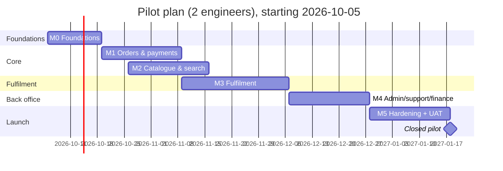

# Delivery Plan

Status: Draft v0.2 · Updated 2026-09-27 · Parent: [BLUEPRINT](BLUEPRINT.md)

> **Superseded for the GitHub release.** This document plans a real launch (team, pilot, merchants). With the project now published on GitHub only, the active plan is [IMPLEMENTATION_PLAN.md](IMPLEMENTATION_PLAN.md) (G0–G8, one developer, test mode). This document is kept as design exploration.

## 1. Team (assumed for the estimates)

| Role | Allocation | Responsibilities |
|---|---|---|
| Engineer A (backend/payments lead) | 100% | Payments, orders, ledger, webhooks, security |
| Engineer B (full-stack/frontend lead) | 100% | Storefront, merchant console, admin UI, catalogue pipeline |
| Product/founder | 50% | Scope, merchant relationship, UAT, legal/finance coordination |
| Designer | 25% (M1–M3) | Checkout, merchant console, receipts |
| Accountant / lawyer | as needed | Tax (B3, ADR-0009), merchant agreement, Terms/Privacy, CPA review |

With one engineer, multiply the durations by roughly 1.8. There's less parallelism, and money-critical code needs a second reviewer, so plan an external reviewer for payments PRs.

## 2. Milestones

The ticket-level breakdown of these milestones (phases P1–P10, with IDs, files, acceptance criteria and gates) is in [IMPLEMENTATION_PLAN.md](IMPLEMENTATION_PLAN.md). Mapping: M0 = P1, M1 = P2, M2 = P3, M3 = P4, M4 = P5, M5 = P6 + P7.

Estimates are in engineer-weeks (ew), with ±30% uncertainty. Each milestone ends in a demo and is closed only when its exit criteria are met.

### M0 Foundations: weeks 1–2 (≈ 4 ew)
- Repo hygiene: delete the stray `web/summerhill-commerce/web/`, `__pycache__`, template seed; `.gitignore`; decide on the repo name
- `infra/docker-compose.yml` (Postgres, search, Stripe CLI); a real `.env.example`; zod-validated config
- Rotate the leaked DB password; secret manager for staging
- Migration runner + migrations 001–00n (catalog, merchant, ops); retire `schema.sql`
- Module skeleton + boundary lint rules
- `middleware.ts`, `authorize()`, route policy registry; lock down all existing admin routes (GAP-01)
- Server-side pricing in the existing checkout (GAP-02) as an interim fix
- Move Stripe test fixtures out of runtime code (GAP-08); SQL allow-list (GAP-09); zod everywhere (GAP-10)
- CI: lint, typecheck, unit, integration (Testcontainers), gitleaks, audit; preview deployments
- ADRs 0002–0011 reviewed; business questions B1–B8 have owners and dates

**Exit:** a fresh clone runs in < 15 min; CI green and required; no unauthenticated admin/money route; the authz matrix test exists.

### M1 Orders and payments core: weeks 3–5 (≈ 6 ew)
- `commerce`/`finance` schemas: carts, orders, order_lines, order_events, payments, refunds, ledger, fee_schedules
- Server cart + merge; one-merchant rule; quote engine (promos, deposits, HST, weight buffer, fee)
- Job system (pg-boss) + outbox + worker deployable
- Checkout v2: quote hash, idempotency, `pending_payment` order, manual capture, `on_behalf_of`, HST line, hold line
- Webhook endpoints (platform + Connect) with the event store; `account.updated` sync
- Capture/void services + ledger writes (capture triggered manually by admin until M3)
- Transactional email (confirmation, cancellation); order status page; guest magic link
- Remove the Payload ecommerce plugin's commerce features and template commerce pages (ADR-0003)
- Rate limits on checkout/login; Radar baseline rules
- Sentry + structured logging

**Exit:** a test-mode order is placed, captured by admin, and appears correctly in the ledger; duplicate webhooks are harmless; the worked example golden test passes.

### M2 Catalogue v2 and search: weeks 4–6, parallel (≈ 3 ew)
- Connector framework (Dagster assets): Summerhill connector with the full canonical model; promotions; category mapping
- Quality rules, quarantine, anomaly guard, `ingest_runs`; delta every 15 min + nightly full
- Image mirroring to object storage + CDN
- Search per ADR-0007: projection, synonyms, facets, fallback; search API v2 + UI filters
- PDP: unit pricing, sale price, tax/deposit indicators, availability days

**Exit:** all 3,150 upstream products are present (vs. 3,100 today) with correct pricing model and tax code; a price change upstream is visible within 15 min; a 50%-drop feed is held.

### M3 Fulfilment: weeks 6–9 (≈ 6 ew)
- Merchant settings (hours, capacity, lead times, closures, pause); slot generation, holds, checkout slot picker
- Merchant console (tablet): queue with sound, accept/reject, auto-reject + escalation, pick session, weights, substitutions, unavailable, complete picking → capture job, handover code
- Substitution preferences at checkout; optional approval by SMS
- SMS provider; "ready" + receipt notifications with HST detail
- Customer cancel before acceptance (void)
- Internal dogfood on staging

**Exit:** a full journey (order → accept → pick with a weight change and a substitution → capture → pickup) works end to end on a tablet, and the final amounts match the golden rules.

### M4 Admin, support and finance: weeks 9–11 (≈ 4 ew)
- Admin console `/ops`: merchants (lifecycle, health, onboarding link), orders (search, timeline), catalogue overrides, ingest runs, flags, audit log viewer
- Refunds with the liability matrix; support issues + auto-approval engine; photo upload
- Disputes: records, alerts, evidence pack
- Payouts: schedule, manual with approval, status sync; new-merchant payout delay
- Daily reconciliation + report; monthly merchant statement; accounting CSV export
- Staff MFA

**Exit:** support can resolve every liability-matrix scenario in the tool; reconciliation runs clean on staging for 5 days.

### M5 Hardening and pilot: weeks 12–14 (≈ 4 ew + pilot)
- Security headers/CSP; external pen test and fixes; ZAP; dependency review
- k6 load tests; resilience drills (Stripe timeout, search down, DB failover); DR restore drill
- Alerts and runbooks complete; on-call rota; status page
- Legal: Terms, Privacy Policy, refund/no-show policy, merchant agreement signed; CASL consent flows
- Live Stripe platform account activated; live webhooks; production environment
- Merchant UAT (2 sessions) → closed pilot (20–50 customers) → public pilot

**Exit:** the [PRD §9](product/PRD.md#9-release-criteria-pilot-go-live-checklist) release checklist is signed off.

### After the pilot: v1.1 (≈ 6–8 weeks)
Delivery through a courier API, merchant #2 (CSV or POS connector), Express onboarding, saved cards, reorder, merchant statements PDF, recall tooling.

## 3. Timeline

The plan allows for the holiday period (late December). Expect lower throughput. The core plan alone gives a public pilot in **February 2027**. With the recommended pilot additions (B9, incl. scanning) and the ≈ 25 d of work found in the completeness audit, it's **≈ 29 March 2027** (options to pull it in: B16). With the optional Christmas pre-order wedge (B11), add ≈ 2 weeks. See [BLUEPRINT §12](BLUEPRINT.md#12-roadmap-summary).

## 4. Risk register

| # | Risk | L | I | Mitigation | Owner |
|---|---|---|---|---|---|
| R1 | No permission to use the merchant's catalogue/API (B1) | M | **H** | Raise in week 1; CSV connector as a fallback; written agreement | Founder |
| R2 | Stripe platform application or live activation delayed/rejected (Custom accounts need extra review) | M | H | Apply in M0; choose Express if possible (ADR-0011); a clear business description | Founder |
| R3 | Tax treatment wrong (HST on goods and commission) | M | H | Accountant review before M1 ends; config-driven | Founder |
| R4 | Store staff don't adopt the console at peak times | M | H | Early design with pickers; UAT; email/phone fallback; auto-reject protects customers | Product |
| R5 | Weighed-item variance exceeds the buffer often | L | M | 15% buffer tuned from pilot data; trim prompt | Eng A |
| R6 | Upstream catalogue stock flag is useless → high unavailability | H | M | Substitutions, "out today" toggle, weekly report; push for an inventory feed | Product |
| R7 | Card-testing attack on launch | M | M | Radar, rate limits, Turnstile, alert | Eng A |
| R8 | Fee-tier cliff causes merchant/business friction (B2) | M | M | Decide early; config supports both | Founder |
| R9 | Scope creep (delivery, multi-merchant carts) before the pilot | H | M | Explicit out-of-scope list; change control through the PRD | Product |
| R10 | Key-person dependency (2 engineers) | M | H | Docs, ADRs, runbooks, pairing on payments | Eng leads |
| R11 | Unit economics negative on small baskets | M | M | Minimum order / service fee (B6); track contribution per order | Founder |
| R12 | Payload template beta instability / upgrade churn | M | L | Pin versions; use Payload only for auth/CMS | Eng B |
| R13 | Holiday period reduces merchant availability for UAT | H | L | Book UAT sessions early | Product |
| R14 | **Channel conflict:** the merchant's current vendor (Homesome) switches on pickup/delivery, making us redundant | M | **H** | Position as complementary (pre-orders, order-ahead, multi-merchant discovery); ask the merchant about their plans in week 1; B10 | Founder |
| R15 | **Commission uncompetitive** for pickup vs. ~6–10% delivery-app pickup rates and a flat SaaS fee | H | H | Prove incremental customers; B10 pricing test; pre-order wedge | Founder |
| R16 | **Merchant concentration:** one merchant = the whole business; marketplace value to shoppers is weak | H | H | LOIs from 3–5 merchants before the public pilot; partnerships hat from M0 | Partnerships |
| R17 | Online grocery demand is small in Canada | M | M | Focus on prepared foods, pre-orders, specialty; modest targets | Product |
| R18 | Part XX / GST-HST platform obligations missed | L | H | Onboarding collects TIN/BN; accountant sign-off in M1; annual filing runbook | Finance |
| R19 | Stripe declines IC+ / card-network features | M | L | Design falls back to weight buffer + second authorisation | Eng A |

L = likelihood, I = impact (L/M/H).

## 5. Ways of working

- **Planning:** 2-week sprints; milestone goals fixed, sprint content flexible. Backlog in GitHub Projects linked to the use-case IDs (S1, M3, A6…).
- **Definition of Ready:** use case ID, acceptance criteria, designs (if UI), open questions answered, test approach noted.
- **Definition of Done:** see [TESTING §6](TESTING.md#6-definition-of-done-per-story).
- **Branching:** trunk-based; short-lived branches; squash merge; conventional commits.
- **Reviews:** 1 reviewer by default; 2 for `payments/`, `payouts/`, `pricing/`, `identity/`, migrations (CODEOWNERS).
- **Releases:** merge → staging automatically; production on approval; migrations before rollout; feature flags for risky changes; release notes generated from commits.
- **Design docs:** any change touching money, auth, PII or a new external integration gets a short design doc/ADR before code.
- **Demos:** end of every sprint, to the merchant from M3 onward.

## 6. RACI (key decisions)

| Decision | Responsible | Accountable | Consulted | Informed |
|---|---|---|---|---|
| Scope / priorities | Product | Founder | Eng leads, merchant | Team |
| Architecture / ADRs | Eng leads | Eng A | Founder | Team |
| Fee model, liability matrix | Founder | Founder | Accountant, merchant | Team |
| Tax treatment | Accountant | Founder | Eng A | Team |
| Security acceptance / go-live | Eng A | Founder | Pen tester | Team, merchant |
| Merchant agreement | Founder | Founder | Lawyer | Eng |

## 7. Immediate next actions (week 1)

1. Founder: email Summerhill Market about catalogue/API/image permission (B1) and the merchant-agreement basics (B7).
2. Founder: book an accountant for B3/ADR-0009; decide B2 and B5.
3. Eng: start M0. The auth guard + server-side pricing PR comes first (a day each).
4. Eng: apply for the Stripe platform / Connect live review early (R2).
5. Product: design session with 1–2 Summerhill pickers on how they fulfil orders today.
