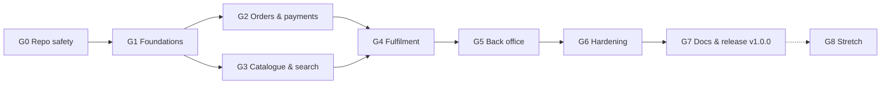

# Implementation Plan: Remaining Phases (GitHub scope)

Status: v2.1 (traceability-audited) · Owner: Pranita Panchal · Updated 2026-09-29 · Parent: [BLUEPRINT](BLUEPRINT.md)

> **Scope decision (2026-09-27):** this project is published **on GitHub only**, as a professional reference implementation of a grocery marketplace. It isn't operated as a business. It runs entirely in **Stripe test mode** with **synthetic demo data**, is set up locally with one command, and is judged by code quality, correctness, tests, security hygiene and documentation. This plan replaces the startup launch plan (v1.0).
>
> The market research, business model and compliance analysis in the other documents stay as **design exploration**: they explain *why* the system is built this way. Anything that only matters for a real launch (company set-up, insurance, live payments, real merchants, tax filings, pilot) is listed in [§ Out of scope](#out-of-scope-for-the-github-release) so it's visibly decided, not forgotten.

> **Working mode: local only (decided 2026-09-27).** All work happens on the local machine. **No commits or pushes to GitHub** until the owner lifts this. Consequences:
> - Every check that would run in GitHub Actions runs locally through `npm run ci:local` (same steps, same order).
> - GitHub-only items (history purge, push protection, branch protection, Actions, releases, project board) are collected in the **[Pre-publish checklist](#pre-publish-checklist-run-before-the-first-push)** and done in one go before the first push.
> - Local git commits are made only when the owner asks for them.
> - **Exposure note:** the public GitHub repo still contains `search_sample.json` (see G0) until the pre-publish purge. Switching the repository to **private** in GitHub settings removes public access without any commit or push. That's the owner's call and one click.

## How to read this plan

- **Completeness is checked, not assumed.** Every requirement in every document is mapped to a work item or an explicit decision in [TRACEABILITY.md](TRACEABILITY.md); `node docs/tools/check-docs.mjs` fails if anything is unmapped or a reference is broken.
- **Phases run in order.** Each ends with a **gate**: a checklist that must pass before the next phase starts.
- **Work item IDs** (`G2-07`) are used as GitHub issue titles and in commit messages (`feat(G2-07): …`). One GitHub milestone per phase.
- **★ = core track.** The core items alone produce a complete, working system (≈ 108 days). Unstarred items make it "full" (≈ 157 days total). Totals are the sums of the item estimates below. If time runs short, ship the core track and list the rest as roadmap in the README.
- **Estimates** are in developer-days (**d**) for **one developer**, including tests and docs, ±30%.
- **Paths** are relative to `web/summerhill-commerce/` unless they start with `/` (repo root).
- **Definition of Done** for every item:
  - tests written, and `npm run ci:local` green
  - lint and typecheck clean
  - docs/ADR updated if behaviour or a decision changed
  - no secrets and no real merchant data
  - item ticked in the [tracking table](#tracking)
  - (issue/PR links apply once work moves to GitHub)

## Phase overview

| Phase | Name | Goal | Core / full effort |
|---|---|---|---|
| **G0** | **Public-repo safety** (urgent) | Nothing confidential or unsafe in the public repo or its history | 2 d / 2.5 d |
| **G1** | Foundations | Safe, reproducible, one-command setup, CI-guarded | 12 d / 16.5 d |
| **G2** | Orders & payments core | Correct orders, auth-then-capture, webhooks, ledger (test mode) | 31 d / 35 d |
| **G3** | Catalogue & search | Synthetic + opt-in real connector, full product model, search v2 | 14.5 d / 21 d |
| **G4** | Fulfilment (merchant console) | Accept → pick → weigh/scan → replace → capture → handover | 27.25 d / 36.5 d |
| **G5** | Back office & finance | Refunds, disputes, payouts, reconciliation, audit (test mode) | 14 d / 28 d |
| **G6** | Quality, security & observability | Hardened, measured, accessible | 3.5 d / 9.5 d |
| **G7** | Documentation, demo & release | README, screenshots/GIF, demo script, v1.0.0 release | 4 d / 8 d |
| **G8** | Stretch showcases (optional) | 1–2 advanced features that show depth | – / pick (all 7 ≈ 34.5 d) |
| | **Total (G0–G7)** | **116 work items (+7 stretch)** | **≈ 108 d core / ≈ 157 d full** |

At about 4 productive days a week, the core track is roughly **27 weeks** (≈ 6.5 months) and the full track roughly **39 weeks** (≈ 9 months). These totals come from the traceability audit (v2.1), which added 18 work items for requirements the v2.0 plan had silently dropped. Money-critical items (G2, G4-13, G5-04/05) dominate. They are the showcase, so don't cut them; cut unstarred items instead.

---

## G0 — Public-repo safety (do first)

**Why first:** the repository is **already public** (`github.com/pranitap123/summerhill-commerce-platform`).
- `search_sample.json` (committed in `f3cd3e1`) contains **the merchant's 30-day in-store and online sales volumes for 100 products**: confidential business data obtained through their API.
- No API keys or Stripe keys were found in the history (scan on 2026-09-27).

In local-only mode, G0 splits in two:
- **Now (local):** G0-04 … G0-07, plus the local half of G0-03 (gitleaks pre-commit hook, `.gitignore`), and deleting `search_sample.json` from the working tree.
- **Before the first push:** G0-01, G0-02 and the GitHub half of G0-03. See the [Pre-publish checklist](#pre-publish-checklist-run-before-the-first-push).

| ID | Work item | Acceptance criteria | Est | ★ |
|---|---|---|---|---|
| G0-01 | *(pre-publish)* **Purge `search_sample.json` from all history.** Back up the repo (`git clone --mirror`), run `git filter-repo --path search_sample.json --invert-paths`, force-push **all** branches (`main`, `payload-cms`, `feature/scraper`, `stripe-connect-marketplace`). If the data has been viewed or forked, ask GitHub Support to purge cached views. **Needs the owner's explicit approval: it rewrites public history** | `git log --all -- search_sample.json` is empty locally and on GitHub; every branch re-pushed; collaborators re-clone | 0.5 | ★ |
| G0-02 | *(pre-publish, or locally when the owner asks)* Commit a checkpoint of the Stage 4 work + `docs/` (after G0-01, so it doesn't reintroduce the file) | Clean working tree; one commit per concern | 0.25 | ★ |
| G0-03 | Secret and data guards: enable GitHub **secret scanning + push protection**; add a `gitleaks` pre-commit hook and a CI job; extend `.gitignore` (`*.json` dumps under `/data/`, `.env*`) | A test commit with a fake `sk_test_…` is blocked | 0.5 | ★ |
| G0-04 | **Real data never in the repo:** confirm `scraped.json`/`sample.json` stay ignored; the product images in the demo use placeholders (no hotlinking to the merchant's CDN) | `git ls-files` shows no scraped data; the demo shows no merchant images | 0.25 | ★ |
| G0-05 | **Disclaimer and naming** (B15): README states it's an independent educational project, **not affiliated with or endorsed by Summerhill Market**, and that the demo uses synthetic data. Optionally rename the repo/app to a neutral name (GitHub redirects the old URL) | Disclaimer at the top of the README and in the site footer | 0.25 | ★ |
| G0-06 | `LICENSE` (choose: MIT for open reuse, or "All rights reserved" for a portfolio), `SECURITY.md` (how to report issues) | Files present; license shown on GitHub | 0.25 | ★ |
| G0-07 | Repo hygiene: delete `web/summerhill-commerce/web/` (stray, **older** copy of the onboard route), `/dagster/__pycache__/`. The template seed is **moved to G2-15**: the Payload dashboard, the `[slug]` home page and the `Products` collection import it | Typecheck error count unchanged (baseline: 8 errors in 3 template files); tree is clean | 0.5 | |

**Gate G0 (local):**
- [ ] `search_sample.json` deleted from the working tree and ignored
- [ ] gitleaks pre-commit hook active
- [ ] No real merchant data or images needed to run the app
- [ ] Disclaimer and license files present

**Gate G0 (pre-publish):** see the [Pre-publish checklist](#pre-publish-checklist-run-before-the-first-push).

---

## G1 — Foundations

**Goal:** anyone can clone the repo and run the whole system with one command; CI blocks broken or unsafe changes; the obvious security holes are closed.

| ID | Work item | Key files | Acceptance criteria | Est | ★ |
|---|---|---|---|---|---|
| G1-01 | **One-command local stack** | `/infra/docker-compose.yml` (Postgres 16, Elasticsearch, Mailpit for email, Stripe CLI), `/Makefile` or npm scripts (`dev`, `seed`, `test`) | Fresh clone → `docker compose up` + `npm run dev` → working app in < 15 min, following the README; Node and Python versions pinned (`.nvmrc`, `engines`, `.python-version`) | 1.5 | ★ |
| G1-02 | Validated config | `src/server/config.ts` (zod); rewrite `.env.example` with every variable documented; remove hardcoded credentials in `src/lib/catalogDb.ts`, `src/lib/esClient.ts`, `/scripts/*.js` | App refuses to boot on a missing or invalid variable; no credentials in code | 1 | ★ |
| G1-03 | Migrations | `/db/migrations/001…`, `node-pg-migrate`; fold `004_add_merchants.sql`; retire `/schema/schema.sql` (fixes the FK-violating seed row) | Empty DB → `npm run db:migrate` → full schema; runs in CI | 1.5 | ★ |
| G1-04 | merchant → locations model | migration `005_locations.sql` | Products reference `location_id` | 0.5 | ★ |
| G1-05 | Module skeleton + boundary lint | `src/modules/*`, `src/server/db.ts`, `eslint-plugin-boundaries` | Lint fails on cross-module internal imports | 1 | |
| G1-06 | **Admin auth guard** (GAP-01) | `src/middleware.ts`, `src/server/auth.ts`, route policy registry; move `src/app/admin/merchants` → `src/app/(ops)/ops/merchants` | Anonymous 401 / customer 403 / admin 200 on every admin route | 1.5 | ★ |
| G1-07 | **Server-side pricing** interim fix (GAP-02) | `src/app/api/checkout/route.ts` | Client sends `{productId, qty}` only; the charged amount equals the DB price | 0.5 | ★ |
| G1-08 | Input validation everywhere | zod schemas for `src/app/api/**` | Bad input → 400 with the standard error envelope | 1 | ★ |
| G1-09 | SQL allow-list | `src/lib/connect/merchantDb.ts` | Unknown columns rejected (unit test) | 0.25 | ★ |
| G1-10 | Stripe test fixtures out of runtime code | move KYC/ToS test values to `/test/fixtures/stripe/`; demo routes only when `STRIPE_MODE=test` | No `127.0.0.1` ToS acceptance in runtime code | 0.75 | ★ |
| G1-11 | Error envelope, request id, structured logs | `src/server/http.ts`, pino | `X-Request-Id` on every response; JSON logs with redaction | 0.75 | |
| G1-12 | Time handling | `src/server/time.ts` (`America/Toronto`, stored as UTC) | DST tests for 1 Nov 2026 and 14 Mar 2027 pass | 0.5 | |
| G1-13 | **Synthetic seed data** | `/db/seed/`: ~200 generated products covering every pricing model, tax code, promo, deposit and availability rule; demo users for every role | `npm run db:seed` produces a realistic demo **without any real merchant data** | 1.5 | ★ |
| G1-14 | **CI, local first** | `npm run ci:local` (install check, lint, typecheck, unit, integration against the compose Postgres, migrations, gitleaks, `npm audit`, and `node docs/tools/check-docs.mjs`); `/.github/workflows/ci.yml` written to run the **same script**, but first executed on GitHub at pre-publish; CodeQL + Dependabot configs prepared | `npm run ci:local` green on a clean clone; the workflow file lints locally (actionlint); **fix the ESLint config crash** found in G0 (`TypeError: Converting circular structure to JSON`: ESLint can't lint any file today); fix the 8 baseline TypeScript errors (or remove their files in G2-15) | 1.5 | ★ |
| G1-15 | Money unit tests | `revenueShare.test.ts` boundary table + property test | 100% branch coverage | 0.5 | ★ |
| G1-16 | Authz matrix test harness | `tests/authz/matrix.spec.ts` | Every route has a declared policy, or CI fails | 0.75 | |
| G1-17 | Conventions (branch protection at pre-publish) | `CONTRIBUTING.md` (commit convention, branch naming, DoD); PR/issue templates prepared | Files present; branch protection is on the pre-publish checklist | 0.5 | |
| G1-18 | Postgres schemas + least-privilege DB roles (ADR-0004) | schemas `catalog`, `merchant`, `commerce`, `finance`, `ops`; roles `migrator`, `app_rw`, `ingest_rw`, `readonly`; ledger INSERT-only | App runs as `app_rw`; an UPDATE on the ledger fails (test) | 1 | |

**Gate G1:**
- [x] One-command setup verified from an empty volume (stack → migrations → seed → app, 2026-09-27)
- [x] `npm run ci:local` green: all 10 steps passed on 2026-09-27 (131 unit + integration tests, authz matrix, typecheck 0 errors, lint, format, secret scan, docs, fixture, audit). GitHub Actions + CodeQL follow at pre-publish

**Note for G2 (changes made while closing G1, with the G2 session stopped):**
- `pricing/revenueShare.ts`: narrowed the fee schedule to its flat variant before reading `minCents` (type error)
- `payments/index.ts`: re-exported `postCapture`, `postProcessingFee`, `isBalanced` and the ledger types from `ledgerRules.ts`
- `tests/unit/goldenMoney.test.ts`: typed the shared fixture instead of `as const` (readonly tuple vs `Promotion[]`)
- the interim `api/checkout` route now uses `getPricingProducts`, charges the effective (promo) price, and returns **422 `WEIGHED_ITEMS_NOT_SUPPORTED`** for per-weight items until checkout v2 (G2-07) replaces it
- the integration test uses `unitPriceCents` / `getPricingProducts`
- Prettier formatting applied to six G2 files (whitespace only)
- [x] No unauthenticated admin/money route (authz matrix: 7 admin routes × 3 roles; verified over HTTP with real sessions)
- [x] The demo runs on synthetic data only (219 generated products). Product photos are public-domain/CC0 images from Wikimedia Commons, one per kind of food, never merchant images; credits in `web/summerhill-commerce/public/product-images/CREDITS.md`

### G1 implementation record (2026-09-27)

**Deviations from the plan, and why:**

| Item | Planned | Built | Reason |
|---|---|---|---|
| G1-03 | `node-pg-migrate` | `db/migrate.mjs` (~100 lines): numbered SQL files, one transaction each, advisory lock, checksum guard that refuses edited migrations | Full control over plain SQL, no extra dependency; behaviour covered by integration tests |
| G1-18 / ADR-0004 | Payload in a `payload` schema | Payload in its own `payload` **database** (same server) | Payload's `schemaName` is experimental and breaks on duplicate table names (`categories`). ADR-0004 updated |
| G1-18 | "UPDATE on the ledger fails" | Roles and default privileges done; the ledger INSERT-only test moves to **G2-01** | The ledger table is created in G2-01 |
| G1-05 | `eslint-plugin-boundaries` | ESLint core `no-restricted-imports`, generated per module in `eslint.config.mjs` | The plugin's v7 API changed; the core rule enforces the same boundary with one fewer dependency; covered by a regression test |
| G1-06 | `src/middleware.ts` | `src/proxy.ts` | Next.js 16 renamed the middleware convention to `proxy` |
| G1-10 | Fixtures in `/test/fixtures/stripe/` | `src/modules/merchant/stripeTestFixtures.ts`, every accessor refuses to run outside test mode or in production | The onboarding routes need them at runtime in test mode; ToS acceptance now uses the real request IP and user agent |
| G1-14 | Testcontainers for integration tests | The compose Postgres, with a throwaway database per test run | Docker Compose already provides it; faster and simpler |
| G1-14 | actionlint for workflows | YAML validated locally; actionlint runs on the first GitHub push | actionlint isn't installed locally |

**Problems found and fixed while implementing:**
- The ESLint config crashed; with it fixed, lint surfaced 11 pre-existing React hook errors in template/stage-3 UI. These are handled by an explicit **ratchet list** (`LEGACY_HOOK_RULE_FILES`), not a global disable.
- The 8 baseline TypeScript errors are fixed (typecheck: 0 errors).
- A DST bug in slot generation (duplicate slot on spring-forward day) was caught by a strengthened test and fixed.
- The compose healthcheck reported healthy during Postgres's temporary init server (TCP check now used).
- `node --env-file` can't be used with the Next/Payload CLIs (Node rejects it in `NODE_OPTIONS`) → `scripts/with-env.mjs`.
- `payload run` exits once the script is imported → the seed script uses top-level `await`.
- The shop page crashed on any API error → it now treats errors as "no data" and shows a message.
- The `/ops` layout was invisible (template CSS hides `<html>` until `data-theme` is set).
- Slow disk: Turbopack's dev cache made compiles take minutes → `NEXT_DEV_FS_CACHE=false` in `stack.env`, plus a configurable DB connect timeout.

**Follow-ups assigned to later items:**
- `/ops` 403 page is served with HTTP 200 (Next's `forbidden()` is experimental) → **G5-01**
- search readiness reports `false` until an index exists → **G3-08**
- legacy lint ratchet list shrinks in G2-15, G2-20, G3-10, G3-13

---

## G2 — Orders & payments core (Stripe test mode)

**Goal:** closing the browser after paying still produces a correct, recorded order; money moves through **authorise → capture of the final amount**, with the fee computed at capture and every movement ledgered.

| ID | Work item | Acceptance criteria | Est | ★ |
|---|---|---|---|---|
| G2-01 | Commerce/finance/ops schemas (orders, lines, events, payments, refunds, transfers, ledger, fee_schedules, webhook_events, idempotency_keys, outbox, audit_log, feature_flags) | Constraints enforce cents ≥ 0, enums, uniqueness; **`finance.ledger_entries` is INSERT-only for `app_rw`** (integration test: UPDATE/DELETE fail; moved here from G1-18) | 2 | ★ |
| G2-02 | Prices in integer cents | No float money in `src/modules/**` | 1 | ★ |
| G2-03 | Job queue (pg-boss) + transactional outbox + worker process | Outbox event delivered exactly once; retry and dead-letter path tested | 2.5 | ★ |
| G2-04 | Idempotency keys | Same key + body → same response; different body → 422 | 1 | ★ |
| G2-05 | **Pricing/quote engine** (lines, promos, deposits, HST per line, weight buffer, fee schedules flat and marginal) | **Golden test** reproduces the worked example in [PAYMENTS §9](domains/PAYMENTS_AND_MONEY.md#9-ledger) to the cent; 100% branch coverage | 3 | ★ |
| G2-06 | Server cart (one merchant per cart, merge on login, quote hash) | Cart survives reloads and login; stale quote → 409 | 2.5 | ★ |
| G2-07 | **Checkout v2**: pending order first; Checkout Session with manual capture, destination charge + `on_behalf_of`, HST line, hold line + `custom_text`, `request_overcapture` / `request_incremental_authorization` `if_available` | Order exists before the redirect; session metadata links the order | 2.5 | ★ |
| G2-08 | **Webhooks** (platform + Connect) with raw-body signature check and an event store | Duplicate and out-of-order events harmless; `checkout.session.expired` marks the order abandoned and releases the slot (X5); API version pinned in `src/lib/stripe.ts` with `maxNetworkRetries`; works locally through `stripe listen` | 2.5 | ★ |
| G2-09 | Order state machine with events + outbox | All transitions table-tested; concurrent accept/cancel → one wins | 1.5 | ★ |
| G2-10 | Capture/void + ledger | Capture sets `amount_to_capture` and `application_fee_amount`; stores `capture_before` and card-feature statuses; ledger balances per order | 2.5 | ★ |
| G2-11 | Merchant status via `account.updated` (replaces polling) | Status updates within seconds in test mode | 1 | |
| G2-12 | **Cart and checkout UI v2** (breakdown, hold explained, minimum order, all-in totals) | Matches the quote engine exactly | 2.5 | ★ |
| G2-13 | Order status page + guest magic link + order history | Success page shows the real order after the webhook | 2 | ★ |
| G2-14 | Transactional email through the outbox (to **Mailpit** locally) | Confirmation/cancellation emails visible in Mailpit | 1 | |
| G2-15 | Remove the Payload ecommerce plugin's commerce parts (ADR-0003) | One checkout path; Payload `Products` collection, template seed and template tests removed; `payload-types.ts` regenerated; Payload admin still works for content/users | 1.5 | ★ |
| G2-16 | Rate limits on checkout/login | 429 beyond the limits | 0.5 | |
| G2-17 | Integration tests (checkout → webhook → order → capture) | Run in CI < 8 min with Stripe test mode / stripe-mock | 1.5 | ★ |
| G2-18 | OpenAPI spec generated from zod + contract test | `docs/openapi.yaml` stays in sync | 1 | |
| G2-19 | Auth-expiry guard job | Alerts 48 h before `capture_before` (fake-clock test) | 0.5 | |
| G2-20 | **Customer accounts v2** (S13, S15): sign-up with email verification (Mailpit), password reset with rate limit, account page (profile, default replacement preference), guest lookup `POST /api/v1/orders/lookup` (same response for every input), remove the plugin address pages | Customer sees only their own data (authz rows); lookup can't be used to enumerate orders | 2.5 | ★ |

**Gate G2:**
- [x] Test-mode order survives a closed tab. The order exists before the redirect and the webhook places it with no browser involved (integration test). Also verified live on 2026-09-27; see "Live Stripe test-mode run" below
- [x] Golden money test passes (`tests/unit/goldenMoney.test.ts` reproduces PAYMENTS §9 to the cent)
- [x] Ledger balances on every test order (checked per order in the integration test; an unbalanced journal is rejected by the database at commit)
- [x] Only one checkout path remains (plugin, `/api/checkout` and template checkout removed)

### G2 implementation record (2026-09-27)

**Deviations from the plan, and why:**

| Item | Planned | Built | Reason |
|---|---|---|---|
| G2-03 | pg-boss | `ops.jobs` + `src/modules/ops/jobs.ts`: `SKIP LOCKED` claims, backoff with jitter, `dead` status + `onDead` hook + alert. Outbox relay in the same transaction (exactly-once publication); `ops.processed_events` inbox for consumers | pg-boss needs DDL rights at startup, which `app_rw` doesn't have (ADR-0004); enqueueing in the caller's transaction is simpler. ADR-0008 amended |
| G2-08 | API version pinned in `src/lib/stripe.ts` | `src/modules/payments/stripe.ts` (G1 moved it); webhook secrets `STRIPE_WEBHOOKS_SIGNING_SECRET` + optional `STRIPE_CONNECT_WEBHOOKS_SIGNING_SECRET` | Module boundaries (ADR-0002) |
| G2-08 | "releases the slot (X5)" | The expired-session handler has the hook point; slot holds arrive with **G4-02** | Slots don't exist before G4 |
| G2-17 | Stripe test mode / stripe-mock | A `PaymentGateway` interface; integration tests use an in-memory gateway with test-mode semantics; webhook signatures use Stripe's real algorithm. 52 integration tests in ≈ 15 s | stripe-mock is stateless (it can't authorise then capture); a live key doesn't belong in CI |
| G2-13 | Success page shows the order | Stripe's `success_url` goes straight to `/orders/{publicId}?t=…`, which re-renders every 2 s until the webhook has placed the order; `/checkout/success` was removed | One page to maintain; it reads our record, never Stripe's redirect |
| G2-16 | Rate limits on checkout/login | Postgres fixed-window counters (`ops.rate_limits`) on checkout, order lookup, login, sign-up and password reset (Payload `beforeOperation` hook), plus Payload's per-account lockout (5 attempts / 15 min) | Works across instances; Payload's REST route is generated code |
| G2-12 | Minimum order | `merchant.merchants.min_order_cents` (demo merchant: $15) | Needed a home for the setting |
| (tooling) | – | `POST /api/admin/demo/orders/{id}/fast-forward` (demo only, 404 in production, audited) walks placed → picked, so capture can be demonstrated before the G4 console | Otherwise nothing could reach capture until G4 |

**Problems found and fixed while implementing:**
- The authz/unit test mocks imported `hasRole` from `identity/auth` (it lives in `identity/roles`); this broke typecheck and unit tests before G2 started.
- Idempotent checkout replays broke once the payment had converted the cart (the cart was resolved before the key was checked). The key is now scoped to the caller and checked first.
- Payload's dev schema push stopped at an interactive prompt on existing databases after the plugin removal. Fixed with `npm run payload:cleanup` (see ADR-0003).
- Payload caches its instance, so config changes (email adapter) need a dev-server restart.

**Live Stripe test-mode run (2026-09-27).** The demo merchant was onboarded as a Custom test account, and the Stripe CLI (`npm run stack:up:stripe`) forwarded webhooks to the app and the worker. Order `SH-93AYSP`: the $19.59 hold was authorised with card 4242…; `checkout.session.completed` placed the order and the confirmation email reached Mailpit. After "picking" with weighed items 10% heavier, the worker captured **$19.02** with a **$3.64** application fee (20% of $18.19) and released $0.57. Stripe's API confirmed the manual capture, `on_behalf_of` and the destination transfer. Three Connect `account.updated` events set the merchant to `verified` (G2-11). The ledger balanced, including Stripe's real $1.00 processing fee. Found and fixed during the run:
- Stripe rejects the **whole Checkout Session** when an ineligible platform requests overcapture / incremental authorisation, even with `if_available`. They're now opt-in: `STRIPE_CARD_FEATURES=off|if_available`, default `off` (decision B14: IC+ pricing or Stripe approval). Capture reads availability from the charge either way.
- Stripe rejects `https://example.com` as a business URL; the test fixtures now use Stripe's documented test site `https://accessible.stripe.com` (G1 code).
- The current Stripe CLI requires an explicit `--events` list; added to the compose service and `npm run stripe:listen`.
- A stale `.next` dev cache made existing routes return 404 after routes were deleted; `rm -rf web/summerhill-commerce/.next` fixes it.
- Two flaky tests surfaced in repeated CI runs and were fixed: test browsers now get distinct client IPs (a random-IP collision could hit the checkout rate limit), and the OpenAPI route-import test has the same 60 s timeout as the authz matrix.

**Follow-ups assigned to later items:**
- Customer self-cancel before acceptance → **G4-15** (admin cancel/void exists: `POST /api/admin/orders/{id}/cancel`)
- Stripe processing fee is posted with the capture when the balance transaction is already available; late fees are picked up by reconciliation → **G5-05**
- `x-forwarded-for` is trusted for per-IP limits; correct behind a proxy that sets it, spoofable when the app is exposed directly → **G6-01**
- Storefront product tiles still read the legacy search index's decimal `price` → **G3-08**

---

## G3 — Catalogue & search

**Goal:** a complete, correct product model and good search, fed by a **synthetic connector by default**. A real connector runs only with the user's own credentials and permission.

| ID | Work item | Acceptance criteria | Est | ★ |
|---|---|---|---|---|
| G3-01 | Restructure `/dagster` + `/scripts` into a `/pipeline` package with pytest | `dagster dev` runs; tests in CI | 1 | ★ |
| G3-02 | **Connector interface + `fixture` connector** (synthetic feed, deterministic) | Default pipeline runs with no external calls; the local DB is dropped and re-ingested (old rows keyed by product name are discarded) | 1.5 | ★ |
| G3-03 | `homesome_api` connector (opt-in): env credentials, retries, timeouts, **no spoofed headers**, README note that it needs the data owner's permission | Disabled unless explicitly configured | 1 | |
| G3-04 | Canonical model + normalise (units/per-weight, tax codes, deposits, `avgWeight`, dietary claims, promos, availability days) | Mapping unit tests for every field | 1.5 | ★ |
| G3-05 | Quality rules + quarantine + anomaly guard | Bad rows quarantined; a 50% feed is held | 1.5 | ★ |
| G3-06 | Upsert by `external_id`, soft delete, `source_hash`, `ingest_runs` (replaces `load-data.js`) | Re-run = 0 writes; all fixture rows present | 1.5 | ★ |
| G3-07 | Promotions → effective price in `pricing` | Sale price applied; duplicate-UPC edge case tested | 1 | |
| G3-08 | Search v2 (Elasticsearch kept, since it's already part of the project): mapping, bulk index, alias swap, outbox sync, Postgres fallback | Typos, prefixes, synonyms; p95 < 300 ms locally; ADR-0007 marked Accepted (Elasticsearch) | 2.5 | ★ |
| G3-09 | Search/browse API + UI filters (category, price, organic, on sale, dietary with disclaimer) | Facets correct | 1.5 | ★ |
| G3-10 | PDP v2 (unit price, sale badge, tax/deposit, weighed estimate, availability days) | Matches design; accessible | 1.5 | |
| G3-11 | Catalogue overrides (hide, hidden-until, recategorise) | Survive re-ingest | 0.5 | |
| G3-12 | Retire old ES scripts; schedules in Dagster (delta + nightly) | Old scripts removed; schedules visible in Dagster UI | 0.5 | |
| G3-13 | **Storefront pages v2** on the new APIs: home, shop/category, merchant/location page, **Specials page**, header/footer, loading/empty/error states, responsive layout; ISR tag revalidation on `product.changed`; old-slug 301 redirects | Every storefront page reads only `/api/v1` or module services; Lighthouse mobile check passes; **theme mismatch fixed** (found in G0): the theme provider sets `data-theme="dark"` from the OS while the storefront forces a cream background, so any `dark:` style becomes unreadable. Either support dark mode properly or remove the theme selector | 2.5 | ★ |
| G3-14 | Category taxonomy + per-merchant mapping table + "Specials" virtual category | All fixture source categories mapped; unknown → "Uncategorised" and flagged | 1 | ★ |
| G3-15 | Search analytics: query log (no PII), zero-result and click-position report | Weekly report query works on seeded traffic | 1 | |
| G3-16 | SEO basics: meta via Payload SEO plugin, schema.org `Product`/`Offer` JSON-LD, sitemap, canonical URLs | Rich-results test passes on sample PDPs | 1 | |

**Gate G3:**
- [x] Pipeline runs end to end on synthetic data with no network access (`fixture` connector; `npm run db:setup` and the pytest suite ingest through it)
- [x] Search meets its latency and relevance tests (integration: typos, prefixes, synonyms, stemming, exact match on both engines; p95 < 300 ms for search and browse)
- [x] No real merchant data required to run anything (the only other connector, `homesome_api`, is opt-in and tested against a fake HTTP session)

### G3 implementation record (2026-09-28)

**What was built:**
- `/pipeline` (Python 3.13, Dagster 1.13, psycopg 3): canonical model, `fixture` and `homesome_api` connectors, quality rules with quarantine, anomaly guard with held runs (approve/reject CLI), category mapping with an "Uncategorised" fallback, upsert by `external_id` + `source_hash`, soft deletes, slug history, promotions by UPC, outbox events. 74 pytest tests (18 against real Postgres as `ingest_rw`). Dagster schedules: delta every 15 min 07:00–21:45 ET, full nightly 03:00 ET.
- Migration `006_catalog_v2.sql`: canonical columns, `catalog.product_view` (overrides + visibility), `category_mappings`, `product_overrides`, `product_slug_history`, `ops.ingest_runs`, `ops.ingest_quarantine`, `ops.search_queries`/`search_clicks`, `pg_trgm`, grants (ingest can't write overrides; the app can't write products).
- Search v2 (`src/modules/search`): Elasticsearch mapping/analysers/synonyms, rebuild with alias swap, outbox-driven upserts, Postgres engine for browse and fallback, drill-down facets, analytics with PII redaction and a weekly report.
- API: `GET /api/v1/{categories,merchants,products,products/{slug},search}`, `POST /api/v1/search/clicks`; admin: product overrides, search report, rebuild, ingest runs. OpenAPI regenerated.
- Storefront v2: home, `/shop` (+ search), `/shop/{category}`, `/specials`, `/stores`, `/stores/{merchant}`, PDP v2, header/footer, loading/empty/error states, tagged caching with worker-driven revalidation, JSON-LD, sitemap, robots, canonical URLs.

**Deviations from the plan, and why:**

| Item | Planned | Built | Reason |
|---|---|---|---|
| G3-01 | `dagster dev` runs; tests in CI | `npm run pipeline:*` wrappers over a repo `.venv`; `pipeline:dagster` serves on :3070; unit tests in `ci:fast`, DB tests in `ci:local`; `ci.yml` installs Python | One command per task on every OS; port 3000 is the web app |
| G3-02 | Local DB dropped and re-ingested | Migration 006 backfills `external_id = id`; the fixture connector keeps ids (`DEMO-0001`), so existing carts and orders stay valid. `npm run stack:reset` still gives a clean slate | No data loss for existing local databases |
| G3-02 | Seed loads the catalogue | `db/seed/seed.mjs` creates the merchant/location, then runs the pipeline's fixture connector | One writer of `catalog.products`: the demo seed exercises the real ingest path |
| G3-06 | `last_seen_at` | `last_ingest_run_id` + `deleted_at` | Touching every row on each run would contradict "re-run = 0 writes"; full runs deactivate by absence |
| G3-08 | Search via Elasticsearch | Text search via Elasticsearch; browsing via Postgres (also the fallback); products always hydrated from Postgres | A stale or missing index can never hide products or show stale prices (ADR-0007) |
| G3-11 | Overrides | Data model, read path and admin API (`PUT/DELETE /api/admin/products/{id}/override`) | The console UI for them is G4-20 / G5-14 |
| G3-12 | Old scripts removed | `/dagster` and `/scripts/*.js` are **superseded but not yet deleted** (the deletion needs the owner's go-ahead); nothing references them | Deleting tracked files was held back for confirmation |
| G3-13 | 301 redirects | 308 (Next's `permanentRedirect`); old slugs, legacy `/<id>` and `/products/<id>` URLs, and `/shop?category=<name>` (in `src/proxy.ts`, before rendering) | 308 is the permanent redirect that preserves the method; same SEO effect |
| G3-13 | Storefront reads `/api/v1` or module services | The pre-G3 `/api/products*` and `/api/categories` routes remain as **deprecated aliases** (`Deprecation` + `Link: successor-version` headers) of the v1 services | Old clients keep working; they had uncommitted local changes, so they were rewritten rather than deleted |
| G3-13 | Loading states | Listings stream behind a Suspense skeleton rendered *after* the category/store lookup, not a route `loading.tsx` | A route-level `loading.tsx` starts streaming first, turning 404s and redirects into 200s |
| G3-13 | Theme mismatch | Fixed light theme (`data-theme="light"` on the server, selector removed) | The storefront design is light-only; half-supported dark mode was the bug |
| G3-13 | Lighthouse mobile check | **Not run** (Lighthouse isn't installed locally). Checked instead at 375 px: no horizontal scroll, no duplicate ids, landmarks, skip link, labelled form controls, keyboard-reachable filters | Run `npx lighthouse http://localhost:3000/shop --preset=perf --form-factor=mobile` before G6 sign-off |
| G3-16 | Rich-results test | JSON-LD validated by unit tests against Google's required Product/Offer fields; Google's online test not run | It needs a public URL; covered again in G7 if a hosted demo exists |

**Problems found and fixed while implementing:**
- Trigram similarity 0.4 matched "chips" to "Butter **Chi**cken" (0.5); the fallback threshold is 0.55, which still catches "brocoli", "sourdogh", "salmn".
- `refresh=wait_for` upserts timed out against the 3 s query timeout on a busy machine; bulk writes now have their own 30 s timeout.
- The first revalidation request after a dev-server start timed out while the route compiled; failures are now logged (pages still refresh on their 5-minute timer).
- `robots.ts` inside the `(app)` route group was never served (404); it moved to the app root.
- Four pages rendered a `<main>` inside the layout's `<main>`; the missing favicons were referenced but never shipped.

**Follow-ups assigned to later items:**
- Delete `/dagster` and `/scripts/*.js` (and the root `axios`/`dotenv` dependencies they use) once the owner confirms → before **G7-01**
- Approval UI for held runs and the category-mapping editor → **G5-14**
- Merchant "out of stock today" button on top of `hidden_until` → **G4-20**
- Local `.env` files created from the old template still set `SITE_NAME="Payload Commerce"`; `.env.example` has the demo name

---

## G4 — Fulfilment (merchant console)

**Goal:** the system's showcase. A store worker on a tablet accepts an order, picks it (scanning and weighing), handles replacements, and completes it. The customer is charged **exactly the final amount**.

| ID | Work item | Acceptance criteria | Est | ★ |
|---|---|---|---|---|
| G4-01 | Location settings + console settings screen (hours, slot length, capacity, lead time, **holiday closures**, pause) (M10, M13) | Owner role only; changes audited and affect future slots only | 1.5 | ★ |
| G4-02 | Slot generation + atomic holds + release job | 20 parallel checkouts on a capacity-5 slot → exactly 5 | 2.5 | ★ |
| G4-03 | Slot picker in checkout (lead time, availability days, ≤ 5-day window) | Only valid slots offered; DST days (1 Nov 2026, 14 Mar 2027) produce no duplicate or missing slots | 1.5 | ★ |
| G4-04 | Replacement preferences (best match / up to 3 specific / refund) | Stored per line | 1.5 | ★ |
| G4-05 | Merchant staff roles scoped to merchant/location | Cross-tenant access denied (authz tests) | 1.5 | ★ |
| G4-06 | Console shell (tablet-first PWA): queue, sound, polling, offline banner | New order visible < 30 s | 3 | ★ |
| G4-07 | Accept/reject + auto-reject job (voids the hold) | Auto-reject at 15 min tested with a fake clock | 1.5 | ★ |
| G4-08 | Pick session + pick list | One picker per order | 2 | ★ |
| G4-09 | Line actions: picked qty, weight, unavailable | Weight sanity checks | 2 | ★ |
| G4-10 | Barcode scan-to-verify (camera, UPC) | Wrong item blocked (demo with printed barcodes) | 3 | |
| G4-11 | **Deli-label decoder** (GS1 variable-measure, prefix 2/02 → weight/price) as a pure, well-tested function, wired to the scanner | Test vectors decode correctly | 2 | |
| G4-12 | Replacement flow + "never pay more" rule + live updates to the customer | Customer can reject until picking completes | 2.5 | ★ |
| G4-13 | **Complete picking → capture job** (overcapture if available, else cap) → ready | Final amounts match the golden rules; fee on the final subtotal | 2.5 | ★ |
| G4-14 | "I'm here" check-in + pickup code handover + no-show job | Arrival shown on the console; alternate pickup name shown; wrong code 5× locks the order; handover recorded with staff id | 2 | ★ |
| G4-15 | Customer cancel before acceptance (void) | Hold released; slot freed | 0.75 | ★ |
| G4-16 | Bag labels / pick slip print view | Prints from the browser | 1 | |
| G4-17 | Notifications for ready/rejected/receipt (email via Mailpit) incl. HST detail | Receipt matches the ledger to the cent | 1 | |
| G4-18 | E2E journeys (Playwright): order → accept → weigh → replace → capture → handover; cancel; declined card; 3DS | Green in CI | 2.5 | ★ |
| G4-19 | Buy again + reorder + order rating (1–5 + tags) (S14) | Reorder adds available items and flags unavailable ones; rating stored and visible in /ops | 1.5 | |
| G4-20 | "Out of stock today" toggles for a product and a whole category (M11) | Hidden until the next opening; suggested after an "unavailable" line | 0.75 | |

**Gate G4:**
- [x] The full journey runs end to end in the browser: Playwright (`tests/e2e/fulfilment.spec.ts`, 4 journeys) and a manual walkthrough on 2026-09-28 (order `SH-CHM8SH`: 3-D Secure payment → accept → scan, deli label, out of stock → capture $60.01 → handover). **The README GIF is recorded in G7-01** (screen recording isn't possible from this environment)
- [x] Final charges, fees and ledger are correct on every E2E order: checked to the cent in the integration suite (`tests/integration/fulfilment.test.ts`: capped replacement, deli label, weighed line, fee on the final subtotal, balanced ledger, receipt = ledger) and on the manual run (captured 6001 = final total, fee 863 = 15 % of 5753)

### G4 implementation record (2026-09-28)

**What was built:**
- Migration `007_fulfilment.sql`: `merchant.location_settings` (hours, slot length/capacity, lead time, pause, scale-label layout), `location_closures`, `staff_memberships`; `commerce.slots` + `slot_holds` (counters with a `booked + held <= capacity` CHECK); pickup, acceptance, picking, handover and rating columns on orders; scan/substitution/customer-decision columns on lines; `ops.unrecognised_barcodes`; `catalog.category_availability` and a `product_view` that honours it. Migration `008_payment_simulator.sql` (below).
- `scheduling` module: DST-safe slot planning, generation that only touches future slots and never shrinks below bookings, atomic holds, booking/release wired into `ordering.transition` (placed → book, abandoned/cancelled → release), the release job.
- `fulfilment` module: staff scope (owner ⊃ manager ⊃ picker, location-scoped, 404 across tenants), the console workflow (accept/reject, one picker per order with confirmed takeover, line actions with weight sanity checks, scan-to-verify, GS1 variable-measure decoding, replacements with the "never pay more, all in" rule, complete with an over-authorisation check, handover with lockout and manager unlock), customer actions (cancel, replacement decisions, "I'm here", rating, buy again), "out of stock today" for products and categories, acceptance and no-show sweeps.
- APIs: `/api/console/*` (new `staff` route policy) and `/api/v1/cart/slots`, `/cart/items/{id}/replacements`, `/orders/{publicId}/cancel|substitutions/{lineId}|arrived|rating|reorder`; all in `docs/openapi.yaml`, all in the authz matrix (console routes × anonymous/customer/staff/admin).
- UI: cart slot picker and ranked replacement chooser; order page with pickup time and code, live replacements (approve/reject), cancel, check-in, rating, buy again; the merchant console (`/console`: queue with 10 s polling, chime and offline banner; pick screen with scan bar and camera scanning via BarcodeDetector; settings; out of stock; printable pick slip and bag labels with real EAN-13 barcodes); `/ops/orders` with ratings.
- Emails: confirmation with pickup time and code, ready + receipt (HST per line, released hold, seller and facilitator), store-reject/auto-reject apologies, "we replaced an item".
- Demo staff accounts (`DEMO_OWNER_EMAIL`, `DEMO_PICKER_EMAIL`) and synthetic UPCs in the fixture (restricted-circulation `4…` codes, variable-measure `2…` codes for weighed items; derived from the item number, so no price changed).
- Tests: unit (barcode vectors and properties, slot planning and DST days), integration (30 tests: 20 parallel checkouts on a capacity-5 slot, cross-tenant scope, fake-clock auto-reject and no-show, the whole console journey against real Postgres), E2E (4 Playwright journeys).

**Deviations from the plan, and why:**

| Item | Planned | Built | Reason |
|---|---|---|---|
| G4-02 | 15-min holds | 40-min holds (session + 10 min); a paid order with an expired hold is booked over capacity with an alert | Stripe sessions last ≥ 30 min; see [ORDERS §13](domains/ORDERS_AND_FULFILMENT.md#13-implementation-notes-g4) |
| G4-05 | Staff roles | Memberships in `merchant.staff_memberships` (Payload users stay customers); staff sign in on the storefront, `/console` is a separate root layout | Payload's `/admin` is for platform admins; membership rows scope to merchant/location without touching Payload's schema |
| G4-06 | PWA | Web app manifest, installable, offline banner; no service worker | Order data must never be served stale from a cache; the shell is small |
| G4-07 | Escalation SMS | Ops alert `order.unaccepted` at 10 min | SMS out of scope |
| G4-10 | Demo with printed barcodes | Pick slip prints EAN-13 barcodes (and demo scale labels); camera scanning where the browser has BarcodeDetector; keyboard-wedge scanners type into the scan field | BarcodeDetector isn't in every browser (desktop Chrome/Firefox lack it); scanners and typed codes always work |
| G4-11 | Scale config per merchant | Per location (`scale_barcode`) | Scales belong to a store |
| G4-12 | Customer can reject | Approve/reject on the order page (15 s refresh) + email; unanswered = approved at completion; "specific" replacements are strict | No SMS; see ORDERS §13 |
| G4-13 | Overcapture if available, else cap | As planned, plus a pre-completion check that asks the picker to confirm going over the card hold | Makes "trim the item" the default |
| G4-14 | Alternate pickup name shown | Pickup name shown on the queue and pick screen; the email address never is | Privacy |
| G4-17 | Notifications for ready/rejected/receipt | As planned; the receipt is built from the captured order, so it equals the ledger (integration test) | |
| G4-18 | Playwright with Stripe test mode, "green in CI" | Playwright against the app with the **payment simulator** (`PAYMENT_PROVIDER=simulator`, refused in production): an in-app stand-in for Stripe Checkout that accepts Stripe's test cards (success, decline, insufficient funds, 3-D Secure) and records a `checkout.session.completed` event in the same webhook store | CI has no Stripe account; the hosted Stripe page is slow and flaky to automate. The same test card numbers work on real Stripe. Also lets reviewers run the demo without a Stripe account |
| G4-18 | Browser | Playwright's Chromium, or an installed Chrome/Edge via `PW_CHANNEL` | No browser download was needed locally; CI installs Chromium |
| G4-18 | – | E2E runs against a production build (`build:sim` + `start:sim`, which set `ALLOW_PAYMENT_SIMULATOR=true`; the config otherwise refuses the simulator in production). CI gets a separate `e2e` job | Against the dev server the journeys failed: on-demand compilation stalls the Node process past the 20 s database connect timeout. On the build the 4 journeys take ~1 min |
| G4-19 | Rating visible in /ops | `/ops/orders` (recent orders with ratings; full order search is G5-03) | |
| G4-20 | Category toggle | `catalog.category_availability` + `product_view`; products announced as changed so search and pages refresh | Keeps per-product overrides untouched |
| (tooling) | – | `npm run dev:sim` / `worker:sim`, `scripts/with-env.mjs` takes several env files | Keyless demo and E2E |

**Problems found and fixed while implementing:**
- Logging an unknown barcode inside the pick transaction was rolled back with the error; logging it from a second connection deadlocked on the order row (the FK check waits for the transaction's `FOR UPDATE`). It's now logged after the transaction ends.
- The slot picker overflowed the cart's summary column: a `<fieldset>`'s default `min-width: min-content` stops a scrolling child from shrinking (`min-w-0`).
- The shared `globals.css` makes `<body>` a flex container, so centred console pages shrank to their content; the console layout uses a block body.
- The queue's 10 s poll stacked requests while a slow response was pending; a tick is now skipped while one is in flight.
- The G3 search latency test (p95 < 300 ms) failed at 327 ms when the integration files ran in parallel with the new G4 suite (20 simultaneous checkouts); integration files now run one at a time (`fileParallelism: false`).
- Re-seeding with UPCs queued ~220 storefront revalidation jobs that each time out while the dev server compiles; on a local database they can be marked done (pages refresh on their 5-minute timer anyway).

**Follow-ups assigned to later items:**
- README GIF of the journey → **G7-01**; demo script uses `dev:sim` → **G7-03**
- Service worker / offline queue for console actions → backlog (store operations)
- Refunds after capture, no-show refund policy, support issues → **G5-04**, **G5-11**
- Staff management UI (memberships are seeded) → **G5-15**; MFA for staff → **G5-12**
- SMS channel for escalation and substitution approval → out of scope (see [Out of scope](#out-of-scope-for-the-github-release))

---

## G5 — Back office & finance (test mode)

| ID | Work item | Acceptance criteria | Est | ★ |
|---|---|---|---|---|
| G5-01 | `/ops` console shell with role-based menus | Only staff roles can enter | 1.5 | ★ |
| G5-02 | Merchant management: Connect onboarding (Express or embedded components, test mode), health, go-live gate, pause | Test merchant onboarded end to end in test mode; **offboarding** (pause → no new orders → final payout) works; ADR-0011 updated with the choice | 2 | ★ |
| G5-03 | Order search + full timeline | Any order fully explained on one page | 2 | ★ |
| G5-04 | **Refunds with the liability matrix** (`reverse_transfer` / `refund_application_fee` per liability) + **cancel on behalf** (A7) + role limits (support ≤ $50) | Ledger and statements correct for each liability case; void before capture, refund after; limits enforced (threat T16) | 2.5 | ★ |
| G5-05 | **Daily reconciliation job** + invariant checks + report | Mismatch detected in a seeded fault test | 2.5 | ★ |
| G5-06 | Disputes: test-mode dispute (Stripe dispute test card), alert, evidence pack | Evidence pack includes the handover record | 1.5 | |
| G5-07 | Payouts: schedule, manual payout with second-admin approval (test mode) | Approval rule enforced | 1.5 | |
| G5-08 | Merchant statement (monthly) + CSV export | Matches the ledger | 1.5 | |
| G5-09 | Audit log on every admin write + viewer | 100% of admin mutations audited | 1 | |
| G5-10 | Feature flags / kill switch UI | Checkout off → banner within 30 s | 0.5 | |
| G5-11 | Support issues ("report a problem") + auto-approval rules | Auto-refund within thresholds | 1.5 | |
| G5-12 | Staff MFA (TOTP) for merchant and platform roles (threat T2) | Staff can't reach /ops or the console without a second factor | 1.5 | |
| G5-13 | Merchant-facing sales, fees, payouts and statements view in the console (M12) | Owner role only; figures match the ledger | 1.5 | |
| G5-14 | **Catalogue admin** (A3, A4): ingest runs list with counts/errors, approve or reject a held run, re-run; overrides UI (hide, hidden-until, recategorise) | Held-run approval works end to end on the fixture feed | 1.5 | ★ |
| G5-15 | **Platform user and role management** (A11): invite, change role, deactivate | Every change audited; last admin can't be removed; deactivation ends sessions | 1 | ★ |
| G5-16 | Data retention purge job (X8; [SECURITY §7.1](SECURITY_AND_COMPLIANCE.md#71-data-inventory-and-retention)) | Purges or anonymises past-retention data on a fake clock | 0.5 | |
| G5-17 | Privacy requests: customer data export (JSON) and account deletion/anonymisation ([SECURITY §7.3](SECURITY_AND_COMPLIANCE.md#73-data-subject-requests)) | Orders kept but anonymised; export contains every personal field | 1.5 | |
| G5-18 | Admin metrics page: orders, GMV, conversion, fill rate, accept/pick time, pickup wait, pick accuracy ([PRD §8](product/PRD.md#8-success-metrics)) | Each metric has a written definition; numbers match SQL spot checks | 1.5 | |
| G5-19 | E2E back-office journeys: support refund, admin onboarding (test mode), test-mode dispute | Green nightly | 1 | ★ |

**Gate G5:**
- [x] Every liability-matrix scenario can be demonstrated: `tests/integration/backoffice.test.ts` runs each row of [ORDERS §9](domains/ORDERS_AND_FULFILMENT.md#9-liability-matrix) through the real routes and checks the Stripe calls, the ledger and the statement: missing item, wrong substitute, damaged, quality (merchant: transfer reversal + commission returned), price error (platform expense), goodwill split (refund + partial transfer reversal), auto-rejected or cancelled before capture (void, nobody pays), cancelled after capture (full refund), chargeback with a verified pickup code (fought with the evidence pack, platform bears the fee), merchant-liable chargeback (recovered by transfer reversal), won chargeback (funds reinstated), no-show and changed mind (refused as not refundable)
- [x] Reconciliation catches an injected mismatch: the same suite reconciles a clean day to the cent, then adds 1¢ to a captured payment and a rogue Stripe charge; the run reports `amount_mismatch:charge_amount`, `invariant:capture_split`, `invariant:lines_total` and `unmatched_stripe:charge`, raises the alert, and is clean again once the fault is removed

### G5 implementation record (2026-09-28)

**What was built:**
- Migration `009_back_office.sql`: refunds with scenario, shares and fee refund; `finance.disputes`, `finance.payouts` (four-eyes CHECK), `finance.recon_runs`/`recon_items`; `commerce.support_issues`; `ops.staff_mfa`; `ops.ingest_requests` (for the pipeline); `ops.privacy_requests`; merchant lifecycle columns; audit IP and user agent; new flags; the simulator's back-office record kinds.
- `identity`: platform roles `support` and `finance` next to `admin` (Payload `roles`), the permission map (SECURITY §4.1) and `can()`; TOTP MFA (RFC 6238, encrypted secrets, replay and rate limits, a session-bound cookie); user management over a `UserDirectory` (Payload; in-memory in tests): invite, roles, deactivate (sessions end), reset MFA, store memberships. The route gate checks role, permission and the second factor; `route()` audits every successful admin mutation (a specific entry from the handler or service, else a generic one).
- `payments`: refunds with the liability matrix, cancel on behalf (void before capture, refund after; new `ready → cancelled`), disputes (webhooks, ledger, evidence pack, deadline alerts, recovery, reinstatement), gateway extended for refunds, transfer reversals, Express accounts, balances, payouts, balance transactions and dispute evidence (Stripe, the simulator and the test fake).
- `payouts` (new module): manual payouts with balance check, idempotency and second-person approval above $5,000; `payout.*` webhooks; schedules; Express onboarding; finishing an offboarding with a final payout; daily reconciliation with six invariants; monthly statements from the ledger; monthly close CSV.
- `support` (new): the auto-approval policy engine and support issues; `reporting` (new): order search, the one-page order dossier with a merged timeline, and the metrics with written definitions; `privacy` (new): weekly retention purge, data export and deletion.
- `merchant`: lifecycle (draft → live ⇄ paused → offboarding → offboarded) with the go-live gate and health figures. `catalog`: runs, held-run decisions, re-run requests, the category-mapping editor. Pipeline: `process-requests` command and a Dagster sensor (30 s); `CATALOG_FIXTURE_FRACTION` demo knob.
- APIs: 49 `/api/admin` operations, `/api/v1/status`, `/api/v1/orders/{publicId}/issues`, `/api/v1/me/{mfa,mfa/verify,data,delete-account}`, `/api/console/merchants/{id}/{finance,statements/{month}}`, `/api/simulator/onboarding/{account}`; all in `docs/openapi.yaml` (the contract test now covers `/api/admin` too) and in the authorisation matrix (admin routes × anonymous/customer/support/finance/admin, plus MFA_REQUIRED for every admin and console route).
- UI: `/ops` with a role-based menu: dashboard (alerts and what's waiting), orders + order page (refund and cancel forms, timeline), support issues, merchants + merchant page (onboarding, lifecycle, payouts, statements), payouts (approvals), disputes (evidence pack, submit, liability), reconciliation (runs, mismatches, close export), refunds by agent, metrics, catalogue, users, flags, audit log, privacy. `/mfa` (enrol, verify). Storefront: "Report a problem", refunds on the order page, "Your data" on the account page, the checkout-paused banner. Console: "Sales & payouts" for owners. Simulator: Stripe-hosted onboarding stand-in.
- Emails: refund confirmation, rejected problem report. Worker jobs: `recon.daily`, `disputes.deadlineAlerts`, `retention.purge`.
- Demo: support and finance accounts; staff enrolled with the demo TOTP secret (`npm run demo:totp` prints the code).
- Tests: unit (47: TOTP vectors from RFC 6238, the MFA cookie, the role map, refund amounts and shares with property tests, refund and dispute ledger rules, the support policy, reconciliation matching, business days across DST), integration (54 in `backoffice.test.ts`, against real Postgres as app_rw, plus pytest for the pipeline requests), authorisation matrix (580 cases), E2E (3 journeys in `backoffice.spec.ts`).

**Deviations from the plan, and why:**

| Item | Planned | Built | Reason |
|---|---|---|---|
| G5-01 | `/ops` shell | Staff sign in on the storefront (`/login`), not Payload's `/admin/login`; the menu is filtered by permission | One sign-in page, followed by the second factor; Payload's panel stays the content CMS |
| G5-02 | Express or embedded components | Express with Stripe-hosted Account Links ([ADR-0011](adr/0011-connect-account-type.md), now Accepted). The Custom test-value routes stay as admin-only test tools. New merchants start as hidden drafts | Least compliance burden; bank details never pass through our UI (T14) |
| G5-04 | Ledger on the refund webhook | Posted when Stripe reports `succeeded`: at once for card refunds, else on `refund.updated`; a later failure posts a reversing journal. Split liability = refund + a transfer reversal of the merchant share | Test-mode card refunds succeed synchronously; Stripe's refund API can't reverse only part of a transfer |
| G5-04 | Role limits | Support's $50 limit is cumulative per order; the matrix fixes the liability for its scenarios (staff choose only for goodwill and cancellation) | Stops splitting one refund into several small ones; the matrix is enforced, not advisory |
| G5-05 | Daily at 06:00 | Hourly job, one run per business day after 06:00 Toronto (unique run date); transfers, application fees and payouts are counted, not matched | The worker schedules intervals; those balance lines are destination-charge mechanics, not our records |
| G5-06 | Evidence incl. IP/device at checkout | Not stored in v1; the pack says so. The dispute test card (`4000 0000 0000 0259`) works in the simulator too | Collecting device data needs a consent decision (SECURITY §7) |
| G5-07 | `payout.syncStatus` job | `payout.*` Connect webhooks create or update payout rows; no polling | Webhooks are the source of truth; nothing to poll in test mode |
| G5-08 | Statement matches the ledger | Built from the ledger journals themselves; the integration test compares it with the money tables | Can't drift from the ledger by construction |
| G5-09 | 100% of admin mutations audited | Structural: `route()` writes a generic entry for any successful admin mutation that didn't record a specific one; IP and user agent on every entry | Guarantees coverage for routes added later |
| G5-10 | Banner within 30 s | `/api/v1/status` reads the flag without the cache; the banner polls every 15 s; checkout itself sees a flipped flag within the 30 s cache (at once in the process that flipped it) | |
| G5-11 | Photos | No photo upload | Object storage and malware scanning are real-business concerns ([Out of scope](#out-of-scope-for-the-github-release)) |
| G5-12 | Staff MFA (TOTP) | TOTP for `/ops`, `/console`, `/api/admin`, `/api/console`; Payload's own `/admin` CMS panel isn't behind it yet; no WebAuthn | Follow-up in G6-01; TOTP covers T2 for every money and store action |
| G5-13 | `GET /api/v1/merchant/statements` | `/api/console/merchants/{id}/finance` and `/statements/{month}` (owner only) | Merchant-scoped APIs live under the console surface and its staff policy |
| G5-14 | Approve / re-run from the admin UI | Requests in `ops.ingest_requests`, carried out by the pipeline (Dagster sensor or `npm run pipeline:requests`); reject is direct | The app role can't write the catalogue (ADR-0004) |
| G5-15 | Invite, change role, deactivate | Plus store memberships and MFA reset; deactivation clears Payload's sessions and `deactivatedAt` blocks sign-in | G4 follow-up (staff management) and a lost-device path |
| G5-16 | Retention purge | Also redacts Stripe webhook payloads after 90 days (added to SECURITY §7.1); the 7-year audit-log purge needs a privileged role | The app role can't delete audit rows, by design |
| G5-17 | Admin export/deletion | Plus self-service on the customer's account page | |
| G5-18 | Metrics | Fill rate counts orders by the time they were packed (`picked` event) | Works for every packing path |
| G5-19 | Green nightly | Three Playwright journeys; `ci.yml` gains a nightly schedule (runs once pushed) | Local-only working mode |

**Problems found and fixed while implementing:**
- Stripe's documentation confirmed that a destination charge transfers the full amount and collects the fee back, so a merchant-liable refund reverses the refund amount and returns commission in proportion; the ledger rules and the simulator follow that.
- A refund that fails after succeeding and a won dispute both show up in Stripe's balance history (`refund_failure`, a positive dispute adjustment); without matching them reconciliation reported false mismatches.
- Postgres can't infer a parameter's type in `$1 - interval '1 day'`; cast to `timestamptz`.
- A second report on a partly refunded line claimed 0¢; the claim is now capped by what's left, not reduced by it.
- Test mocks that list only some exports of `@/modules/identity` broke once the gate read `can`/`isPlatformStaff`: the G4 suite's mock now spreads the real module.
- Search-index administration (create, settings, refresh, alias swap) used the 3 s query timeout and timed out in the full integration run on a busy machine; it now has the 30 s budget G3 gave bulk writes.
- A signed-in user sent to `/login?redirect=/ops` was bounced to `/account`, racing the sign-in form's own redirect; the login page now honours the (safe) redirect target, so staff land on the second-factor page.
- The integration test for the scheduled reconciliation depended on the time of day (after 06:00 Toronto the worker's own schedule had already run); it now uses a fixed future day.

**Follow-ups assigned to later items:**
- WebAuthn for staff, and Payload's `/admin` behind the second factor → **G6-01** (session and cookie review)
- Route alerts (disputes due, recon mismatches, failed payouts, the weekly refunds-by-agent review) to a channel → **G6-09**
- A live Stripe test-mode run of refunds, a dispute, a payout and Express onboarding (G2 did this for checkout/capture); the simulator and the test fake cover the code paths today → before **G7-03**
- Issue photos, accounting-system mappings for the close export → backlog

---

## G6 — Quality, security & observability

| ID | Work item | Acceptance criteria | Est | ★ |
|---|---|---|---|---|
| G6-01 | Security headers + CSP (Stripe domains), cookie review | Observatory grade A or better on the local build; `Origin` check on mutating routes (CSRF) | 1 | ★ |
| G6-02 | OWASP ZAP baseline scan in CI (against the compose stack) | No high findings | 1 | ★ |
| G6-03 | Coverage gates: money/state-machine modules 100% branches; overall ≥ 75% | CI enforces them | 0.5 | ★ |
| G6-04 | Accessibility (axe in Playwright; keyboard pass on checkout) | No serious axe violations on key flows | 1 | ★ |
| G6-05 | Resilience tests: Stripe timeout, search down → fallback, worker crash mid-capture | Fallbacks and retries proven; one HTTP client wrapper gives every outbound call a timeout, retry with jitter (idempotent calls only) and a circuit breaker | 1.5 | |
| G6-06 | k6 load script (search, PDP, checkout) + results in the docs | p95 targets met locally | 1 | |
| G6-07 | Lighthouse CI performance budgets | Budgets enforced | 1 | |
| G6-08 | Observability: OpenTelemetry traces + a local Grafana/Jaeger profile in compose (optional) | One checkout traced end to end | 1.5 | |
| G6-09 | Alert rules as code: webhook failures, capture failures, reconciliation mismatch, held ingest run, card-testing signal → admin notification + log alert | Each rule fires in a test | 1 | |

**Gate G6:**
- [x] All scans green: Observatory rules A+ on every page; ZAP baseline 0 High (1 Medium accepted and documented in `infra/zap/rules.tsv`)
- [x] Coverage gates met: money and state-machine files at 100% lines/branches/functions, overall 84% lines (gate 75%), enforced by `npm run test:coverage` in the full `ci:local`
- [x] Accessibility clean on the key flows: 0 serious/critical axe violations on 21 pages; checkout completed with the keyboard alone

### G6 implementation record (2026-09-28)

**What was built:**
- G6-01 `src/server/securityHeaders.ts` + `src/proxy.ts`: per-request CSP nonce (`strict-dynamic`), static headers (HSTS in production, COOP, CORP `same-origin`, Permissions-Policy, frame-ancestors none), Origin/Sec-Fetch-Site CSRF check on mutating routes, `TRUSTED_PROXY_HOPS` for client IPs, Payload `serverURL`/`csrf`/`cors`, auth cookie `SameSite=Lax`, the MFA gate in front of `/admin`, `method="post"` on credential forms. `npm run scan:headers` (local Observatory rules).
- G6-02 ZAP baseline in compose (profile `security`), `npm run scan:zap`, rule file with regression guards (header rules and credentials-in-URL as FAIL).
- G6-03 coverage thresholds in `vitest.config.mts`; `ci:local` full mode runs all projects once with the gates.
- G6-04 `tests/e2e/accessibility.spec.ts` (axe-core, WCAG 2.1 AA; keyboard-only checkout with visible focus).
- G6-05 `src/server/outbound.ts`: one guard for every outbound call (Stripe via its fetch client, Elasticsearch via a guarded connection, SMTP, revalidation): per-attempt timeout, retries with full jitter only for idempotent calls (Stripe writes only with an idempotency key, honouring `Stripe-Should-Retry`), a circuit breaker per dependency with a single half-open trial. Tests: `tests/unit/outbound.test.ts` (13, incl. a local HTTP server for the Stripe client) and `tests/integration/resilience.test.ts` (Stripe timeout and worker crash mid-capture → one capture, one journal), plus the Elasticsearch-hangs case in the catalog suite.
- G6-06 `tests/load/storefront.js` (k6 in compose, profile `load`, `npm run test:load`) with the peak defined in the script; results in [TESTING §2.1](TESTING.md#21-quality-security-and-performance-results-g6-2026-09-28).
- G6-07 `lighthouserc.cjs` (`npm run test:lighthouse`): score, Core Web Vitals and weight budgets, no third-party requests.
- G6-08 `src/server/tracing.ts`: OpenTelemetry (off unless `OTEL_EXPORTER_OTLP_ENDPOINT`), a span per API request and per job, pg and undici instrumentation, trace context carried in the outbox event and the Checkout Session metadata; Jaeger in compose (profile `observability`, `npm run stack:observability`); `tests/integration/tracing.test.ts`.
- G6-09 `src/modules/ops/alertRules.ts`: routes for every alert kind (a unit test fails on an unrouted kind), condition rules (webhook lag/failures, card testing, held ingest runs) in the `alerts.evaluate` job, every alert emailed to its channel (`ALERT_EMAIL_*`) through the outbox; the simulator now reports declined test cards as `payment_intent.payment_failed`, like Stripe. `tests/integration/alerts.test.ts` fires each rule.

**Deviations from the plan, and why:**

| Item | Planned | Built | Reason |
|---|---|---|---|
| G6-01 | CSP with Stripe domains | No Stripe domains needed: Checkout is a redirect, nothing of Stripe's loads on our pages. Fonts self-hosted instead of allowing Google Fonts | Smallest policy; the CSP had been blocking the Google Fonts stylesheet |
| G6-02 | In CI | Local (`npm run scan:zap`, Docker) | Local-only until GitHub is allowed |
| G6-06 | p95 targets met locally | Product pages and errors meet them; search (p95 5.2 s) and checkout (4.4 s) don't on the 8 GB dev machine, where Elasticsearch alone has p95 3.4 s at 6 parallel clients | Hardware-bound; rerun on a CI-class runner before the pilot. **Open** |
| G6-07 | Budgets enforced | Enforced; performance budgets fail on this machine (CPU benchmark 216, 4× throttling). `LHCI_CPU_SLOWDOWN` calibrates it | Same as above. Accessibility, best practices and SEO are 1.0 after the fixes |
| G6-08 | New columns for trace context | Carried in the existing outbox payload (`_trace`, moved into the job by the relay) and in Stripe metadata; no migration | No schema change needed |
| G6-09 | Admin notification + log alert | Email per channel plus the structured log line with `alert.channel`; "checkout failing", "DB" and "ingest stale" stay *(not yet)* in OPERATIONS §3 | Those need metrics the demo doesn't collect |

**Known issue:** `next build` with Turbopack stalls on this machine since the OpenTelemetry packages were added (no CPU, no output after ~4 min, three times); `next build --webpack` builds in ~9 min. Not yet known whether it's the packages or memory pressure (the machine had < 500 MB free).

---

## G7 — Documentation, demo & release

| ID | Work item | Acceptance criteria | Est | ★ |
|---|---|---|---|---|
| G7-01 | **README rewrite**: what it is, disclaimer, architecture diagram, feature list, screenshots + GIF of the fulfilment journey, quick start, test cards, demo accounts, CI badges | A stranger runs the demo from the README alone | 1.5 | ★ |
| G7-02 | Docs pass: mark business sections as design exploration; update ADR statuses; link the docs index from the README | No contradictions between docs and code | 1 | ★ |
| G7-03 | **Demo script** (5-minute walkthrough: browse → checkout with a hold → console pick with a weight change and a replacement → capture → refund → reconciliation) | Rehearsed; also a short screen recording | 1 | ★ |
| G7-04 | `CHANGELOG.md`, semantic version tag **v1.0.0**, GitHub Release with notes | Release published | 0.5 | ★ |
| G7-05 | GitHub Project board: milestones G0–G8, issues from this plan, labels (`core`, `money`, `security`, `good first issue`) | Board reflects reality | 1 | |
| G7-06 | Optional hosted demo (free tiers; test mode only; seeded data reset nightly), **or** a clear "run locally" note | Demo link works, or the decision is documented | 1.5 | |
| G7-07 | Runbooks for a self-hosted deployment: replay a webhook, failed capture, reconciliation mismatch, held ingest run, search rebuild, rotate secrets, restore the DB, privacy request | Each walked through once on the local stack | 1.5 | |

**Gate G7 (release):**
- [ ] v1.0.0 tagged: **pre-publish** (a tag needs the checkpoint commits of G0-02; the GitHub Release needs publication)
- [x] README demo reproducible: the demo script was run end to end on the local stack by its recording (`tests/e2e/demo.spec.ts`), which also produced the README screenshots and GIF
- [ ] All core-track items closed: all built locally except G7-04 (tag and release) and the pre-publish halves of G0

### G7 implementation record (2026-09-29)

**What was built:**
- G7-01 README rewritten: what it is and why (pay for what was packed), disclaimer, GIF of the fulfilment journey, six screenshots (`docs/media/`), feature table, Mermaid architecture diagram, quick start with the simulator, Stripe test mode, test cards, demo accounts, checks, docs entry points. CI badges are left for publication (pre-publish step 8).
- G7-02 docs pass: [docs/README.md](README.md) indexes every document as *current*, *design + current*, *design exploration*, *historical* or *superseded*, and each document's banner says the same. ADR statuses updated (0002, 0004 accepted and implemented, 0004 amended; 0009 accepted for the demo). OPERATIONS §6 links the runbooks.
- G7-03 [DEMO.md](DEMO.md): the 5-minute script (browse → hold → pick with a weight and a replacement → capture → handover → refund → reconcile) with what to say at each step; `tests/e2e/demo.spec.ts` (skipped unless `DEMO_RECORD=1`) plays it, saves the screenshots and a frame of the store window per step; `scripts/demo-media.mjs` turns the frames into the GIF (system ffmpeg, 410 KB). Rehearsed end to end on 2026-09-29 (passed in 9.5 min on the dev machine). Rehearsing found that every E2E run on Windows left its worker behind (teardown didn't wait for `taskkill`); four stray workers starved Postgres. Fixed in `tests/e2e/global-setup.ts`.
- Final verification (2026-09-29, fresh production build): full E2E suite 13/13 (demo skipped by design), including a new test that the monthly close export downloads as a file. It caught one regression-class bug: `/ops` export links used `next/link`, which prefetched the CSV/JSON exports on every view and kept the reconciliation page from ever going idle (the accessibility check timed out); now plain download links. With Elasticsearch stopped, `/shop?q=…` served results from the Postgres fallback and the circuit opened after 3 failures. No worker left behind after two E2E runs.
- G7-04 [CHANGELOG.md](../CHANGELOG.md) with v1.0.0 (unreleased). The tag and the GitHub Release are pre-publish.
- G7-05 `tools/github-board.mjs`: milestones, 123 issues (116 + 7 stretch) with acceptance criteria, labels `core`/`money`/`security`/`good first issue`, finished items closed. Dry run by default; `--apply --repo owner/name` at publication.
- G7-06 decision: **no hosted demo.** A hosted copy needs external accounts (hosting, managed Postgres, Elasticsearch) and a nightly reset, and would be the only thing running outside the local-only working mode; the demo runs locally in a few commands with the payment simulator and no accounts. Documented in the README's Status section.
- G7-07 [runbooks](runbooks/README.md) RB-03…RB-14 and RB-16, each with how it was walked through. Building them exposed three gaps, now fixed:
  - an order in `payment_issue` had no way back: `retryCapture` (same idempotency key, audited) and `npm run ops -- capture:retry`;
  - a failed webhook could only be replayed with SQL: `replayWebhookEvent` (failed or pending events only, audited) and `npm run ops -- webhook:replay`;
  - rotating `PAYLOAD_SECRET` would have locked every staff member out of two-step verification (TOTP secrets are encrypted with a key derived from it): `reencryptMfaSecrets` and `npm run ops -- mfa:reencrypt`.
  Alerts now link to their own runbook, and a unit test fails if a runbook file is missing. Tests: `tests/integration/resilience.test.ts` (RB-03, RB-04), `tests/unit/secretRotation.test.ts`, `tests/unit/alertRoutes.test.ts`.

**Deviations from the plan, and why:**

| Item | Planned | Built | Reason |
|---|---|---|---|
| G7-01 | CI badges | Placeholder comment | Badges need GitHub Actions runs (pre-publish) |
| G7-03 | A short screen recording | A GIF of the store's side (the core of the demo) built from frames, plus screenshots of every other step | Playwright's video needs its own ffmpeg download; frames plus the installed ffmpeg need none, and a GIF of every window would be large for a README |
| G7-04 | Tag v1.0.0, GitHub Release | CHANGELOG only | Local-only mode: no commits, no GitHub |
| G7-05 | Board on GitHub | Script, dry-run verified | Needs GitHub |
| G7-06 | Hosted demo or a documented decision | Decision: run locally | See above |
| G7-07 | Each runbook walked through on the local stack | Live on the local stack: RB-09 (a real open alert), RB-10, RB-11, RB-13 (`PAYLOAD_SECRET`), RB-14 (dump and restore); through integration tests against real Postgres: RB-03, RB-04, RB-06, RB-12, RB-16; read-throughs against the code: RB-05, RB-07, RB-08 and the Stripe/database parts of RB-13 | They need Stripe events, time passing or production infrastructure the local stack doesn't have; each runbook says how it was checked |

---

## G8 — Stretch showcases (optional, pick 1–2 after v1.0.0)

| ID | Showcase | Why it's impressive | Est |
|---|---|---|---|
| G8-01 | **Add items to a placed order** with incremental authorisation (fallback: second PaymentIntent; combined fee) | Advanced Stripe; real grocery need | 5 |
| G8-02 | **Holiday pre-orders** (saved card + authorisation 48 h before pickup, or extended authorisation) | Handles long lead times properly | 6 |
| G8-03 | Promo codes with a funding model (merchant vs. platform, top-up transfers) | Marketplace money-flow depth | 6 |
| G8-04 | Delivery via a **mock courier adapter** (zones, fee, dispatch, tracking events) | Integration design without external accounts | 6 |
| G8-05 | Store credit ledger | Double-entry accounting | 5 |
| G8-06 | Multi-merchant catalogue (a second synthetic merchant + location picker) | Proves the marketplace model | 4 |
| G8-07 | Saved cards + express checkout (Stripe Customer + SetupIntent) (S17); prerequisite for G8-02 | Card saved with consent; reused at checkout | 2.5 |

---

## Pre-publish checklist (run before the first push)

Everything that needs GitHub, done once, in this order, **only when the owner decides to publish**:

1. [ ] Mirror backup of the local repo (`git clone --mirror`)
2. [ ] **G0-01** purge `search_sample.json` from history (`git filter-repo`), verify with `git log --all -- search_sample.json`
3. [ ] **G0-02** local checkpoint commits exist for all finished work (conventional commits, one concern each)
4. [ ] Final local gates: `npm run ci:local` green; gitleaks scan of the **full history** clean; `git ls-files` contains no scraped/real merchant data
5. [ ] Decide the repo name (B15) and visibility; add the disclaimer (G0-05) if not already done
6. [ ] Force-push all branches (or delete obsolete remote branches: `payload-cms`, `feature/scraper`), since history was rewritten
7. [ ] **G0-03** enable secret scanning + push protection; **G1-17** branch protection on `main`
8. [ ] First GitHub Actions run of **G1-14** (CI + CodeQL + Dependabot) green; add README badges
9. [ ] If needed, ask GitHub Support to purge cached views of the removed file
10. [ ] **G7-04/05/06** release tag, project board, optional hosted demo, when G7 is reached

## Backlog after v1.0.0

Valid features, deliberately scheduled after v1.0.0 (disposition **Backlog** in [TRACEABILITY](TRACEABILITY.md)). Re-score before picking any of them up:

| Area | Items |
|---|---|
| Shopper | Frequently bought together; recipe/bundle pages; natural-language search; favourites and shopping lists; back-in-stock notifications; recurring orders; slot pricing and passes; live status + ETA; paid membership |
| Store operations | Pick-path ordering; automatic slot throttling; multi-picker orders; POS/inventory integrations |
| Merchant | CSV catalogue import; self-serve application; AI catalogue enrichment (never allergen/health claims); advanced merchant analytics; merchant quality score |
| Trust & support | Product recall tool (and its runbook RB-15); device fingerprinting and refund-abuse scoring; view-as-customer; bulk support tools; LLM reply drafting |
| Growth & data | Weekly specials email; abandoned-cart reminder; referral programme; waitlist pages; sponsored products; A/B testing; data warehouse; catering/office-lunch discovery |

**Won't build:** loyalty points, pickup lockers, gift cards, product reviews, small-basket fees (drip-pricing rules). Reasons are in [FEATURE_ROADMAP §4](product/FEATURE_ROADMAP.md#4-what-we-will-deliberately-not-build-and-why).

## Out of scope for the GitHub release

Decided and documented, so reviewers see they were considered:

| Item from the startup plan | Why it's out | Where it's discussed |
|---|---|---|
| Live payments, Stripe live activation, IC+ negotiation | Test mode only; no real money | [PAYMENTS](domains/PAYMENTS_AND_MONEY.md) |
| Real merchant onboarding, merchant agreement, catalogue licence, pilot, UAT with store staff | No real merchants | [BLUEPRINT §4](BLUEPRINT.md#4-strategy-what-the-research-means) |
| Company set-up, insurance, HST registration, CRA Part XX filings | No business operations | [SECURITY §7.2](SECURITY_AND_COMPLIANCE.md#72-obligations-canadaontario-to-be-confirmed-by-counsel) |
| Real legal documents (Terms, Privacy, CASL flows) | Placeholder "demo terms" page only | [SECURITY §7](SECURITY_AND_COMPLIANCE.md#7-data-protection-and-privacy) |
| SMS provider, real courier, CDN image mirroring, SEO, analytics consent | Replaced by Mailpit, a mock courier (G8-04) and placeholders | [SYSTEM_DESIGN §9](architecture/SYSTEM_DESIGN.md#9-integrations-catalogue) |
| External pen test, on-call, status page, DR drills in production | No production; replaced by ZAP, CodeQL and resilience tests (G6) | [OPERATIONS](OPERATIONS.md) |
| Using or redistributing the real merchant's data or images | Confidential or third-party; synthetic data instead | G0 |

---

## Tracking

| Phase | Status | Gate | Notes |
|---|---|---|---|
| P0 (Stages 1–4) | ✅ Done | n/a | Stage 4 uncommitted |
| G0 | 🟡 Local part done 2026-09-27 | Local ✅ / pre-publish ⬜ | Done: G0-03 (local hook + scanner), G0-04, G0-05 (README, footer, /terms), G0-06 (LICENSE all rights reserved, SECURITY.md, THIRD_PARTY_NOTICES.md), G0-07. Pending pre-publish: G0-01, G0-02, GitHub half of G0-03 |
| G1 | ✅ Done 2026-09-27 | ✅ 4/4 | `npm run ci:local` fully green (10/10 steps). See the implementation record and the note for G2 under Gate G1 |
| G2 | ✅ Done 2026-09-27 | ✅ 4/4 | All 20 items built; `npm run ci:local` green; live Stripe test-mode run passed. See the G2 implementation record |
| G3 | ✅ Done 2026-09-28 | ✅ 3/3 | All 16 items built; `npm run ci:local` green. See the G3 implementation record (old scripts await deletion) |
| G4 | ✅ Done 2026-09-28 | ✅ 2/2 | All 20 items built; `npm run ci:local` green; E2E journeys green (payment simulator). README GIF moves to G7-01. See the G4 implementation record |
| G5 | ✅ Done 2026-09-28 | ✅ 2/2 | All 19 items built; `npm run ci:local` green; E2E journeys green (payment simulator). See the G5 implementation record |
| G6 | 🟡 Built 2026-09-28 | ✅ 3/3 | All 9 items built; gate met. Open: G6-06/07 performance targets on a CI-class machine (fail on the 8 GB dev box). See the G6 implementation record |
| G7 | 🟡 Built locally 2026-09-29 | 1/3 (+2 pre-publish) | All 7 items built or prepared; tag/release (G7-04) and the board (G7-05) run at publication. See the G7 implementation record |
| G8 | ⬜ | ⬜ | Optional |

Update this table in the PR that closes each gate.
