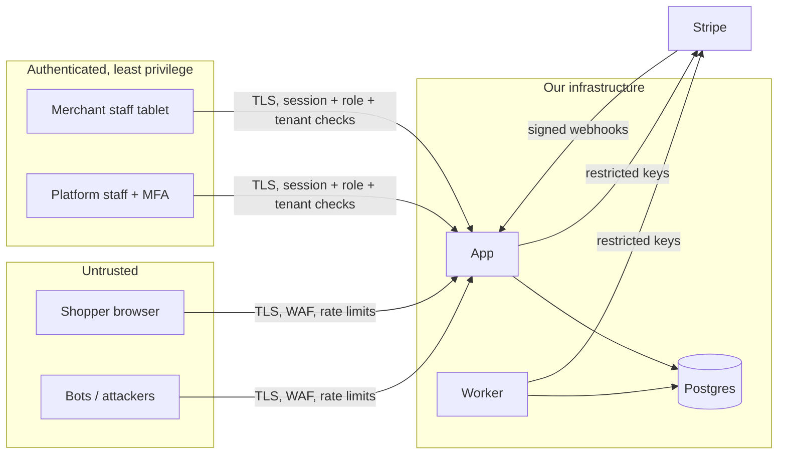

# Security and Compliance

Status: v1.0 · Updated 2026-09-29 · Parent: [BLUEPRINT](BLUEPRINT.md)

> **Design + current** ([documentation index](README.md)). The controls in §3–§6 and §9 are built and scanned (G6). The legal obligations in §7.2 and the production infrastructure in §8 apply to a real launch.
**Legal items are flagged for review by a lawyer/accountant. This document is an engineering plan, not legal advice.**

## 1. What we protect

| Asset | Why it matters | Classification |
|---|---|---|
| Stripe secret keys, webhook secrets | Full control over money | **Secret** |
| Ability to refund, pay out, change payout bank | Direct theft vector | **Critical action** |
| Customer PII (name, email, phone, address, order history) | PIPEDA; trust | **Confidential** |
| Merchant KYC data (Custom accounts: owner DOB, ID documents) | Identity theft; Stripe terms | **Restricted**. Avoid storing it: pass it straight to Stripe |
| Merchant sales and payout data | Commercial confidentiality between merchants | **Confidential** |
| Catalogue | Public, but integrity matters (prices) | Public / integrity-critical |
| Admin and merchant staff accounts | Gateway to all of the above | **Critical** |

We never see or store card numbers (Stripe hosted Checkout).

## 2. Trust boundaries

## 3. Threat model (STRIDE)

| # | Threat | Scenario | Controls | Residual |
|---|---|---|---|---|
| T1 | Spoofing | Forged webhook marks order paid | Signature verification on the raw body, 5-min tolerance, separate Connect secret, event re-fetch for money events | Low |
| T2 | Spoofing | Admin/merchant account takeover (phishing, credential stuffing) | MFA (TOTP/WebAuthn) mandatory for staff; breached-password check; login rate limits; new-device email; session 8 h / idle 30 min | Medium |
| T3 | Tampering | Client changes price, fee or tax | All amounts from `pricing`; checkout accepts only IDs + quantities + quote hash | Low |
| T4 | Tampering | Merchant staff enters a fake weight to inflate the capture | Weight > 150% of estimate requires confirmation; capture ≤ authorisation; per-picker anomaly report | Low |
| T5 | Tampering | SQL injection | Parameterised queries only; column allow-lists for dynamic updates (fix `updateMerchantStatus`); lint rule banning template-literal SQL with `${}` | Low |
| T6 | Repudiation | "I didn't issue that refund/payout" | `ops.audit_log` (actor, IP, UA, request id, before/after), append-only; four-eyes on payouts > $5k | Low |
| T7 | Info disclosure | IDOR: customer reads another's order; merchant reads another merchant's orders | Opaque `public_id`; every query scoped by `user_id` / `merchant_id` from the **session**, never from params; row-level tests in CI | Low |
| T8 | Info disclosure | Secrets in git (already happened: `postgres/password`) | Rotate; secret manager; `gitleaks` pre-commit + CI; `.env*` ignored | Low after rotation |
| T9 | Info disclosure | Verbose errors / stack traces | Error envelope; details only when `NODE_ENV != production`; Stripe messages not echoed | Low |
| T10 | Info disclosure | PII in logs / analytics | Log redaction list; hashed customer ids in analytics; no PII in URLs | Low |
| T11 | DoS | Checkout spam, slot hoarding | Rate limits; hold TTL; max 2 open checkouts per session; Turnstile challenge on anomaly | Medium |
| T12 | DoS / fraud | **Card testing** through checkout | Radar rules; velocity limits per IP/device/email; block after N declines; monitor the decline-rate alert | Medium |
| T13 | Elevation | Customer calls admin/merchant API | `middleware.ts` + per-route `authorize(role, tenant)`; deny-by-default route registry; authz matrix test | Low |
| T14 | Elevation | Merchant staff changes their payout bank | Bank changes happen only in Stripe-hosted flows (Express) or through admin with verification + alert to the owner email | Low |
| T15 | Supply chain | Malicious npm/pip package | Lockfiles; Renovate with review; `npm audit`/`pip-audit`; minimal dependencies | Medium |
| T16 | Insider | Support agent abuses refunds | Role limits, auto-approval caps, weekly refund report by agent | Low |
| T17 | Data poisoning | Upstream feed changes prices wildly | Ingest anomaly guard + quarantine ([CATALOG §4](domains/CATALOG_AND_SEARCH.md#4-data-quality-rules)) | Low |

## 4. Identity and access

### 4.1 Roles and permissions

| Role | Scope | Can | Cannot |
|---|---|---|---|
| `customer` | own data | cart, checkout, own orders, issues | anything else |
| `merchant_staff` | one merchant | order queue, pick, handover, mark unavailable | settings, statements, refunds |
| `merchant_owner` | one merchant | + settings, hours, pause, statements, staff management | payouts bank changes (Stripe-hosted only), refunds |
| `support` | all merchants | read orders/customers, refunds ≤ $50, cancel before capture | payouts, merchant config, flags |
| `finance` | all | refunds any amount, payouts, reconciliation, disputes | user/role admin |
| `platform_admin` | all | everything, incl. roles and flags | skip audit; approve their own payouts > $5k |

Implementation: roles in Payload `users` (`roles[]`, `merchant_id` for merchant roles), checked by a single `authorize(ctx, permission, resource)` helper. Permissions are code constants; the role→permission map is reviewed like code.

*As built (G5):* platform roles `admin` (= platform_admin), `support` and `finance` are Payload `roles`; store roles are `merchant.staff_memberships` (owner ⊃ manager ⊃ picker, G4-05). The permission map is `src/modules/identity/permissions.ts`; every `/api/admin` route declares the permission it needs (`route('admin', …, { permission })`) and the authorisation matrix test runs each admin route as anonymous, customer, support, finance and admin. Support's refund cap is cumulative per order; four eyes on payouts above $5,000 is also a database CHECK (`approved_by ≠ requested_by`).

### 4.2 Authentication

- Customers: email + password (Payload); breached-password check (k-anonymity HIBP API); email verification before saved payment methods (v1.1).
- Staff (merchant and platform): **MFA required**; WebAuthn preferred; SSO later. *As built (G5-12):* TOTP (RFC 6238) for everyone who can reach `/ops`, `/console`, `/api/admin` or `/api/console`. Secrets are AES-256-GCM encrypted at rest; codes are checked with ±30 s of drift, never accepted twice, and rate-limited (5 per 5 min per user). A verified session gets an HttpOnly cookie bound to the Payload session id (8 h), so signing out or ending the session invalidates it. Admins can reset a lost device. WebAuthn and putting Payload's own `/admin` CMS panel behind the second factor are follow-ups (G6).
- Cookies: `HttpOnly; Secure; SameSite=Lax`; CSRF protection through the SameSite cookie + `Origin` check on mutating routes.
- Guest order access: a signed, expiring token (HMAC, 7 days) in email links; the order-lookup endpoint is rate-limited and always returns the same response (no enumeration).
- Merchant tablet: named staff logins (no shared account); a short PIN re-auth on the device for handover actions (P1).

## 5. Application security baseline

- Validation: zod on every input (body, query, params, webhook metadata we read back).
- Output: React escaping; no `dangerouslySetInnerHTML` except the CMS rich text renderer (sanitised).
- Headers: CSP (Stripe domains allowed: `js.stripe.com`, `checkout.stripe.com`), HSTS (preload), `X-Content-Type-Options: nosniff`, `Referrer-Policy: strict-origin-when-cross-origin`, `Permissions-Policy`, `frame-ancestors 'none'`.
- Uploads (issue photos): type sniffing, 5 MB limit, stored privately, served through signed URLs, malware scan.
- Rate limits (Redis/Upstash or DB-backed token bucket):

| Endpoint | Limit |
|---|---|
| login / password reset / order lookup | 5 / min / IP, 20 / hour / account |
| checkout | 5 / min / session, 20 / hour / IP |
| search | 30 / 10 s / IP |
| admin money actions | 30 / min / user |

- Server-side request forgery: no user-supplied URLs are fetched (image mirroring uses the connector's configured base only).

## 6. Fraud and abuse

- **Stripe Radar rules** (start conservative, tune with data):
  - Block if CVC check fails; block if postal-code check fails **and** risk is elevated.
  - Review (hold before acceptance) if risk_level = elevated **or** the first order is > $150.
  - 3DS when requested by the issuer or Radar.
- Velocity:
  - > 3 declined attempts per session → Turnstile challenge
  - > 10 declines per IP per hour → block for 1 h
- **Pickup code verification** is the main defence against "not received" chargebacks; the verification is logged with staff id and timestamp.
- Refund abuse: per-customer refund totals over 90 days feed the auto-approval engine ([ORDERS §10](domains/ORDERS_AND_FULFILMENT.md#10-support-issues)).

## 7. Data protection and privacy

### 7.1 Data inventory and retention

| Data | Where | Retention | Basis |
|---|---|---|---|
| Account (name, email, phone, password hash) | `payload.users` | Until deletion request + 30 days | Contract |
| Guest contact on an order | `commerce.orders` | 7 years (tax/accounting), then anonymised | Legal obligation |
| Orders, payments, ledger | commerce/finance | 7 years | CRA record keeping |
| Issue photos | object storage | 1 year | Legitimate interest |
| Notification log | `ops.notifications` | 1 year (recipient hashed after 90 days) | |
| Audit log | `ops.audit_log` | 7 years | |
| Application logs | log platform | 30 days; no PII | |
| Search analytics | aggregated | 13 months, no PII | |
| Stripe webhook payloads | `ops.webhook_events` | payload redacted after 90 days (the event id, type and status stay) | Legitimate interest |
| Payment simulator records | `ops.payment_simulator` | 90 days (demo/test only) | |
| Staff TOTP secrets | `ops.staff_mfa` | until reset or account deletion; encrypted | Security |
| Privacy request log | `ops.privacy_requests` | 7 years; subject stored as a hash only | Legal obligation |
| Merchant KYC | **Stripe only** | Not stored by us | |

### 7.2 Obligations (Canada/Ontario, to be confirmed by counsel)

| Law / standard | What it means for us | Owner |
|---|---|---|
| **PIPEDA** (still in force; Bill C-27 died Jan 2025; **Bill C-36** tabled 15 Jun 2026, not law) | Privacy policy; consent; access and correction requests (30 days); breach reporting to the OPC and notice to individuals for a "real risk of significant harm"; breach record keeping; **a named privacy officer**. Watch C-36 monthly | Founder (privacy officer) + eng |
| **Competition Act: drip pricing** (Bill C-59, 2024) | Advertised prices must include every mandatory fee except government taxes. No fee may first appear at checkout. Any future slot/service fee is shown before the shopper commits and within the totals | Product + legal |
| **CRA Part XX: digital platform reporting** | We're a reporting platform operator (sale of goods). Collect and verify each merchant's name, address, TIN/BN and jurisdiction; keep yearly totals; file the XML return by 31 January. Excluded sellers need < 30 sales **and** ≤ $2,800. Sellers who refuse their TIN face CRA penalties, so make it a go-live requirement | Finance + eng |
| **GST/HST distribution-platform rules** | Registered merchants collect their own HST through us; the **platform collects for non-registered merchants**. v1 onboards registered merchants only and validates their numbers | Finance + accountant |
| **CASL** | Transactional emails OK; marketing emails need express consent (unticked checkbox, recorded with timestamp), sender identification, unsubscribe within 10 business days | Product |
| **Ontario Consumer Protection Act** (internet agreements) | Clear disclosure of total price, delivery/pickup, cancellation and refund policy before purchase; send a copy of the agreement (the order confirmation). The **CPA 2023** has Royal Assent but isn't in force yet; write plain-language terms now so the switch is cheap | Product + legal |
| **AODA** | Accessibility; target WCAG 2.1 AA | Eng |
| **PCI DSS** | SAQ A (hosted Checkout); annual self-assessment; don't embed our own card fields | Eng |
| **Stripe Connect platform terms** | Accurate KYC; merchant accepts the Connected Account Agreement (real ToS acceptance: date, IP, UA); we're responsible for merchant monitoring | Founder |
| **Food / product safety** | Show allergen/disclaimer text from the merchant; cold-chain handling at pickup; recalls: be able to find every customer who bought a product in a date range (order_lines query + notification template) | Merchant + ops |
| **Alcohol (AGCO)** | Not sold; ingest blocks `isAlcohol` products | Legal |
| **Quebec Law 25** | Not applicable while we serve Toronto only; re-assess before expanding | Legal |

### 7.3 Data subject requests
- Export: JSON of the account, orders and notifications (admin tool, P1).
- Deletion: anonymise the account; keep orders with anonymised contact data for the retention period.
- *As built (G5-16, G5-17):* `/ops/privacy` (admin) and self-service on the customer's account page (download my data, close my account). Deletion anonymises the account (email, name, password, sessions, MFA), the orders' contact fields and issue descriptions; the amounts, lines and ledger stay. Staff accounts must lose their roles and memberships first. The weekly `retention.purge` job applies §7.1; the 7-year purge of `ops.audit_log` needs a privileged role (the app role can't delete audit rows) and is an operations task.

## 8. Infrastructure security

- All traffic over TLS 1.2+; HSTS.
- Database: private networking, TLS, encryption at rest, per-workload roles, no public admin access (bastion or provider console with SSO + MFA).
- Secrets: the platform's secret manager (e.g. Vercel/Doppler/AWS Secrets Manager); never in code, images or logs; rotation runbook; quarterly rotation for DB credentials.
- Backups: PITR 7 days + daily snapshot kept 30 days, encrypted; restore tested quarterly.
- Least-privilege access to cloud consoles; SSO + MFA; access reviews quarterly; offboarding checklist.
- Separate Stripe accounts/keys per environment; live keys readable only by production.

## 9. Secure development lifecycle

| Stage | Control |
|---|---|
| Design | Threat model section required in any design doc touching money, auth or PII |
| Code | Money/auth/PII code owned via CODEOWNERS → 2 reviewers |
| CI | lint (incl. security rules), typecheck, tests incl. authz matrix, `gitleaks`, `npm audit --audit-level=high`, `pip-audit`, CodeQL |
| Pre-launch | External penetration test of storefront, merchant console, admin, webhooks; fix all high/critical |
| Runtime | Sentry, anomaly alerts (decline rate, refund rate, login failures), audit log review weekly |
| Incident | See [OPERATIONS §5](OPERATIONS.md#5-incident-management); breach playbook with the PIPEDA reporting steps |

## 10. Security backlog (ordered)

1. Auth guard on all admin routes and pages (GAP-01)
2. Server-side pricing (GAP-02)
3. Rotate + externalise DB credentials (GAP-05); add `gitleaks`
4. Remove test KYC/ToS fixtures from runtime code (GAP-08)
5. Allow-list columns in `updateMerchantStatus` (GAP-09)
6. zod validation everywhere (GAP-10)
7. Webhook signature verification + idempotent event store
8. Rate limits + Radar rules (GAP-11)
9. Staff MFA
10. Security headers/CSP
11. Audit log
12. Pen test before the pilot
