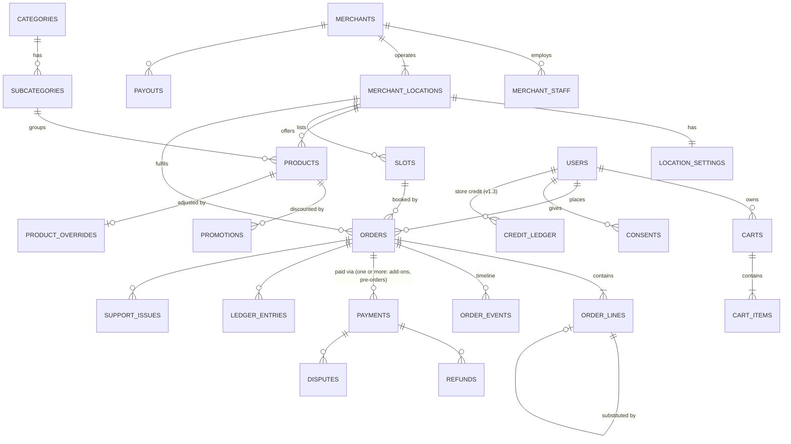

# System Design (to-be)

Status: v1.0 (built in G1–G6) · Updated 2026-09-29 · Parent: [BLUEPRINT](../BLUEPRINT.md)

> **Design + current** ([documentation index](../README.md)). The architecture below is built. Deployment topics (hosting providers, regions, costs) describe a real launch and are design exploration; the demo runs on the local compose stack.
Domain details live in [CATALOG_AND_SEARCH](../domains/CATALOG_AND_SEARCH.md), [ORDERS_AND_FULFILMENT](../domains/ORDERS_AND_FULFILMENT.md) and [PAYMENTS_AND_MONEY](../domains/PAYMENTS_AND_MONEY.md). This document covers the shared structure.

## 1. Design principles

1. **One system of record.** Postgres. Search, caches and Stripe dashboards are views, never the source.
2. **The server decides every number the customer pays.** The client sends IDs, quantities and choices.
3. **Payment outcomes come from Stripe webhooks**, not from redirects.
4. **Anything that moves money** is idempotent, validated, authorised, audited and written to the ledger.
5. **Side effects leave the request path.** Emails, captures and search updates go through the outbox and job queue with retries.
6. **Integer cents, snapshotted.** An order stores the prices, tax and fee that applied when it was made.
7. **Deny by default.** Every route declares who may call it.
8. **Boring and small.** One deployable, one database, managed services. Earn every new moving part.

## 2. Context diagram

```mermaid
flowchart TB
  Shopper((Shopper<br/>web/mobile web))
  Staff((Merchant staff<br/>tablet))
  Admin((Platform admin/support<br/>MFA))
  subgraph Platform [Summerhill Marketplace]
    APP[Next.js + Payload app<br/>storefront · merchant console · admin · APIs · webhooks]
    WRK[Worker process<br/>pg-boss jobs · schedules]
    DAG[Ingest pipeline<br/>Dagster]
    PG[(Postgres)]
    SE[(Search index)]
    OBJ[(Object storage + CDN<br/>product images)]
  end
  Stripe[(Stripe<br/>Checkout · Connect · Radar)]
  Email[(Email provider<br/>Postmark/Resend)]
  SMS[(SMS provider<br/>Twilio)]
  Merchant[(Merchant catalogue source<br/>store API / CSV / POS)]
  Courier[(Courier API<br/>v1.1)]
  Obs[(Sentry · logs · metrics)]

  Shopper --> APP
  Staff --> APP
  Admin --> APP
  APP <--> PG
  WRK <--> PG
  APP --> SE
  WRK --> SE
  APP <--> Stripe
  Stripe -->|webhooks| APP
  WRK --> Stripe
  WRK --> Email & SMS
  DAG --> Merchant
  DAG --> PG & OBJ
  APP & WRK & DAG --> Obs
  WRK -.v1.1.-> Courier
```

## 3. Deployables

| Unit | Runtime | Responsibility | Scaling |
|---|---|---|---|
| **app** | Next.js 15 (App Router) + Payload 3 | Storefront (SSR/ISR), merchant console, admin, REST API, webhook endpoints | Horizontal, stateless |
| **worker** | Node process in the same repo (`src/worker.ts`) sharing module code | pg-boss consumers + cron schedules | 1–2 instances; jobs are idempotent |
| **ingest** | Dagster (Python) | Scheduled catalogue extraction/transform/load | Single; runs are serialised per merchant |
| **Postgres** | Managed (RDS / Neon / Supabase) | System of record, job queue | Vertical; read replica later |
| **Search** | Per ADR-0007 | Product search projection | Managed |

**Why the worker is separate from the app:** serverless request handlers (e.g. on Vercel) can't run long-lived consumers or cron reliably, and webhook handlers must return fast. The worker imports the same domain modules, so there's no duplicated logic.

## 4. Module structure (modular monolith)

```
src/
  modules/
    identity/      users, roles, sessions, MFA, merchant staff membership
    merchant/      merchants, settings (hours, capacity, lead time), Stripe account sync
    catalog/       products, categories, promotions, overrides, availability rules
    search/        query service, projection writer
    pricing/       quote engine: line prices, promos, deposits, tax, weight buffer, fee
    cart/          server carts, validation, merge
    slots/         slot generation, capacity, holds
    ordering/      orders, state machine, timeline, cancellation
    fulfilment/    pick sessions, weights, substitutions, handover
    payments/      Stripe checkout/capture/refund/dispute adapters, ledger
    payouts/       schedules, manual payouts, reconciliation
    notifications/ templates, channels, delivery log
    support/       issues, refund-policy engine
    ops/           outbox, jobs, audit log, feature flags, idempotency
  app/             routes only: thin, call module services
  worker.ts        job registrations
```

**Rules** (enforced with `eslint-plugin-boundaries`):
- `app/` routes call module **services**, never other modules' tables.
- A module reads another module's data only through that module's exported service functions.
- Money calculations exist **only** in `pricing` and `payments`.
- Stripe SDK imports are allowed only in `payments`, `payouts` and `merchant/stripeSync`.

## 5. Data architecture

### 5.1 Postgres schemas and DB roles

| Schema | Owner module(s) | Written by role |
|---|---|---|
| `catalog` | catalog, search | `ingest_rw`, `app_rw` (overrides only) |
| `merchant` | merchant | `app_rw` |
| `commerce` | cart, slots, ordering, fulfilment, support | `app_rw` |
| `finance` | payments, payouts | `app_rw` (ledger INSERT only) |
| `ops` | ops, notifications | `app_rw` |
| `payload` | Payload (users, pages, media) | `app_rw` |
| `pgboss` | job queue | `app_rw` |

Roles: `migrator` (DDL, CI only), `app_rw`, `ingest_rw`, `readonly` (analytics/support SQL), `backup`.

### 5.2 Entity overview



A **merchant** is the legal entity (Stripe account, agreement, statements). A **location** is a physical store (address, hours, slots, catalogue connector). Staff belong to a merchant and can be limited to specific locations. Orders reference both. Pilot: one merchant, one location. The split exists from day one because the upstream catalogue is already per location ([FEATURE_ROADMAP §6](../product/FEATURE_ROADMAP.md#6-build-now-to-make-later-features-cheap) lists the other model choices made now for later features).

Full column-level definitions are in each domain doc. Cross-cutting conventions:
- PK `id bigint generated always as identity`. Public-facing IDs are separate, opaque and non-sequential (`public_id`, e.g. `SH-7K2P9Q`).
- `created_at`, `updated_at timestamptz` on every table; `updated_at` maintained by trigger.
- Money: `*_cents bigint` + `currency char(3)`; `CHECK (x_cents >= 0)` except ledger amounts.
- Enumerations as Postgres `enum` types or `CHECK` constraints, never free text.
- Soft delete (`archived_at`) for business entities; hard delete only for PII purges.
- `ops.webhook_events`, `ops.idempotency_keys`, `ops.outbox`, `ops.audit_log`, `ops.feature_flags`, `ops.ingest_runs`, `ops.notifications`.

### 5.3 Migrations
- `node-pg-migrate`, SQL files, numbered, forward-only, reviewed. Payload manages only the `payload` schema through its own migrations.
- Expand → migrate data → contract, for anything touching live tables.
- CI applies all migrations to an empty DB **and** to an anonymised production snapshot (from M5).

## 6. Asynchronous processing

### 6.1 Transactional outbox
Every state change that has side effects writes an `ops.outbox` row **in the same transaction**:

```sql
BEGIN;
UPDATE commerce.orders SET status='accepted' WHERE id=$1 AND status='placed';
INSERT INTO commerce.order_events(order_id,type,actor,...) VALUES (...);
INSERT INTO ops.outbox(topic, key, payload) VALUES ('order.accepted', $1, '{...}');
COMMIT;
```

A relay job moves outbox rows into pg-boss queues. Consumers are idempotent, keyed by `(topic, key, version)`. Result: no "order saved but email never sent", and no "email sent but order rolled back".

### 6.2 Job catalogue

| Job | Trigger | Idempotency | Retries |
|---|---|---|---|
| `stripe.webhook.process` | webhook insert | `event_id` unique | 10, exp. backoff, then DLQ + alert |
| `notify.send` | outbox | `notification_id` | 5; provider failover for SMS optional |
| `orders.acceptanceSweep` | cron 1 min: escalation alert at 10 min, auto-reject (void) at 15 min after `placed_at` | status check under a row lock | next sweep |
| `payment.capture` | picking completed | Stripe idempotency key `capture:{order_id}` | 5, then page on-call |
| `payment.authExpiryGuard` | cron hourly | status check | alerts at day 5 of 7 |
| `slots.releaseExpired` | cron 1 min | hold status re-checked under a lock | next sweep |
| `slots.generate` | cron hourly, and on every settings/closure change | `UNIQUE (location_id, starts_at)` | next run |
| `orders.noShowSweep` | cron 15 min: `ready` 24 h after the pickup window → `no_show` | status check | next sweep |
| `checkout.expireAbandoned` | Stripe `checkout.session.expired` + cron sweep | | |
| `search.upsertProduct` | outbox `product.changed` | version check | 5 |
| `search.rebuild` | nightly after ingest | alias swap | |
| `recon.daily` | cron hourly; runs once per business day after 06:00 Toronto | unique run date | alert on mismatch |
| `disputes.deadlineAlerts` | cron hourly: 72 h and 24 h before evidence is due | alert dedupe key | next run |
| `payout.syncStatus` | `payout.*` Connect webhooks (no polling) | payout id | webhook retries |
| `retention.purge` | cron weekly (SECURITY §7.1) | idempotent updates/deletes | next run |

## 7. API design

### 7.1 Surfaces

| Surface | Base path | Consumers | Auth |
|---|---|---|---|
| Storefront API | `/api/v1/*` | Our web frontend (and future app) | Public / customer session |
| Merchant API | `/api/console/*` | Merchant console | store staff (a staff membership scoped to a merchant and optionally one location; owner ⊃ manager ⊃ picker) or a platform admin; out-of-scope ids answer 404 |
| Admin API | `/api/v1/admin/*` | Admin console | `platform_admin` / `support` / `finance` + MFA |
| Webhooks | `/api/webhooks/stripe`, `/api/webhooks/stripe-connect` | Stripe | Signature |
| Health | `/api/health`, `/api/ready` | Load balancer, uptime monitor | Public / internal |

Server Components may call module services directly (no HTTP hop). The REST API is for client components and future clients.

### 7.2 Conventions
- JSON; zod-validated requests (unknown keys rejected); an OpenAPI 3.1 spec generated from the zod schemas and checked in (`docs/openapi.yaml`).
- Errors: `{ "error": { "code", "message", "requestId", "details?" } }`. Codes are stable strings (`PRICE_CHANGED`, `SLOT_FULL`, `MERCHANT_PAUSED`, `ITEM_UNAVAILABLE`, `CART_MIXED_MERCHANTS`…).
- Status codes: 400 · 401 · 403 · 404 · 409 (state conflict) · 422 (business rule) · 429 · 503 (dependency not ready) · 500.
- Money in and out: `{ "amountCents": 1099, "currency": "CAD" }`.
- `Idempotency-Key` header required on every mutating endpoint that creates or moves money; stored 24 h with a request hash (a different body with the same key → 422).
- Pagination: cursor-based on admin lists; page/limit on the storefront.
- `X-Request-Id` on every response; propagated to logs, Stripe metadata and jobs.
- Versioning: `/v1`; additive changes only; `/v2` for breaking changes, with 90 days of overlap.

### 7.3 Endpoint catalogue

**Storefront**

| Method | Path | Purpose |
|---|---|---|
| GET | `/api/v1/merchants` · `/{slug}` | Live merchants, hours, next available slot |
| GET | `/api/v1/categories` | Tree |
| GET | `/api/v1/products` | Browse (merchant, category, sort, filters) |
| GET | `/api/v1/products/{slug}` | Detail incl. unit pricing, promo, tax flag, availability |
| GET | `/api/v1/search` | Search with facets |
| GET/PUT | `/api/v1/cart` | Current cart (session or user) |
| POST | `/api/v1/cart/items` · PATCH/DELETE `/{lineId}` | Mutate cart |
| POST | `/api/v1/cart/quote` | Full price breakdown (items, promos, deposits, HST, weight buffer, total hold) |
| GET | `/api/v1/cart/slots` | Available pickup slots for the current cart (lead time, 5-day window, item availability days, capacity) |
| GET | `/api/v1/cart/items/{lineId}/replacements` | Products the customer can rank as specific replacements |
| POST | `/api/v1/checkout` | Validate → hold slot → create order `pending_payment` → Stripe session |
| GET | `/api/v1/orders/{publicId}` | Order status (owner session or signed guest token) |
| POST | `/api/v1/orders/{publicId}/cancel` | Before acceptance |
| POST | `/api/v1/orders/{publicId}/arrived` | "I'm here" check-in |
| POST | `/api/v1/orders/{publicId}/rating` · `/reorder` | Rating after pickup; buy again |
| POST | `/api/v1/orders/{publicId}/substitutions/{lineId}` | Approve/decline |
| POST | `/api/v1/orders/{publicId}/issues` | Report a problem |
| POST | `/api/v1/orders/lookup` | Guest magic link (rate-limited) |
| GET | `/api/v1/me/orders` | History |

**Merchant console**

| Method | Path | Purpose |
|---|---|---|
| GET | `/api/console/locations` | Stores the caller can open, with their role |
| GET | `/api/console/locations/{id}/queue` | Queue (polled every 10 s) |
| POST | `/api/console/orders/{publicId}/accept` · `/reject` | |
| POST | `/api/console/orders/{publicId}/start` | Start picking (one picker per order; takeover must be confirmed) |
| POST | `/api/console/orders/{publicId}/lines/{lineId}` | picked qty / weight / scale label / unavailable / reset |
| POST | `/api/console/orders/{publicId}/lines/{lineId}/substitute` | |
| POST | `/api/console/orders/{publicId}/scan` | What a scanned barcode is for this order |
| POST | `/api/console/orders/{publicId}/complete` | Triggers capture |
| POST | `/api/console/orders/{publicId}/handover` | Pickup code check (5 wrong codes lock; `/unlock` for managers) |
| GET/PUT | `/api/console/locations/{id}/settings` | Hours, slot length and capacity, lead time, pause, scale-label layout; closures under `/closures` |
| PUT | `/api/console/locations/{id}/availability/products/{productId}` | Out of stock today (also `/categories/{categoryId}`) |
| GET | `/api/v1/merchant/statements` | Monthly statements |

**Admin** (all audited): merchants CRUD + Stripe onboarding link + go-live/pause; connector config + ingest runs + re-run; catalogue overrides; orders search + timeline; cancel; refund; disputes + evidence; payouts (schedule, manual with approval); reconciliation reports; users/roles; feature flags; audit log.

## 8. Frontend architecture

- **Storefront:** Server Components for catalogue pages (ISR with tag revalidation on `product.changed`); client components for cart/checkout; the Zustand cart is an optimistic mirror of the server cart.
- **Merchant console:** `/console/*`, tablet-first, large touch targets, works on a flaky network (optimistic updates, retry queue, "offline" banner), new-order sound with a wake-lock, polling every 10 s (SSE later).
- **Admin console:** `/ops/*` (avoids a clash with Payload's `/admin`). Payload admin stays for CMS content only.
- Accessibility: WCAG 2.1 AA (AODA), checked with axe in CI.
- Performance budgets: storefront LCP < 2.5 s on 4G mid-range Android; JS < 200 KB gzip per route.

## 9. Integrations catalogue

| Integration | Purpose | Failure mode → behaviour |
|---|---|---|
| Stripe Checkout/PaymentIntents | Authorise, capture, refund | Down → checkout returns 503 with a friendly message; capture jobs retry |
| Stripe Connect | Accounts, transfers, payouts | Onboarding link errors surface to admin; webhooks resync |
| Stripe Radar | Fraud screening | Rules (§SECURITY) |
| Merchant catalogue source | Products, prices, promos | Down → keep the last good catalogue; alert if stale > 2 h in store hours |
| Email (Postmark/Resend) | Transactional email | Retry; bounce tracking |
| SMS (Twilio) | Ready / substitution / manager escalation | Retry; fall back to email |
| Object storage + CDN | Product images | Serve a placeholder |
| Search service | Search | Fall back to Postgres FTS (degraded flag) |
| Sentry / logs / metrics | Observability | Non-blocking |
| Courier API (v1.1) | Delivery dispatch | Manual dispatch fallback |

Every outbound call: timeout (Stripe 10 s, others 3–5 s), retries with jitter only for idempotent operations, a circuit breaker on search and courier.

## 10. Caching

| What | Where | TTL / invalidation |
|---|---|---|
| Category tree, merchant info | Next data cache | tag `catalog` revalidated after ingest |
| Product pages | ISR | tag `product:{id}` on change |
| Search results | none at pilot (cheap) | |
| Slot availability | never cached | computed live, since capacity changes |
| Cart quote | never cached | prices must be current |

## 11. Configuration and feature flags

- Config from env, validated at boot with zod (the app refuses to start on a missing or invalid variable).
- `ops.feature_flags` (DB-backed, cached 30 s): `checkout.enabled`, `merchant.{id}.accepting_orders`, `sms.enabled`, `substitution_approval.enabled`, `delivery.enabled`.
- Kill switches must work without a deploy.
