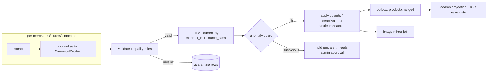

# Catalogue, Pricing Data, Stock and Search

Status: v0.3 (implemented in G3) · Updated 2026-09-28 · Parent: [BLUEPRINT](../BLUEPRINT.md)

## 1. Goals

1. Each merchant's catalogue appears on the marketplace **correctly** (price, promo, tax, unit) and **promptly**: price/promo changes within 15 minutes during store hours.
2. Onboarding merchant #2 means **writing a connector**, not changing the catalogue model.
3. A bad upstream feed can never wipe or corrupt the live catalogue.
4. Search that shoppers trust: finds things with typos, and ranks in-stock and on-sale items sensibly.

## 2. Connector framework



**Connector interface** (Python in Dagster; one module per source):

```python
class SourceConnector(Protocol):
    merchant_id: int
    def extract(self, mode: Literal["full", "delta"]) -> Iterable[dict]: ...
    def normalise(self, raw: dict) -> CanonicalProduct: ...
```

Planned connectors: `homesome_api` (Summerhill's current store API, pending permission **B1**), `csv_upload` (fallback for any merchant), then `shopify`, `square`, `lightspeed` as merchants demand.

**Schedules** (Dagster):
- **Delta** every 15 min during store hours (price, promo, availability).
- **Full** nightly at 03:00 ET (all fields; deactivates missing products).
- **Promotions** refreshed with every delta.

## 3. Canonical product model

Mapping from the upstream fields we observed (sample of 3,150):

| Canonical field | Type | Upstream source | Notes |
|---|---|---|---|
| `merchant_id` | FK | connector | |
| `location_id` | FK `merchant_locations` | connector config (upstream `LOCATION_ID` header) | catalogue, prices and promos are per store location ([FEATURE_ROADMAP §3.1](../product/FEATURE_ROADMAP.md#31-multi-location-merchants-do-the-data-model-now)) |
| `external_id` | text, unique per merchant | `name` (e.g. `091037550460`) | 0 duplicates. **Not** UPC (1 duplicate) and **not** displayName (5 duplicates) |
| `slug` | text unique | derived `displayName` + short hash | stable across renames (keeps old slugs in `product_slug_history` for 301s) |
| `name` | text | `displayName` | |
| `brand` | text | `brand` | |
| `upc` | text | `upc` | not unique |
| `category_id` / `subcategory_id` | FK | `type` / `subType` via **category mapping table** | the platform taxonomy is ours; mapping is per merchant |
| `pricing_model` | enum `each` \| `per_weight` | `unit` (`count` → each; `lb` → per_weight) | 2,887 each · 263 per_weight |
| `unit` | enum `ea` \| `lb` \| `kg` \| `100g` | `unit` | |
| `unit_price_cents` | int | `price × 100` | per each / per lb |
| `sell_by` | enum `quantity` \| `weight` | `sellByQty` | quantity = "3 bananas (≈1.1 lb)"; weight = "1.5 lb of steak" |
| `estimated_weight_per_each` | numeric | `avgWeight` (199 of 263 per-lb items, e.g. bananas 1.5 lb); otherwise a subcategory default, overridable by admin | needed to estimate weighed items and size the hold |
| `dietary_claims` | text[] | `healthClaims` (283 products; 21 claim types: glutenFree, vegan, peanutsFree, kosher…) | filters; always shown with an "as supplied, check the label" disclaimer; a missing claim never means "contains" |
| `source_virtual_category` | text | `virtualCategory` (`specials` on 235) | Specials landing page |
| `weight_step` / `min_weight` | numeric | default 0.25 lb / 0.5 lb | |
| `tax_code` | enum `ZERO_RATED` \| `HST_STANDARD` | `isTaxable` + `taxRate` | 2,200 / 950. Merchant data is authoritative (they're seller of record) |
| `deposit_cents` | int | `bottleFee × 100` | 4 products |
| `is_alcohol` | bool | `isAlcohol` | ingest but **block from sale** unless licensing is resolved |
| `pickup_only` | bool | `isPickupOnly` | matters once delivery exists |
| `min_qty` / `max_qty` | int | `minQuantity` / `maxQuantity` (0 = none) | |
| `available_days` | smallint[] (ISO dow) | `availableDays` | 6 products; slot rules |
| `available_times` | tstzrange[] | `availableTimes` | none now |
| `organic` | bool | `organic` | facet |
| `attributes` / `health_claims` | jsonb | `attributes`, `healthClaims` | facets later |
| `nutrition_label`, `disclaimer` | text | same | show on PDP (allergen/legal) |
| `images` | text[] (our CDN URLs) | `mainImage` → mirrored | |
| `source_status` | enum `listed` \| `unlisted` | `availableToOrder`, `isInStock` | the source's view |
| `is_active` | bool | derived | listed AND not overridden AND not blocked |
| `source_hash` | text | hash of the normalised payload | change detection |
| `last_ingest_run_id` | FK `ops.ingest_runs` | run that last wrote the row | replaces `last_seen_at`: touching every row on every run would break "re-run = 0 writes"; a full run deactivates by absence instead |
| `deleted_at` | timestamptz | full run, product absent | soft delete; never hard-deleted (carts and orders reference products) |

Discarded after review: `isTableSideOnly`, `hasModifiers`, `attachmentsConfig`, `locationInStore` (all empty today; revisit `locationInStore` for pick-path ordering).

### 3.1 Promotions

```
catalog.promotions(id, merchant_id, external_id, product_id, kind 'price_override'|'percent_off',
                   sale_price_cents, label, starts_at, ends_at, source_hash)
```

- Upstream `promotions.items[upc].primary[].salePrice`, keyed by **UPC**, which isn't unique. When the UPC matches more than one product, apply the promo to all of them and log a warning.
- **Effective price** = the lowest active promo price, else the regular price. Computed by `pricing`, never stored on the product.
- Upstream promos have no dates, so treat them as active while present and ended when absent at the next delta.
- The virtual "Specials" category comes from active promos.

### 3.2 Overrides (merchant or admin edits that survive re-ingest)

`catalog.product_overrides(product_id, hidden bool, hidden_until, name, category_id, subcategory_id, estimated_weight_per_each, blocked_reason, updated_by)`

Read path: `COALESCE(override.x, product.x)`, implemented once as the view `catalog.product_view` (which also derives `is_visible`). Ingest never touches overrides: `ingest_rw` has no write grant on the table. Admin API: `PUT`/`DELETE /api/admin/products/{id}/override` (audited, emits `product.changed`).

## 4. Data-quality rules

| Rule | Action |
|---|---|
| Missing `external_id`, `displayName` or `price` | Quarantine row |
| `price <= 0` or `> $2,000` | Quarantine |
| More than 2 decimal places | Quarantine |
| Price changed by more than ±60% vs. the last run | Apply, but flag in the run report |
| Unknown `type`/`subType` (no mapping) | Map to "Uncategorised", flag for admin mapping |
| `is_alcohol = true` | Ingest with `blocked_reason='alcohol_not_licensed'` |
| Image missing or 404 | Placeholder; flag |

**Anomaly guard** (the whole run is held for admin approval if any is true):
- Fetched count < 90% of the last successful run
- More than 10% of active products would be deactivated
- More than 25% of prices changed
- Quarantined rows > 5% of the total

`ops.ingest_runs` stores: counts (fetched, inserted, updated, unchanged, deactivated, quarantined), duration, anomaly flags, approver, errors.

## 5. Stock and availability

**Reality:** the source reports 3,149/3,150 products in stock. It's a *listing* flag, not an inventory count.

**Therefore:**
- We sell "listed" products and discover shortages **at picking** (see [ORDERS §6](ORDERS_AND_FULFILMENT.md#6-picking-weighing-and-substitutions)).
- Merchant staff can mark a product **"out of stock today"** from the console. It's hidden until the next store opening; implemented as an override with `hidden_until`.
- When a picker marks a line unavailable, the console suggests hiding the product for the rest of the day.
- Metric: **line unavailability rate** per product → a weekly report to the merchant. Above 10% overall triggers a request for a real inventory feed.
- No stock reservation in v1 (there are no counts to reserve against).

## 6. Images

- Mirror `IMAGE_BASE/{mainImage}.jpg` into our object storage (`merchant/{id}/products/{external_id}/{hash}.jpg`), and serve through a CDN with `next/image` resizing.
- Re-mirror when the source hash changes; keep the old image until the new one is fetched.
- **Rights:** confirm in the merchant agreement that the merchant licenses its product images and text to us (B1/B7).

## 7. Taxonomy

- The platform category tree is ours (`catalog.categories/subcategories`), versioned in migrations or seed data.
- `catalog.category_mappings(merchant_id, source_type, source_subtype → subcategory_id)`, maintained by an admin, prefilled 1:1 for Summerhill's 16 types.
- Upstream types seen: Dairy & Eggs, Bakery, Canned & Jarred, Produce, Prepared Meals, Frozen Specialties, Meat & Seafood, Deli, Beverages, Snacks & Treats, Health & Baby Care, Household & Cleaning, Dry Goods & Baking, Condiments & Sauces, Giftware & Decor, Miscellaneous.

## 8. Search

### 8.1 Engine
See [ADR-0007](../adr/0007-search-engine.md) (accepted): **Elasticsearch for text search; Postgres (full-text + `pg_trgm`) for browsing and as the fallback**, behind one `SearchService`. Engines return ranked ids; products are always hydrated from Postgres.

### 8.2 Index document (either engine)

`id, merchant_id, merchant_slug, name, brand, category, subcategory, organic, pricing_model, unit, effective_price_cents, on_sale, tax_code, is_active, popularity_30d, image, slug`

### 8.3 Relevance
- Fields and weights: `name^4, brand^2, subcategory^2, category, attributes`.
- Typo tolerance (fuzziness AUTO / trigram similarity ≥ 0.3) and prefix matching for search-as-you-type.
- Synonyms (curated list, versioned): `pop↔soda`, `courgette↔zucchini`, `aubergine↔eggplant`, `ground beef↔minced beef`, `chips↔crisps`, `candy↔sweets`…
- Stemming: English analyser.
- Boosts: on sale (×1.2), popularity (log), exact name match (×3).
- Filters: merchant, category, subcategory, organic, on sale, price range.
- Always excludes `is_active = false`, blocked, and non-live merchants.

### 8.4 Sync
- Near real time: outbox `product.changed` → `search.upsertProduct` job (seconds).
- Nightly full rebuild into a new index/table, verify the count, then swap the alias/view atomically.
- Search analytics: log `query`, result count, clicked position (no PII) → weekly zero-results report → synonyms/mapping fixes.

### 8.5 Performance
p95 < 300 ms end to end; typeahead endpoint p95 < 120 ms; `limit ≤ 50`; query length ≤ 100 characters.
