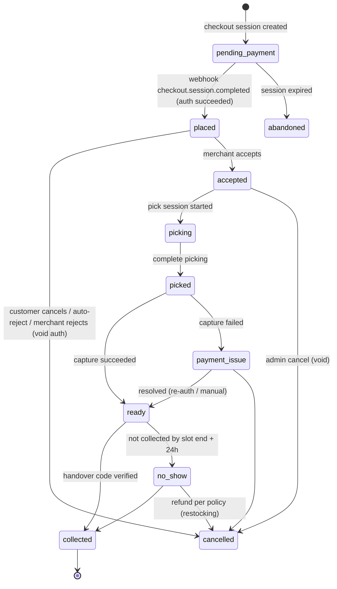

# Cart, Slots, Orders and Fulfilment

Status: v1.0 (built in G4) · Updated 2026-09-28 · Parent: [BLUEPRINT](../BLUEPRINT.md)

This is the part of the system that turns a payment into groceries in a customer's hands. It was built in G4; [§13](#13-implementation-notes-g4) records where the build differs from this design and why.

## 1. Cart

- **Server-side cart** (`commerce.carts`, `commerce.cart_items`): keyed by user id, or by an anonymous signed cookie `cart_id`. The browser store is only a cache.
- **One merchant per cart** in v1 (ADR-0005). Adding an item from another merchant prompts: "Start a new cart? Your cart from X will be saved."
- Line fields: `product_id`, `quantity` (each) **or** `requested_weight` (per-weight, sell-by-weight), `replacement_preference` (`best_match` | `specific` with **up to 3 ranked product IDs** | `refund`, the same three options Instacart uses), `note` (≤ 140 chars, e.g. "green bananas please").
- Validation on every mutation and on quote: product active, merchant live, min/max qty, weight step (0.25 lb), max 50 lines, max 99 per line.
- **Merge on login:** anonymous cart lines are added to the user's cart (max quantity wins on duplicates); if the merchants differ, the more recent cart wins and the other is saved.
- Carts expire after 30 days of inactivity.

## 2. Quote (the price breakdown shown to the customer)

`POST /api/v1/cart/quote` → produced **only** by the `pricing` module:

| Component | Rule |
|---|---|
| Item lines | `each`: qty × effective unit price. `per_weight` sold by weight: requested weight × price/lb. `per_weight` sold by quantity: qty × estimated weight each × price/lb (shown as "est.") |
| Promotions | Effective price per [CATALOG §3.1](CATALOG_AND_SEARCH.md#31-promotions) |
| Deposits | qty × `deposit_cents`; not taxed by us unless the merchant flags it; **not commissionable** |
| HST | Per line: `round_half_up(line_total × 13%)` for `HST_STANDARD`; 0 for `ZERO_RATED` (see [PAYMENTS §5](PAYMENTS_AND_MONEY.md#5-sales-tax-hst)) |
| Weight buffer | +15% of the estimated value of weighed lines (configurable per merchant); shown as a separate "temporary hold for weighed items" |
| Estimated total | items + deposits + HST |
| **Authorisation amount** | estimated total + weight buffer. No substitution buffer is needed: a substitute never costs more than the original line (§6) |

Every quote returns a `quote_hash`. Checkout requires the hash of a quote less than 10 min old. If prices changed since, the client gets `409 PRICE_CHANGED` with the new quote.

## 3. Slots (pickup windows)

**Merchant settings:** weekly hours, slot length (default 60 min), capacity per slot (orders), lead time (default 2 h; 24 h if the cart contains subcategories flagged `needs_lead_time`, e.g. custom cakes), cut-off, holiday closures, `accepting_orders` pause flag.

**Generation:** slots are materialised 7 days ahead by a nightly job: `commerce.slots(merchant_id, starts_at, ends_at, capacity, booked, held)`.

**Available to a cart if:**
- `starts_at ≥ now + lead_time`
- `booked + held < capacity`
- the weekday of `starts_at` is in each item's `available_days` (if set)
- the slot starts **within 5 days** (card authorisations expire after about 7 days; see [PAYMENTS §3](PAYMENTS_AND_MONEY.md#3-authorise-then-capture))

**Holds:** at checkout start, `held += 1` with a 15-min TTL (Stripe Checkout session expiry is also set to 30 min; the hold is extended once on redirect). Paid → `booked += 1`, `held -= 1`. Expired → released by a job. All updates use `UPDATE ... SET held = held + 1 WHERE booked + held < capacity RETURNING`, so there's no overbooking under concurrency.

## 4. Order state machine

Rules:
- Transitions happen only through `ordering.transition(orderId, from, to, actor, reason)`, which uses `UPDATE … WHERE status = from` and writes `order_events` plus the outbox **in one transaction**.
- `order_events` is append-only: `{type, from, to, actor_type (customer|merchant_staff|admin|system|stripe), actor_id, reason, data, at}`. This is the order timeline shown to support.
- Refunds after `collected` don't change the order status; they appear as `refund_status` (`none` | `partial` | `full`).

## 5. Merchant acceptance

- A new order (`placed`) shows on the merchant console queue with sound, and triggers an email to the store's order inbox.
- **Escalation:** at 10 min unaccepted, SMS the store manager. At 15 min, **auto-reject**: void the authorisation, apologise to the customer, count it against the merchant's SLA metric.
- Reject reasons: `too_busy`, `items_unavailable`, `closing`, `other`. Any reject voids the authorisation immediately.
- Merchant `pause` stops new checkouts within 30 s (flag cache TTL). Orders already placed must still be handled.

## 6. Picking, weighing and substitutions

**Pick session:** one picker claims the order (`picker_id`, `pick_started_at`); another picker taking over needs a confirmation. The list is grouped by category (by aisle once `locationInStore` exists).

**Scanning** (target pick accuracy ≥ 98%, the industry best-in-class threshold):
- **Scan-to-verify:** the tablet or phone camera scans the item's UPC. A mismatch with the ordered product (or its accepted replacements) blocks the line with "wrong item?". Scanning is optional per line in the pilot and becomes mandatory once staff are fluent.
- **Deli / meat / cheese labels:** scale-printed labels use **GS1 variable-measure barcodes** (leading `2` or `02`) with the **price or weight embedded**. The console decodes them into actual weight or price, so there's no manual weight entry and fewer typos. The mapping (which digits carry price vs. weight, and the item-code prefix) is configured per merchant scale system during onboarding.
- Unrecognised barcodes are logged per merchant, to fix catalogue UPC gaps.

**Replacement rules** (research: bad substitutions and silence about changes are top complaint categories):
- The picker follows the customer's preference in order: specific choices 1 → 3, else best match (picker's choice), else refund. The console suggests best matches from the same subcategory, sorted by price closeness and (later) past acceptance.
- Every replacement and refund is **pushed to the customer immediately**. The order page lets them approve, reject (→ refund) or pick another option from what the picker scanned, until picking completes.

Per line, the picker records one of:

| Action | Data | Effect on the final amount |
|---|---|---|
| Picked (each) | `picked_qty` ≤ ordered | qty × unit price |
| Picked (weighed) | `actual_weight` (2 dp), from a deli-label scan or manual entry | weight × price/lb, rounded half-up to the cent (or the label's embedded price when the merchant's scale prices it) |
| Substituted | `substitute_product_id`, qty/weight, reason | See the pricing rule below |
| Unavailable | reason | Line total 0 |

**Substitution rules:**
- Allowed only if the customer's preference isn't `refund`.
- **Price rule:** the customer pays the **lower** of the original line estimate and the substitute's actual price (the default promise: "never pay more for a substitute"). The platform fee is computed on what the customer actually pays.
- Substitute must have the same tax code or cheaper-in-total (the system recomputes tax anyway).
- If `substitution_approval.enabled`: the customer gets an SMS link; the picker continues; no answer in 10 min → the preference applies.
- The substitute line is stored as a new `order_line` with `substitutes_line_id` pointing to the original.

**Weight tolerance:** if actual weight > 150% of the estimate, the console asks for confirmation. If the final total exceeds the authorised amount:
1. Capture up to the authorised amount, or up to the overcapture maximum when the card supports it ([PAYMENTS §3](PAYMENTS_AND_MONEY.md#3-authorise-then-capture)).
2. The platform absorbs the difference (small) **or** the merchant trims the item to fit (preferred prompt: "Reduce to ≤ X lb").
3. Never create a second charge without new customer consent.

**Complete picking** → final quote recomputed → `payment.capture` job (see [PAYMENTS §3](PAYMENTS_AND_MONEY.md#3-authorise-then-capture)) → on success the status is `ready` and the customer receives an SMS/email: "Ready for pickup. Final total $X (you were held $Y; the rest is released)."

## 7. Handover

- Each order has a 6-digit **pickup code** (random; shown in the email/SMS and on the order page).
- Staff enter the code or scan the QR → `collected`. Wrong code 5 times → lock and a manager override.
- Chilled/frozen items are held in the fridge; the console shows a "cold items" badge.
- **No-show:** not collected 24 h after the slot ends → `no_show`. Policy: refund minus a restocking fee for non-perishables; perishables are not refunded (disclosed at checkout; needs legal review under the Ontario Consumer Protection Act).

## 8. Cancellations

| When | Who | Money |
|---|---|---|
| `pending_payment` | anyone | nothing charged |
| `placed` (before acceptance) | customer (self-serve), merchant (reject), system (auto-reject), admin | **void authorisation**: no charge, no fee |
| `accepted` / `picking` | admin only (customer via support) | void authorisation |
| After capture (`ready`, `collected`) | admin/support | refund per [PAYMENTS §6](PAYMENTS_AND_MONEY.md#6-refunds) |

## 9. Liability matrix

Decides who pays when something goes wrong. **Needs business sign-off (B4) and must be in the merchant agreement.**

| Scenario | Customer gets | Cost borne by |
|---|---|---|
| Item missing from bag (picker error) | Line refund | Merchant (transfer reversal incl. their share; platform refunds its fee share) |
| Wrong / unacceptable substitute | Line refund | Merchant |
| Damaged / spoiled item | Line refund | Merchant |
| Price displayed wrong due to our bug | Refund of the difference | Platform |
| Customer changed their mind after collection | Nothing (perishables) / per merchant return policy | n/a |
| Auto-rejected order | Full void | Nobody (metric against merchant) |
| Chargeback: fraud (card stolen) | n/a | Platform bears the dispute fee; goods loss → merchant if handed over without a code check, else platform |
| Chargeback: "not received" with a verified pickup code | n/a | Fight with evidence; loss → platform |
| No-show | Per policy | Customer |

## 10. Support issues

- `POST /orders/{id}/issues` within 48 h of `collected`: type (`missing`, `damaged`, `wrong_item`, `quality`, `other`), lines, optional photos (object storage, 5 MB max, virus-scanned).
- **Auto-approval policy engine:** issues ≤ $15 and the customer's 90-day refund total ≤ $30 → auto-refund; otherwise queued for an agent. The thresholds are config.
- Agent view: order timeline, pick records (weights, substitutions, picker), notifications sent, payment objects, previous issues from the same customer.
- Every resolution records `liability` (merchant/platform/customer) for the monthly merchant statement.

## 11. Notifications

| Event | Customer | Merchant | Channel |
|---|---|---|---|
| placed | Confirmation + pickup code + estimated total | New-order alert | email / console + email |
| unaccepted at 10 min | – | Manager escalation | SMS |
| rejected / auto-rejected | Apology + hold released | – | email + SMS |
| substitution needs approval | Approve/decline link | – | SMS |
| ready | Final total + pickup instructions | – | SMS + email (receipt) |
| no-show warning (slot end) | Reminder | – | SMS |
| refund issued | Amount + timing | Statement line | email |

`ops.notifications` logs template, version, recipient (hashed for analytics), provider id, status and error. Templates are versioned in the repo. The receipt includes the merchant's legal name, HST registration number, tax per line and the platform's name as the facilitator.

## 12. Delivery (v1.1 design notes)

- Eligibility by postal-code FSA polygons per merchant; delivery fee by distance band; tip passed 100% to the courier.
- A courier API (Uber Direct / DoorDash Drive) is booked at `ready`; its tracking status feeds `order_events`.
- The delivery fee is a separate line: taxable (HST on delivery), not commissionable (or a separate margin).
- Perishables: max 60 min courier time; merchants use insulated bags; liability for delivery failures is added to the matrix.

## 13. Implementation notes (G4)

Built 2026-09-28 in the `scheduling` and `fulfilment` modules, the merchant console (`/console`) and the customer order page. Where the build differs from the sections above:

| Topic | Design above | As built | Why |
|---|---|---|---|
| Hold lifetime (§3) | 15 min, extended once on redirect | 40 min (Checkout Session lifetime + 10 min); released by the webhook on expiry, by the transition on cancel, or by the 1-minute release job | Stripe's minimum session lifetime is 30 min; a hold shorter than the session could be lost while the customer is still paying. A paid order whose hold did expire is still booked (over capacity, with an alert) |
| Slot capacity changes (§3) | not specified | Future slots only; never below what is already booked + held. A closure deletes empty slots and closes slots that have bookings | Existing orders keep their pickup time |
| Lead time for flagged subcategories (§3) | 24 h for `needs_lead_time` | One lead time per location | No product in the catalogue needs it yet |
| Escalation (§5) | SMS to the manager at 10 min | An ops alert (`order.unaccepted`) and a timeline event | SMS is out of scope (no provider); the alert is the hook |
| Specific replacements (§6) | specific 1 → 3, else best match | Specific means only those products; if none is available the line is marked unavailable (refunded) | "Bad substitutions" are the top complaint; a customer who named products didn't ask for the picker's choice |
| Substitute price rule (§6) | lower of original estimate and substitute | Same, and the substitute can't cost more *all in* (with HST and deposits): a zero-rated item isn't replaced by a taxable one that ends up dearer | "Never pay more" must hold for the total, not only the line |
| Customer approval (§6) | SMS link, 10 min timeout | Order page (refreshes every 15 s) + an email; unanswered substitutes count as approved when picking completes | No SMS; completing picking is the natural deadline |
| Weight tolerance (§6) | > 150 % asks for confirmation | Outside 50–150 % of the estimate asks for confirmation | A far-too-light weight is as likely a typo |
| Over the authorisation (§6) | trim or absorb | The console shows the projected total against the card hold while picking; completing over it needs a confirmation, then capture takes the authorised amount and raises `capture.shortfall` | As designed; the prompt makes trimming the default |
| Scale labels (§6) | per merchant scale system | Per location (`location_settings.scale_barcode`): item/value digits, price check digit, price or weight. The price check digit is skipped, not verified | Scale vendors weight it differently; the overall GS1 check digit still protects the code |
| Pickup code (§7) | 6 digits, QR | 6 digits from a CSPRNG, shown only to the customer (order page, emails); compared in constant time; 5 wrong codes lock until a manager unlocks | QR scanning is a later nicety |
| No-show (§7) | refund per policy | `ready` → `no_show` 24 h after the pickup window; handover is still possible; refunds are G5-04 | Money after capture belongs to back office |
| Pick list order (§6) | by category, then aisle | By category (aisles don't exist in the catalogue yet) | `locationInStore` is backlog |

Payments without Stripe: `PAYMENT_PROVIDER=simulator` (development and tests only; refused in production) replaces Stripe Checkout with an in-app page that accepts Stripe's test card numbers, including a 3-D Secure challenge, and records a `checkout.session.completed` event in the same webhook store. The end-to-end tests (G4-18) and keyless demos use it.

## 14. Implementation notes (G5)

Built 2026-09-28 in the `payments` (refunds, disputes), `support` and `reporting` modules and `/ops`. Where the build differs from §8–§10:

| Topic | Design above | As built | Why |
|---|---|---|---|
| Liability matrix (§9) | Who pays per scenario | A refund names its **scenario** (`missing_item`, `wrong_substitute`, `damaged`, `quality` → merchant; `price_error` → platform; `goodwill`, `cancellation` → staff choose, `split` allowed). Staff can't override a scenario the matrix decides; `changed_mind` and `no_show` are refused as not refundable | The matrix is enforced in code, not left to judgement |
| Cancel after capture (§8) | Admin/support refund | `ready` → `cancelled` with a full refund (new transition); `collected` and `no_show` orders are refunded, not cancelled | Keeps "collected" meaning "handed over" |
| Support issues (§10) | Photos, 5 MB, virus-scanned | No photos (object storage is out of scope); type, items and a description | Upload pipeline is a real-business concern |
| Auto-approval (§10) | ≤ $15 and 90-day ≤ $30 | As designed (config `SUPPORT_AUTO_REFUND_MAX_CENTS`, `SUPPORT_AUTO_REFUND_90D_MAX_CENTS`), plus the `support.auto_refund` kill switch; `other` always goes to an agent; the decision and its reasons are stored with the issue | Auditable, and ops can stop auto-refunds instantly |
| Liability of an issue (§10) | merchant/platform/customer | From the refund (merchant or platform); a rejected issue is `customer` | One source of truth: the refund |
| One open issue per order | – | A second report waits until the first is decided | Stops duplicate claims |
